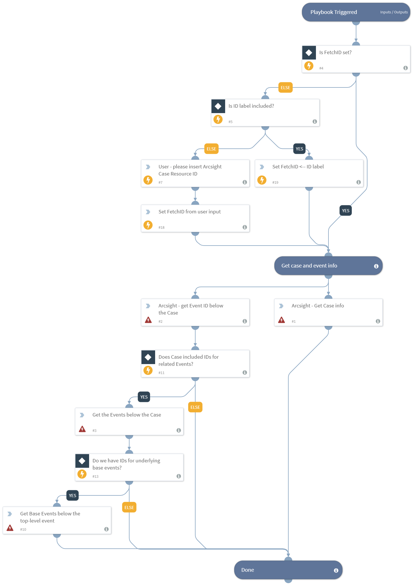

Gets the case's Arcsight `ResourceID` from the `FetchID` field, or the "ID" label. If neither are there, it will ask the user for the ID.

Uses the resource ID to get full data for the case, the correlated/aggregate events underneath it, and all base events underneath them.

## Dependencies
This playbook uses the following sub-playbooks, integrations, and scripts.

## Sub-playbooks
This playbook does not use any sub-playbooks.

## Integrations
* Builtin

## Scripts
* Exists
* Set

## Commands
* as-get-case-event-ids
* as-get-all-cases
* setIncident
* as-get-security-events

## Playbook Inputs
---
There are no inputs for this playbook.

## Playbook Outputs
---
There are no outputs for this playbook.

## Playbook Image
---

