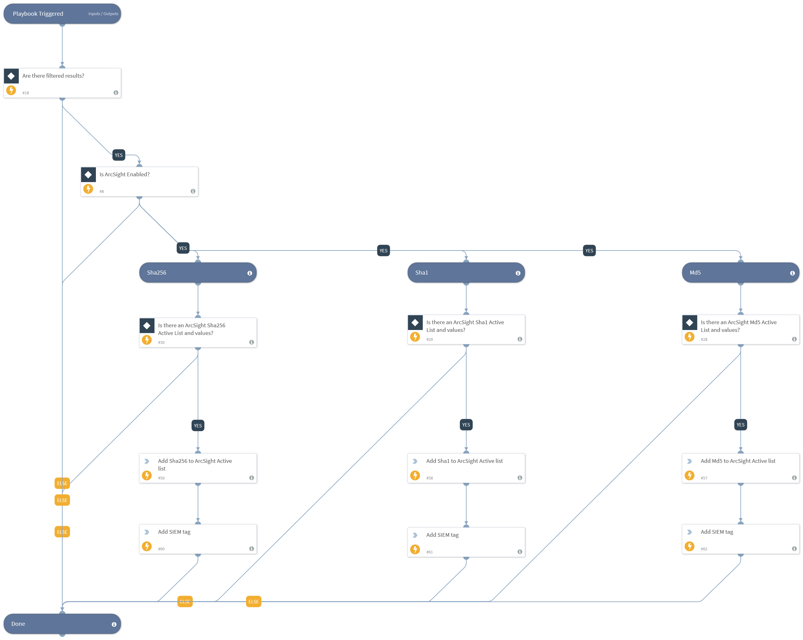

This playbook queries indicators based on a pre-defined query or results from a parent playbook, and adds the resulting indicators to an ArcSight Active List. The Active List ID should be defined in the playbook inputs, as well as the field name in the Active list to which to add the indicators.

## Dependencies
This playbook uses the following sub-playbooks, integrations, and scripts.

### Sub-playbooks
This playbook does not use any sub-playbooks.

### Integrations
* ArcSight ESM v2

### Scripts
This playbook does not use any scripts.

### Commands
* as-add-entries
* appendIndicatorField

## Playbook Inputs
---

| **Name** | **Description** | **Default Value** | **Required** |
| --- | --- | --- | --- |
| ArcSightMd5ActiveListID | ID of the Md5 hash ActiveList resource as it appears in ArcSight. |  | Optional |
| ArcsightMd5ValueFieldName | The name of the Active List field to insert the Md5 hash value to. |  | Optional |
| ArcSightSha1ActiveListID | ID of the Sha1 hash ActiveList resource as it appears in ArcSight. |  | Optional |
| ArcsightSha1ValueFieldName | The name of the Active List field to insert the Sha1 hash value to. |  | Optional |
| ArcSightSha256ActiveListID | ID of the Sha256 hash Active List resource as appears in ArcSight. |  | Optional |
| Indicator Query | Indicators matching the indicator query will be used as playbook input |  | Optional |
| ArcsightSha256ValueFieldName | The name of the Active List field to insert the Sha256 hash value to. |  | Optional |

## Playbook Outputs
---
There are no outputs for this playbook.

## Playbook Image
---
