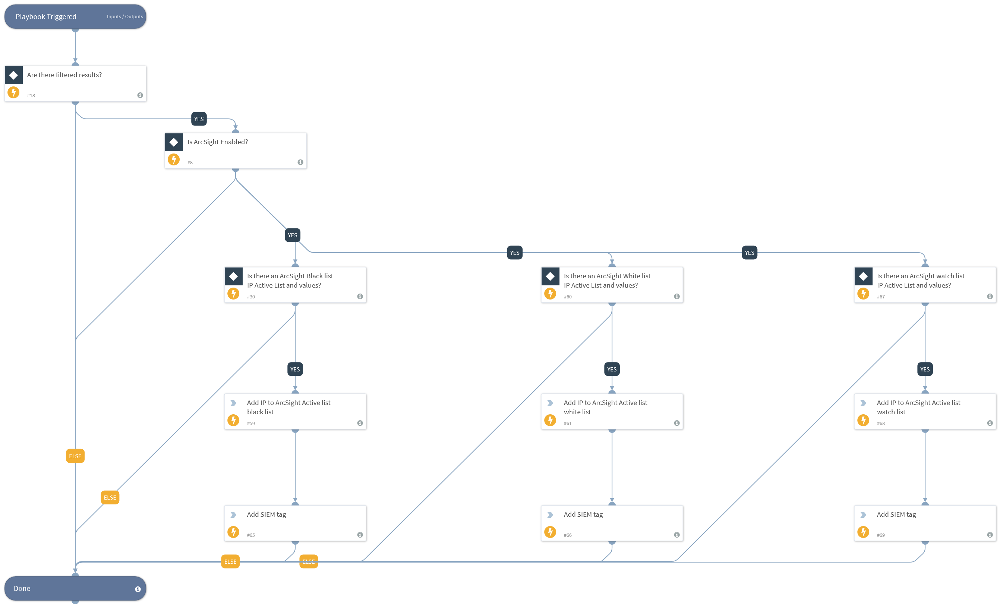

This playbook receives indicators from its parent playbook and provides the indicators as inputs for the sub-playbooks that push the indicators to SIEM.

## Dependencies
This playbook uses the following sub-playbooks, integrations, and scripts.

### Sub-playbooks
This playbook does not use any sub-playbooks.

### Integrations
* ArcSight ESM v2

### Scripts
This playbook does not use any scripts.

### Commands
* appendIndicatorField
* as-add-entries

## Playbook Inputs
---

| **Name** | **Description** | **Default Value** | **Required** |
| --- | --- | --- | --- |
| ArcSightBlackListIPActiveListID | ID of the block list IP Active List resource as appears in ArcSight. |  | Optional |
| ArcsightBlackListIPValueFieldName | The name of the block list Active List field to insert the IP value to. |  | Optional |
| ArcSightWhiteListIPActiveListID | ID of the allow list IP Active List resource as appears in ArcSight. |  | Optional |
| ArcsightWhiteListIPValueFieldName | The name of the allow list Active List field to insert the IP value to. |  | Optional |
| ArcSightWatchListIPActiveListID | ID of the watch list IP Active List resource as appears in ArcSight. |  | Optional |
| ArcsightWatchListIPValueFieldName | The name of the watch list Active List field to insert the IP value to. |  | Optional |
| Indicator Query | Indicators matching the indicator query will be used as playbook input |  | Optional |

## Playbook Outputs
---
There are no outputs for this playbook.

## Playbook Image
---
