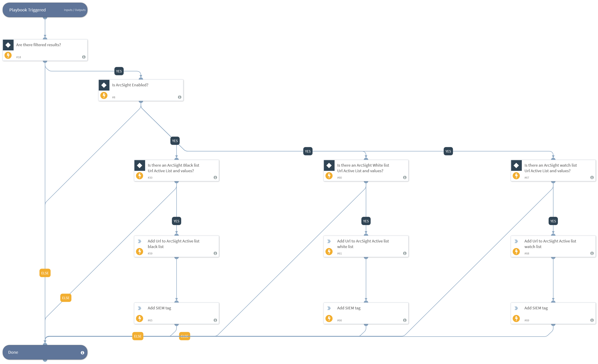

This playbook queries indicators based on a pre-defined
  query or results from a parent playbook and adds the resulting indicators to an ArcSight
Active List. The Active List ID should also be defined in the playbook inputs as well as the field name in the Active list to add to.

## Dependencies
This playbook uses the following sub-playbooks, integrations, and scripts.

### Sub-playbooks
This playbook does not use any sub-playbooks.

### Integrations
* ArcSight ESM v2

### Scripts
This playbook does not use any scripts.

### Commands
* appendIndicatorField
* as-add-entries

## Playbook Inputs
---

| **Name** | **Description** | **Default Value** | **Required** |
| --- | --- | --- | --- |
| ArcSightBlackListUrlActiveListID | ID of the block list Url Active List resource as appears in ArcSight. |  | Optional |
| ArcsightBlackUrlValueFieldName | The name of the block list Active List field to insert the Url value to. |  | Optional |
| ArcSightWhiteListUrlActiveListID | ID of the allow list Url Active List resource as appears in ArcSight. |  | Optional |
| ArcsightWhiteListUrlValueFieldName | The name of the allow list Active List field to insert the Url value to. |  | Optional |
| ArcSightWatchListUrlActiveListID | ID of the watch list Url Active List resource as appears in ArcSight. |  | Optional |
| ArcsightWatchListUrlValueFieldName | The name of the watch list Active List field to insert the Url value to. |  | Optional |

## Playbook Outputs
---
There are no outputs for this playbook.

## Playbook Image
---
