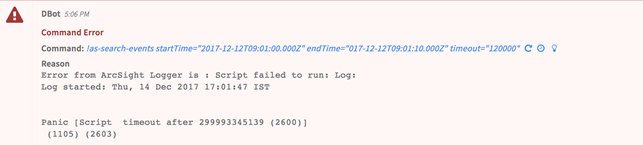
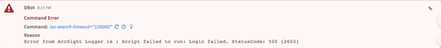
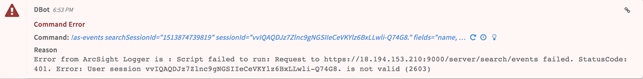

<!-- HTML_DOC -->

ArcSight Logger delivers a universal log management solution that unifies searching, reporting, alerting, and analysis across any type of enterprise machine data.

The Cortex XSOAR-ArcSight Logger integration allows you to run a search session, refine or limit the search and retrieve a list of events detected in the search.

To set up Arcsight Logger to work with Cortex XSOAR:

<ul>
<li>Make sure you have the Arcsight Logger server url.</li>
<li>Make sure you have credentials for Arcsight Logger.</li>
</ul>
<h3>To set up the integration on Cortex XSOAR:</h3>
<ol>
<li>Go to ‘Settings &gt; Integrations &gt; Servers &amp; Services’</li>
<li>Locate ‘ArcSight Logger’ by searching for it using the search box on the top of the page.</li>
<li>Click ‘Add instance’ to create and configure a new integration. You should configure the following settings: <strong>Name</strong>: A textual name for the integration instance. <strong>Server URL and Port</strong>: The API server URL and port number. <strong>Credentials and Password</strong>: User and password used to access ArcSight Logger. 

<label class="checkbox-label" title="Import events as incidents"><label class="checkbox-label" title="Import events as incidents"><strong>Import events as incidents</strong> - Mark </label></label><label class="checkbox-label" title="Import events as incidents">to automatically create Cortex XSOAR incidents from ArcSight Logger events.  <strong>Incident type</strong>: Choose the incident type from the drop-down list. This incident type will be triggered when an event is received from the integration.   <strong>Events query</strong> - The events query received from the integration.  </label>

<label class="checkbox-label" title="Do not validate server certificate (insecure)"><strong>Do not validate server certificate (insecure)</strong> - Select to avoid server certification validation. You may want to do this in case Cortex XSOAR cannot validate the integration server certificate (due to missing CA certificate).</label>

<strong>Use system proxy settings</strong>: Select whether to communicate via the system proxy server or not. <strong>Cortex XSOAR engine</strong>: If relevant, select the engine that acts as a proxy to the server. Engines are used when you need to access a remote network segments and there are network devices such as proxies, firewalls, etc. that prevent the Cortex XSOAR server from accessing the remote networks. For more information on Cortex XSOAR engines see: <a href="https://docs-cortex.paloaltonetworks.com/r/Cortex-XSOAR/6.13/Cortex-XSOAR-Administrator-Guide/Engines">Cortex XSOAR 6.13 - Engines</a>  <a href="https://docs-cortex.paloaltonetworks.com/r/Cortex-XSOAR/8/Cortex-XSOAR-Cloud-Documentation/Engines">Cortex XSOAR 8 Cloud- Engines</a>  <a href="https://docs-cortex.paloaltonetworks.com/r/Cortex-XSOAR/8.7/Cortex-XSOAR-On-prem-Documentation/Engines">Cortex XSOAR 8.7 On-prem - Engines</a> <strong>Require users to enter additional password:</strong> Select whether you’d like an additional step where users are required to authenticate themselves with a password.

</li>
<li>Press the ‘Test’ button to validate connection.
</li>
<li>After completing the test successfully, press the ‘Done’ button.</li>
</ol>
<h3>Fetched incidents data:</h3>

The integration imports events as incidents. All events from 24 hours prior to the instance configuration and up to the current time will be fetched.

Top Use-case:

Arcsight Logger integration can be used to run a search session, refine or limit the search, and retrieve a list of events detected in the search.

This can be achieved in two possible ways:

<ul>
<li>Use ‘as-search-events’ for the complete flow of the use case to be executed. ‘as-search-events’ starts a new search session, waits until the search status is complete or reaches the required number of hits, and then returns the list of detected events.</li>
</ul>
<ul>
<li>Alternatively, the explicit commands can be used to ‘breakdown’ the search-events process. A possible flow of commands can be:
<ul>
<li>Use ‘as-search’ to start a new search session and receive the session ID and search session ID to be used in the following commands.</li>
<li>Use ‘as-drilldown’ to narrow-down the search results to the specified time range.</li>
<li>Use ‘as-status’ to inquire if the search session is complete or still running, view the number of scanned events and hits.</li>
<li>Use ‘as-events’ to get a list of all events detected in the search.</li>
<li>Use ‘as-close’ to stop the execution of the search and clear the session data from the server.</li>
</ul>
</li>
</ul>

Commands:

<ul>
<li style="font-family: courier;"><strong>as-search-events </strong></li>
</ul>

Input:

<table style="margin-left: 70px; width: 681.556px;">
<tbody>
<tr>
<td style="width: 678.556px;">

query, discover_fields, endTime, startTime, summary_fields, field_summary, local_search, timeout, lastDays, offset, length, dir, fields

for example:

<ul>
<li>
<em>!as-search-events </em>query=”deviceVendor= Arcsight AND name CONTAINS \”CPU\””   length=10</li>
</ul>
<ul>
<li>
<em>!as-search-events </em>offset=15 length=10 fields=name,deviceVendor</li>
</ul>

       Find more query examples at <a href="https://wikis.uit.tufts.edu/confluence/display/exchange2010/ArcSight+Logger+-+Commonly+Used+Event+Fields">wikis/ArcsightLogger</a>.

</td>
</tr>
</tbody>
</table>

Context output (example):

<table style="margin-left: 70px; width: 681.556px;">
<tbody>
<tr>
<td>

{

    "ArcSightLogger": {

        "Events": [

            {

                "destinationAddress": ##.##.##.##,

                "agentSeverity": "1",

                "Version": "0",

                "Logger": "Local",

                "ReceiptTime": 1513249919185,

                "deviceCustomNumber1Label": "Percent Usage",

                "deviceCustomNumber1": 2,

                "deviceAddress":  ##.##.##.##,

                "deviceCustomString2Label": "timeframe",

                "deviceVendor": "ArcSight",

                "Device": "Logger",

                "deviceProduct": "Logger",

                "EventTime": 1513249440017,

                "baseEventCount": 1,

                "deviceReceiptTime": 1513249440017,

                "startTime": 1513249440017,

                "deviceEventClassId": "cpu:100",

                "deviceCustomString2": "CurrentValue",

                "name": "CPU Usage",

                "deviceEventCategory": "/Monitor/CPU/Usage",

                "rowId": "347259-26@Local",

                "endTime": 1513249440017,

                "deviceVersion": "6.2.0.7633.0"

            }, 

…

       ]

   }

}

</td>
</tr>
</tbody>
</table>

Raw output (example):

<table style="margin-left: 70px; width: 681.556px;">
<tbody>
<tr>
<td style="width: 678.556px;">

[

   {

Device:Logger

EventTime:1513249693332

Logger:Local

ReceiptTime:1513249693838

Version:0

agentSeverity:3

baseEventCount:1

cn1label:Session

destinationAddress: ##.##.##.##,

destinationUserId:1

destinationUserName:admin

deviceCustomNumber1: 741618068

deviceEventCategory:/Platform/Authentication/Login

deviceEventClassId:platform:230

deviceProduct:Logger

deviceVendor:ArcSight

deviceVersion:L7633

name:Successful login

rowId:347186-0@Local

sourceAddress: ##.##.##.##,

               },

                     …

]

 

</td>
</tr>
</tbody>
</table>
<ul>
<li style="font-family: courier;"><strong>as-search </strong></li>
</ul>

Input:

<table style="margin-left: 70px; width: 681.556px;">
<tbody>
<tr>
<td style="width: 678.556px;">

query, discover_fields, endTime, startTime, summary_fields, field_summary, local_search, timeout, lastDays

for example:

<ul>
<li>

<em>!as-search</em>

startTime=2017-12-21T06:30:00.000Z

endTime=2017-12-21T07:30:00.000Z

local_search=false

</li>
<li>

 

<em>!as-search</em>

lastDays=1

</li>
</ul>

       Find more query examples at <a href="https://wikis.uit.tufts.edu/confluence/display/exchange2010/ArcSight+Logger+-+Commonly+Used+Event+Fields">wikis/ArcsightLogger</a>.

</td>
</tr>
</tbody>
</table>

Context output (example):

<table style="margin-left: 70px; width: 681.556px;">
<tbody>
<tr>
<td>

{

"ArcSightLogger": {

"Search": {

"SearchSessionId": 1513260595933,

"SessionId": "3dxITLyDE9FyRiflQD7UFG_hSsUPq4uCTM4B6Y5D3p4."

}

}

}

</td>
</tr>
</tbody>
</table>

Raw output (example):

<table style="margin-left: 70px; width: 681.556px;">
<tbody>
<tr>
<td style="width: 678.556px;">

{

searchSessionId:1513260595933

sessionId:3dxITLyDE9FyRiflQD7UFG_hSsUPq4uCTM4B6Y5D3p4.

}

</td>
</tr>
</tbody>
</table>
<ul>
<li style="font-family: courier;"><strong>as-drilldown </strong></li>
</ul>

Input:

<table style="margin-left: 70px; width: 681.556px;">
<tbody>
<tr>
<td style="width: 678.556px;">

searchSessionId, sessionId, startTime, endTime, lastDays

for example:

<ul>
<li>

<em>!as-drilldown </em>

<em>lastDays=1  </em><em>searchSessionId="1513875662638" </em><em>sessionId="18t2-5sQ4h1LcTqFwEUJj0XIatasCpM8l0T8NZlhxEg."</em>

</li>
<li>

 <em>!as-drilldown </em><em>startTime=2017-12-21T06:30:00.000Z </em><em>endTime=2017-12-21T07:30:00.000Z </em><em>searchSessionId="1513875662638" sessionId="18t25sQ4h1LcTqFwEUJj0XIatasCpM8l0T8NZlhxEg."</em>

</li>
</ul>
</td>
</tr>
</tbody>
</table>

Context output:

<table style="margin-left: 70px; width: 681.556px;">
<tbody>
<tr>
<td>

 The command has no context.

</td>
</tr>
</tbody>
</table>

Raw output:

<table style="margin-left: 70px; width: 681.556px;">
<tbody>
<tr>
<td style="width: 678.556px;">

The command has no raw output.

</td>
</tr>
</tbody>
</table>
<ul>
<li style="font-family: courier;"><strong>as-status </strong></li>
</ul>

Input:

<table style="margin-left: 70px; width: 681.556px;">
<tbody>
<tr>
<td style="width: 678.556px;">

searchSessionId, sessionId 

</td>
</tr>
</tbody>
</table>

Context output (example):

<table style="margin-left: 70px; width: 681.556px;">
<tbody>
<tr>
<td>

{

"ArcSightLogger": {

"Status": {

"Status": "complete",

"Hit": 2462,

"Elapsed": "00:00:00.290",

"ResultType": "histogram",

"Scanned": 2520,

"SearchSessionId": "1513272858387",

"Message": []

} 

</td>
</tr>
</tbody>
</table>

Raw output (example):

<table style="margin-left: 70px; width: 681.556px;">
<tbody>
<tr>
<td style="width: 678.556px;">

{

elapsed: 00:00:00.290

hit:2462

message: []

result_type: histogram

scanned: 2520

status: complete

}

</td>
</tr>
</tbody>
</table>
<ul>
<li style="font-family: courier;"><strong>as-events </strong></li>
</ul>

Input:

<table style="margin-left: 70px; width: 681.556px;">
<tbody>
<tr>
<td style="width: 678.556px;">

searchSessionId, sessionId, length, dir, offset, fields

<strong>Command use example</strong>

<ul>
<li>
<em>!as-events </em>searchSessionId="1513875662638" sessionId="18t25sQ4h1LcTqFwEUJj0XIatasCpM8l0T8NZlhxEg." length=10 fields=name,deviceAddress,deviceVendor,EventTime</li>
</ul>
</td>
</tr>
</tbody>
</table>

Context output (example):

<table style="margin-left: 70px; width: 681.556px;">
<tbody>
<tr>
<td>

{

"ArcSightLogger": {

"Events": [

{

"destinationAddress": ##.##.##.##,

"agentSeverity": "1",

"Version": "0",

"Logger": "Local",

"ReceiptTime": 1513249919185,

"deviceCustomNumber1Label": "Percent Usage",

"deviceCustomNumber1": 2,

"deviceAddress":  ##.##.##.##,

"deviceCustomString2Label": "timeframe",

"deviceVendor": "ArcSight",

"Device": "Logger",

"deviceProduct": "Logger",

"EventTime": 1513249440017,

"baseEventCount": 1,

"deviceReceiptTime": 1513249440017,

"startTime": 1513249440017,

"deviceEventClassId": "cpu:100",

"deviceCustomString2": "CurrentValue",

"name": "CPU Usage",

"deviceEventCategory": "/Monitor/CPU/Usage",

"rowId": "347259-26@Local",

"endTime": 1513249440017,

"deviceVersion": "6.2.0.7633.0"

}, 

…

]

}

}

</td>
</tr>
</tbody>
</table>

Raw output (example):

<table style="margin-left: 70px; width: 681.556px;">
<tbody>
<tr>
<td style="width: 678.556px;">

[

{

Device:Logger

EventTime:1513249693332

Logger:Local

ReceiptTime:1513249693838

Version:0

agentSeverity:3

baseEventCount:1

cn1label:Session

destinationAddress: ##.##.##.##,

destinationUserId:1

destinationUserName:admin

deviceCustomNumber1: 741618068

deviceEventCategory:/Platform/Authentication/Login

deviceEventClassId:platform:230

deviceProduct:Logger

deviceVendor:ArcSight

deviceVersion:L7633

name:Successful login

rowId:347186-0@Local

sourceAddress: ##.##.##.##,

},

…

]

 

{

</td>
</tr>
</tbody>
</table>
<ul>
<li style="font-family: courier;"><strong>as-stop </strong></li>
</ul>

Input:

<table style="margin-left: 70px; width: 681.556px;">
<tbody>
<tr>
<td style="width: 678.556px;">

searchSessionId, sessionId 

</td>
</tr>
</tbody>
</table>

Context output (example):

<table style="margin-left: 70px; width: 681.556px;">
<tbody>
<tr>
<td>

The command has no context. 

</td>
</tr>
</tbody>
</table>

Raw output (example):

<table style="margin-left: 70px; width: 681.556px;">
<tbody>
<tr>
<td style="width: 678.556px;">

The command has no raw output.

</td>
</tr>
</tbody>
</table>
<ul>
<li style="font-family: courier;"><strong>as-close </strong></li>
</ul>

Input:

<table style="margin-left: 70px; width: 681.556px;">
<tbody>
<tr>
<td style="width: 678.556px;">

searchSessionId, sessionId 

</td>
</tr>
</tbody>
</table>

Context output (example):

<table style="margin-left: 70px; width: 681.556px;">
<tbody>
<tr>
<td>

The command has no context. 

</td>
</tr>
</tbody>
</table>

Raw output (example):

<table style="margin-left: 70px; width: 681.556px;">
<tbody>
<tr>
<td style="width: 678.556px;">

The command has no raw output.

</td>
</tr>
</tbody>
</table>
<h3> </h3>
<h3>Additional info:         </h3>
<ul>
<li>
<strong>Search time range:</strong> When no time limitations are applied on a search session, Arcsight Logger will use its default time limitation and will search events in time range of the last 2 hours. To set the search time range: 
<ul>
<li>
<strong>When starting a new search session, using ‘as-search’</strong>: pass both startTime and endTime parameters to set the time range for the search. Alternatively, you can use the lastDays parameter.</li>
<li>
<strong>When in an active search session:</strong> use ‘as-drilldown’ to narrow-down the search results to a specified time range.</li>
<li>
<strong>When starting a new search, using ‘as-search-events’:</strong> pass both startTime and endTime parameters to set the time range for the search. Alternatively, use lastDays parameter.</li>
</ul>
</li>
<li>
<strong>Date/time format: </strong>Use the compliant date/time format when passing startTime and endTime parameters.</li>
<li>
<strong>Expected date/time format</strong>: yyyy-MM-dd’T’HH:mm:ss.SSSXXX. For example, May 26 2014 at 21:49:46 PM could have a format like one of the following: 
<ul>
<li>Format in PDT: 2014-05-26T21:49:46.000-07:00</li>
<li>Format in UTC: 2014-05-26T21:49:46.000Z</li>
</ul>
</li>
<li>
<strong>Events list default limitation: </strong>The default events list length is 100. To set a new length specify the path length parameter in the relevant commands.</li>
<li>
<strong>Local/global search: </strong>In ‘as-search’ and ‘as-search-events’ you can optionally pass the  ‘local_search’ parameter, to Indicate whether the search is local only, and does not include peers. <strong>Please note</strong> that local search is the default option for a search session.</li>
</ul>
<h3>Known Limitations</h3>
<ul>
<li>
<strong>Session limitations: </strong>Arcsight Logger has default limitations for running maximum sessions simultaneously, and for inactive sessions.  To change the default limitation for both, use administrator credentials to login to Archsight Logger UI, navigate to ‘System Admin’-&gt;’Users/Groups’-&gt;’Authentication’ and set new limitations for ‘Max Simultaneous Logins/User’ and ‘Logout Inactive Session After’.</li>
</ul>
<h3>Troubleshooting</h3>
<ul>
<li>
<strong>Reoccurring ‘timeout’ error</strong> <strong>when using commands ‘as-search-events’ or ‘as-events’:</strong>
</li>
</ul>

This may indicate that a large amount of data returned from Arcsight Logger. To resolve this error, try to limit the search time range or the events list length.  See additional ways to set the search time range in ‘Additional info’ above. <strong>DBot error snap-shot </strong> <strong> </strong>

 

<ul>
<li><strong>Reoccurring ‘Login failed’ error when using ‘as-search’ or ‘as-search-events’:</strong></li>
</ul>

First eliminate the case of wrong credentials configured in the Arcsight Logger instance.

If this error still araises, it may indicate that Arcsight Logger is failing to generate a new search session. New sessions cannot be generated by Arcsight Logger when the maximum allowed number of simultaneous sessions was reached.

To resolve this problem, use administrator credentials to login to Archsight Logger UI and set a new limitation for maximum simultaneous sessions.  See ’Known Limitations’ above for more information.

If administrator credentials are not available for you, use ‘as-close’ to close the running sessions.

 <strong>DBot error snap-shot </strong> <strong> </strong>

 

<ul>
<li><strong>Reoccurring ‘User session id is not valid’ error:</strong></li>
</ul>

The search session timed out.

Search session timeout can be caused by the followings: - Low ‘timeout’ passed to ‘as-search’. This can be resolved by passing a higher ‘timeout’      value to ‘as-search’. - Arcsight Logger limitation on inactive sessions - Inactive sessions are automatically terminated after a defined period of time determined by Arcsight Logger, even if the ‘timeout’ argument is changed to ‘as-search’.

To resolve this problem, use administrator credentials to login to Archsight Logger UI and set a new limitation for inactive sessions. See ’Known Limitations’ above for more information. 

<strong>DBot error snap-shot</strong>

