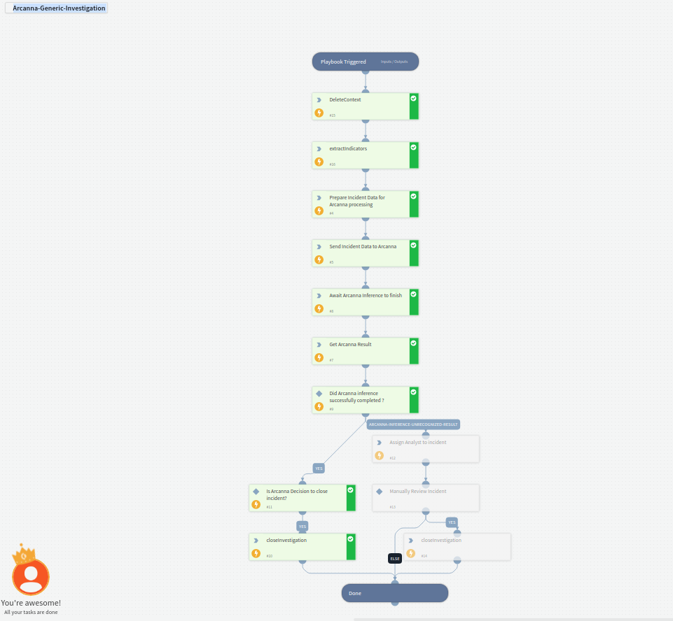

Takes incident data and sends it to Arcanna.Ai for ML inference and automated decision

## Dependencies
There are no dependencies on other playbooks

### Sub-playbooks

### Integrations
This playbook uses ArcannaAi integration

### Scripts
* PrepareArcannaRawJson

### Commands
* arcanna-send-event
* arcanna-get-event-status

## Playbook Inputs
---

| **Name** | **Description** | **Required** |
| --- | --- | --- |
| incident RawJson | Incident rawJson or another Json  formatted string. | Yes |

## Playbook Outputs
---
There are no outputs for this playbook.

## Playbook Image
---

