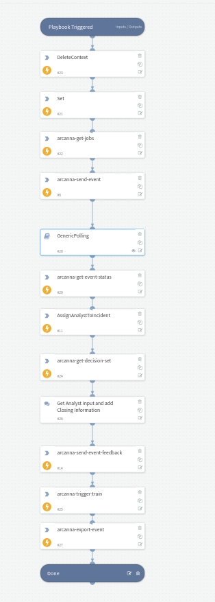

Playbook takes incident data and sends it to Arcanna.Ai for ML inference and automated decision. Once decision is retrieved, manual input ( in this case )
from analyst is added in as feedback and sent back to Arcanna.ai. Once Feedback is provided in the final steps of the playbook, an automated AI Training
is triggered and finally the full record, that contains all Arcanna.ai added metadata, is retrieved back into the context

## Dependencies
There are no dependencies on other playbooks

### Sub-playbooks
GenericPolling

### Integrations
This playbook uses ArcannaAi integration

### Scripts
* PrepareArcannaRawJson

### Commands
* arcanna-get-jobs
* arcanna-send-event
* arcanna-get-event-status
* arcanna-get-decision
* arcanna-send-event-feedback
* arcanna-trigger-train
* arcanna-export-event

## Playbook Inputs
---

| **Name** | **Description** | **Required** |
| --- | --- | --- |
| incident RawJson | Incident rawJson or another Json  formatted string. | Yes |

## Playbook Outputs
---
There are no outputs for this playbook.

## Playbook Image
---

