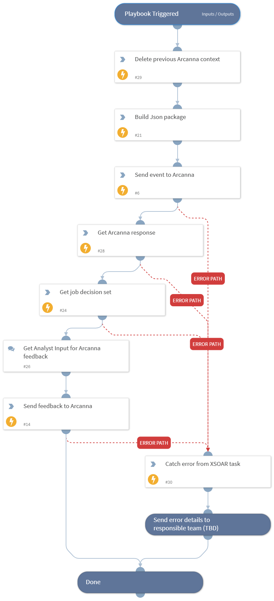

This sub-playbook automates event analysis and feedback exchange with Arcanna in XSOAR — preparing event data, sending it for AI analysis, retrieving results, and optionally collecting and submitting analyst feedback. The 'Get Arcanna Response' step also maps information for layouts and dashboards (see task 'Mapping' tab).

## Dependencies
There are no dependencies on other playbooks.

### Sub-playbooks
No Sub-playbooks.

### Integrations
This playbook uses ArcannaAi integration.

### Scripts
No Scripts.

### Commands
* arcanna-send-event
* arcanna-get-event-status
* arcanna-get-decision-set
* arcanna-send-event-feedback

## Playbook Inputs
---

| **Name** | **Description** | **Required** |
| --- | --- | --- |
| job_id | Job ID from Arcanna (visible in the URL bar after clicking on an AI Job title). | Yes |

## Playbook Outputs
---
There are no outputs for this playbook.

## Playbook Image
---

