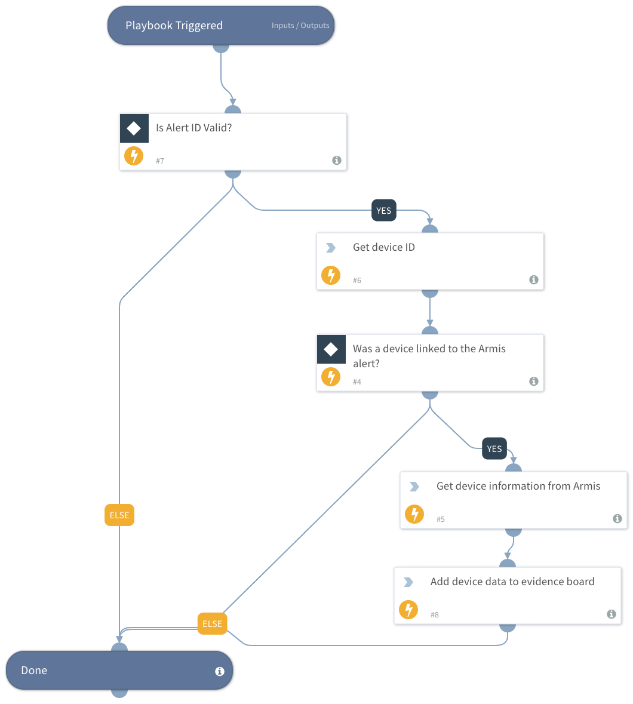

Enrich Armis alerts with the devices in the context details.

## Dependencies

This playbook uses the following sub-playbooks, integrations, and scripts.

### Sub-playbooks

This playbook does not use any sub-playbooks.

### Integrations

* Armis

### Scripts

This playbook does not use any scripts.

### Commands

* armis-search-devices

## Playbook Inputs

---

| **Name** | **Description** | **Default Value** | **Required** |
| --- | --- | --- | --- |
| Armis_Device_Identifier | Get the device ID that is associated with the alert. | ${incident.armisdeviceidentifier} | Required |

## Playbook Outputs

---

| **Path** | **Description** | **Type** |
| --- | --- | --- |
| Device ID | Device ID | string |
| Armis.Device.name | Device name. | string |
| Armis.Device.riskLevel | Device risk level defined by Armis. | number |
| Armis.Device.ipAddress | IPv4 address. | string |
| Armis.Device.site | Site name | string |
| Armis.Device.tags | Tags. | string |

## Playbook Image

---

