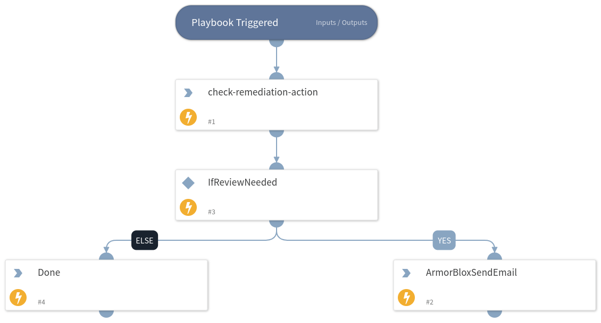

This playbook sends email alerts to admins for Armorblox incidents that need review.

## Dependencies
This playbook uses the following sub-playbooks, integrations, and scripts.

### Sub-playbooks
This playbook does not use any sub-playbooks.

### Integrations
* Armorblox

### Scripts
* Print
* ArmorbloxSendEmail

### Commands
* armorblox-check-remediation-action

## Playbook Inputs
---

| **Name** | **Description** | **Default Value** | **Required** |
| --- | --- | --- | --- |
| recipient_mail_address | Receiver's mailing address. | xyz@gmail.com | Required |
| sender_mail_address | Sender's mailing address | test@gmail.com | Required |
| sender_mail_password | Sender's password | ABCDEF@123 | Required |
| smtp_server | The SMTP server for the sender's email | smtp.gmail.com | Required |
| smtp_port | SMTP server port. | 465 | Required |

## Playbook Outputs
---

| **Path** | **Description** | **Type** |
| --- | --- | --- |
| Armorblox.Threat.remediation_actions | Remediation Action for the incident under inspection. | string |

## Playbook Image
---
