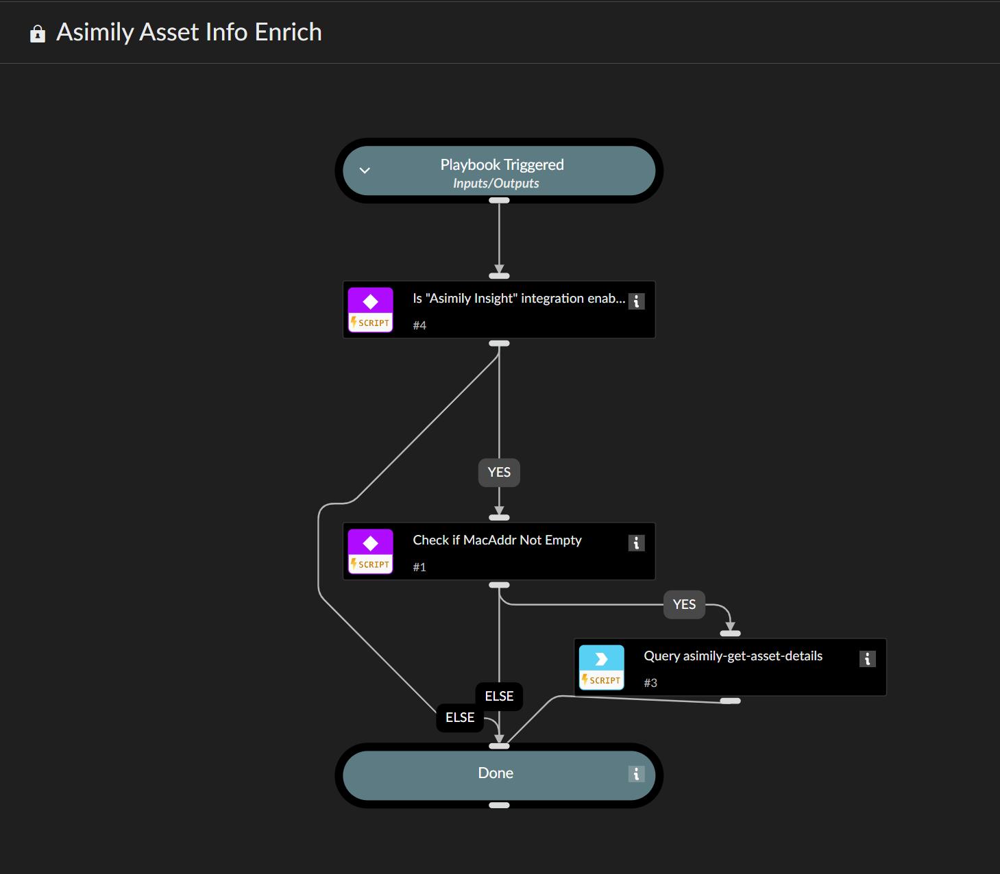

Default playbook for Asimily Anomaly and CVE incidents. It enriches incidents by running asimily-get-assetdetails to fetch related asset information.

## Dependencies

This playbook uses the following sub-playbooks, integrations, and scripts.

### Sub-playbooks

This playbook does not use any sub-playbooks.

### Integrations

* Asimily Insight

### Scripts

This playbook does not use any scripts.

### Commands

* asimily-get-assetdetails

## Playbook Inputs

---
There are no inputs for this playbook.

## Playbook Outputs

---
There are no outputs for this playbook.

## Playbook Image

---

