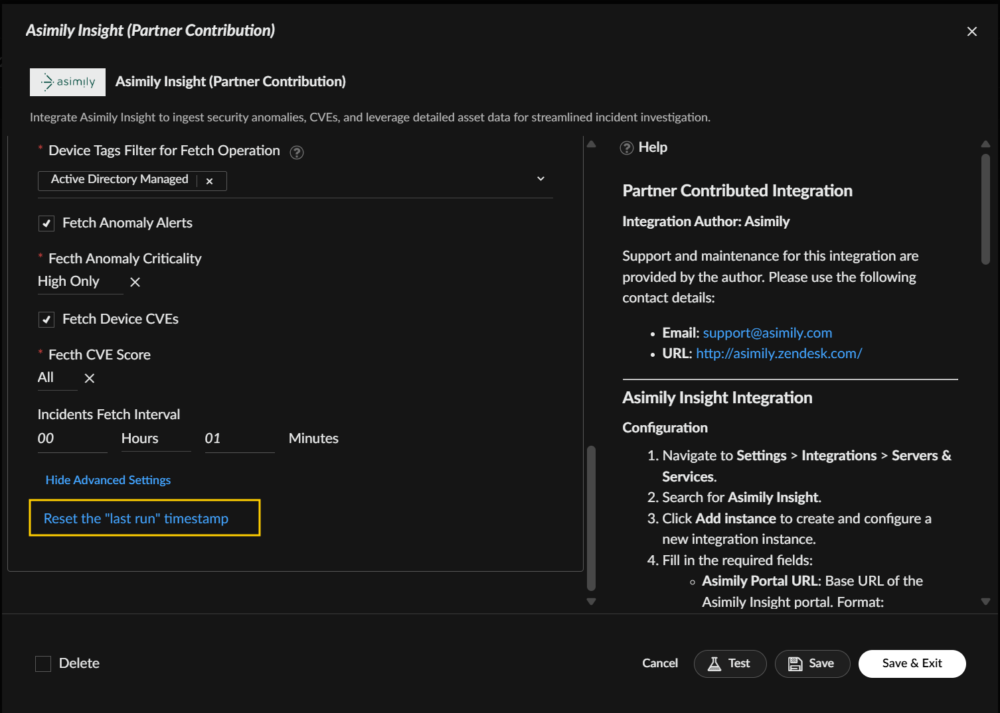
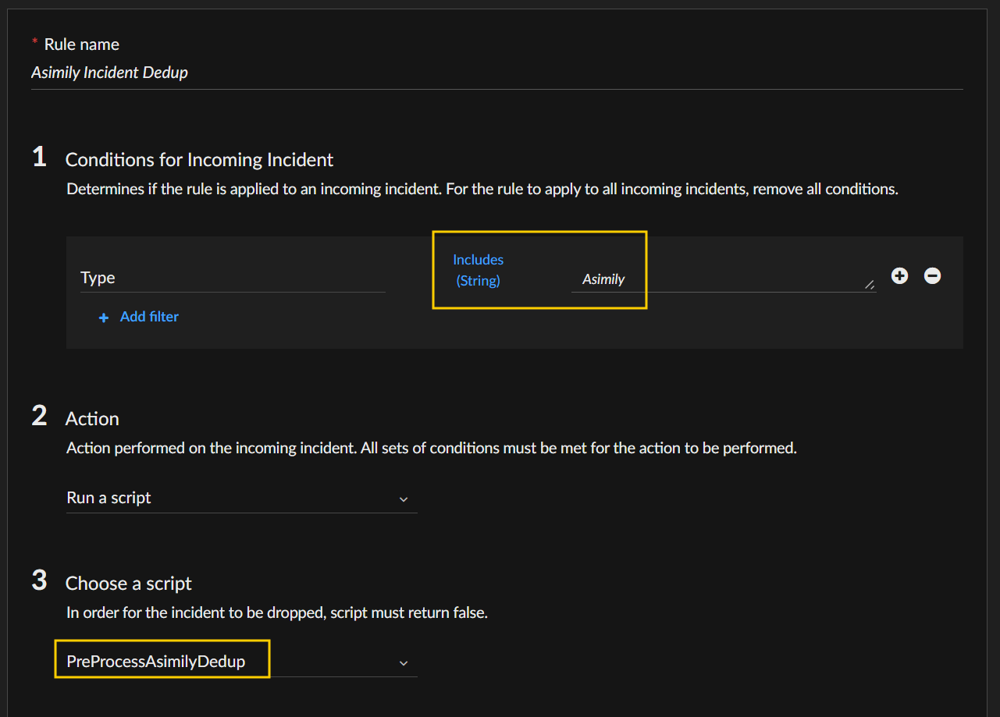

Integrate Asimily Insight to ingest security anomalies, CVEs, and leverage detailed asset data for streamlined incident investigation.

Asimily Insight delivers comprehensive IoT/OT security and management by providing deep asset visibility, automated vulnerability prioritization, and actionable mitigation strategies aligned with MITRE ATT&CK. It analyzes device communication, calculates holistic risk scores, and enables targeted network segmentation. The platform detects anomalies, simplifies policy management, and automates forensic packet capture. Beyond security, Asimily optimizes asset utilization, tracks operational usage, and manages configuration drift. Its Risk Simulator improves efficiency, and centralized data streamlines IT/OT convergence while identifying unmanaged devices.

This integration utilizes the Asimily Insight RESTful APIs to provide seamless access to comprehensive device data. Users can retrieve detailed information on IT, medical, and security parameters, as well as view known vulnerabilities (CVEs), detect asset anomalies, and maintain synchronized data—either on a regular schedule or on demand.

## What does this pack do?

- **On-Demand Asset Retrieval**: Query Asimily Insight for detailed device information using search parameters, such as IP address, MAC address, facility, or device ID.
- **Anomaly Alert Synchronization**: Regularly sync alerts generated by Asimily Insight to ensure up-to-date visibility into device-related security and operational events.
- **Vulnerability (CVE) Synchronization**: Periodically retrieve and update known device vulnerabilities detected by Asimily Insight to support informed risk management and mitigation.
- **Incident Creation in Cortex XSOAR**: All synced data—whether alerts, vulnerabilities, or asset details—is automatically converted into incidents within the Cortex XSOAR platform for streamlined investigation and response workflows.

## Configure Asimily Insight on Cortex XSOAR

1. Navigate to **Settings** > **Integrations** > **Servers & Services**.
2. Search for Asimily Insight.
3. Click **Add instance** to create and configure a new integration instance.

    | **Parameter** | **Description** | **Required/Default** | **Type** |
    | --- | --- | --- | -- |
    | Name | XSOAR Integration Instance Name | True | String |
    | API User Name | The Asimily Insight API username | True | String |
    | Password | The password of the Asimily Insight API user | True | String |
    | Trust any certificate (not secure) |  | Default False | Boolean |
    | Use system proxy settings |  | Default False | Boolean |
    | Device Family Filter for Fetch Operation | Fetch incidents only for assets with selected device families in fetch-incidents | "All" | Multi-Select |
    | Device Tags Filter for Fetch Operation | Fetch incidents only for assets with selected device tags in fetch-incidents | "All" | Multi-Select |
    | Fetch Anomaly Alerts | If fetch anomalies incidents in fetch-incidents | Default False | Boolean |
    | Fecth Anomaly Criticality | Fetch anomaly incidents only for anomalies with selected criticality | "High Only" | Single-Select |
    | Fetch Device CVEs | If fetch CVEs incidents in fetch-incidents | Default False | Boolean |
    | Fecth CVE Score | Fetch CVEs incidents only for CVEs with selected scores | "High Only" | Single-Select |
    | Incidents Fetch Interval | The default 5-minute fetch interval can be adjusted based on observed fetch duration to optimize data freshness and system load. | 5 | Number |
    | Fetches incidents | If Fetch incidents | False | Boolean

4. Click **Test** to validate the URL, API username, API password and connection.

> When modifying fetch-incident filters (Device Family, Device Tags, Anomaly Criticality, CVE Score), it's highly recommended to **reset the "last run" timestamp** (In Advanced Settings) in the Configuration Page. This action guarantees that events for any newly included devices are properly fetched.

## Configure Pre-Process Rules

The integration pulls in assets information, anomaly alerts, CVEs from Asimily Insight based on its updates or upon query, creating the need for a preprocessing rule that drops the incoming incident if it's a duplication. 

Follow the guidelines below to configure the preprocessing rule.

1. Navigate to **Settings** > **Object Setup** > **Incidents** > **Pre-Process Rules**.
2. Click **+New Rule** on top right corner.
3. Name the rule appropriately (e.g. Asimily Incident Dedup).
4. In the **Conditions for Incoming Incident** section, enter:
    - **Type** - **Includes** - **Asimily**
5. In the **Action** section, select **Run a script**.
6. In the **Choose a script** section, pick from the drop-down list:
    - **PreProcessAsimilyDedup**

> The configuration of the preprocessing rule is optional, but highly recommended to avoid duplication.

The integration includes a preprocessing script (**PreProcessAsimilyDedup**) that will drop incoming incident if it's a duplicate. It will search all past incidents with all status.

Alternative rule settings can be:

5. In the **Action** section, select **Drop and update**.
6. In the **Update** section, enter
    - **Link to** - **Oldest incident** - **Created within the last** - *Your desired timeframe*
    - **DbotMirrorId** - **Is identical (Incoming Incident)** - **to incoming incident**

## Commands

You can run these commands from the Cortex XSOAR CLI, as part of an automation, or within a playbook.
Upon successful execution, a DBot message will appear in the War Room with execution details.
If asset data, anomaly alerts, or CVE information is retrieved, corresponding incidents will be automatically created with appropriate incident types.

### asimily-get-assetdetails

***
Fetch assets details from Asimily Insight and create incidents. You can add argument filters.

#### Base Command

`asimily-get-assetdetails`

#### Input

| **Argument** | **Description** | **Required** | **Support List** |
| --- | --- | --- | --- |
| macAddr |  | Optional | No |
| ipAddr |  | Optional | No |
| facility |  | Optional | No |
| asimilyDeviceId | Asimily Insight given ID for devices | Optional | No |

#### Context Output

> Fecthed ${fetch_limit} out of ${device_count} incidents matching search for creation, duplicate assets will be skipped. Incident fetch count is limited to avoid server overload.

### asimily-get-asset-anomalies

***
Fetch anomaly alerts from Asimily Insight and create incidents. You can add argument filters.

#### Base Command

`asimily-get-asset-anomalies`

#### Input

| **Argument Name** | **Description** | **Required** | **Support List** |
| --- | --- | --- | --- |
| macAddr |  | Optional | No |
| ipAddr |  | Optional | No |
| asimilyDeviceId | Asimily Insight given ID for devices | Optional | No |
| deviceFamily |  | Optional | Yes |
| deviceTag | | Optional | Yes |
| criticality | Anomaly Alert Criticality Filter. Options: High Only, Medium and High, All | Optional | No |

#### Context Output

> Fetched ${fetch_limit} anomalies incidents for ${device_count} devices matching search for creation, duplicate anomalies will be skipped.
>
> ${pending_device_count} devices matching search is not fetched. Incident fetch count is limited to avoid server overload.

### asimily-get-asset-vulnerabilities

***
Fetch device CVEs from Asimily Insight and create incidents. You can add argument filters.

#### Base Command

`asimily-get-asset-vulnerabilities`

#### Input

| **Argument Name** | **Description** | **Required** | **Support List** |
| --- | --- | --- | --- |
| macAddr |  | Optional | No |
| ipAddr |  | Optional | No |
| asimilyDeviceId | Asimily Insight given ID for devices | Optional | No |
| deviceFamily |  | Optional | Yes |
| deviceTag | | Optional | Yes |
| cveScore | CVE Score Filter. Options: High Only, Medium and High, All (High=7.5, Medium=3.5) | Optional | No |

#### Context Output

> Fetched ${fetch_limit} CVEs incidents for ${device_count} devices matching search for creation, duplicate CVEs will be skipped.
> 
> ${pending_device_count} devices matching search is not fetched. Incident fetch count is limited to avoid server overload.

