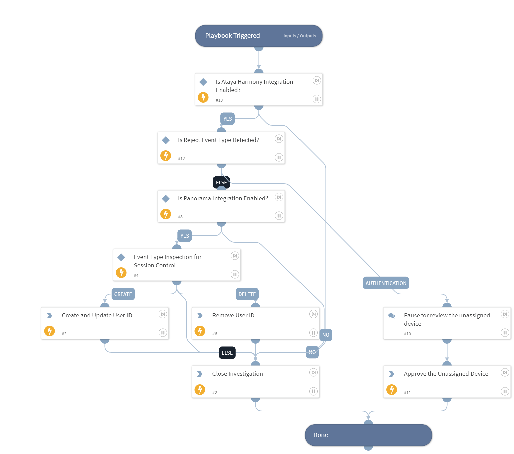

With this playbook, we can enable Identity-Aware Security Across Multiaccess Networks.

## Dependencies

This playbook uses the following sub-playbooks, integrations, and scripts.

### Sub-playbooks

This playbook does not use any sub-playbooks.

### Integrations

* Ataya

### Scripts

* IsIntegrationAvailable
* Print

### Commands

* ataya-assign-user
* closeInvestigation
* pan-os

## Playbook Inputs

---
There are no inputs for this playbook.

## Playbook Outputs

---
There are no outputs for this playbook.

## Playbook Image

---

