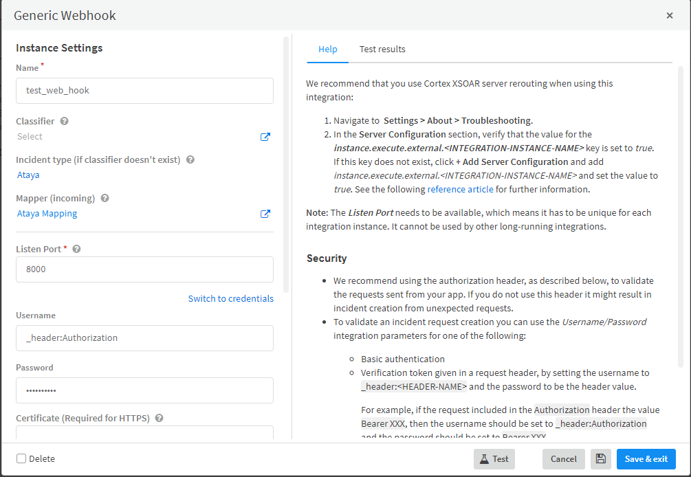
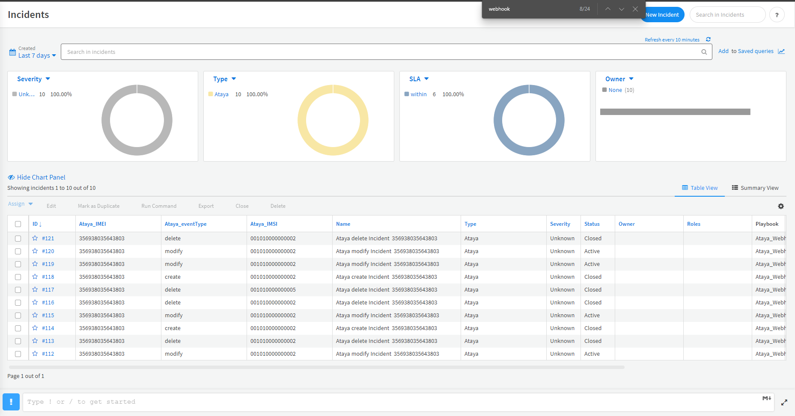

# Ataya Harmony Interface for Cortex XSOAR of Palo Alto Networks

## Summary
The Webhook interface can be enabled in the Ataya's Harmony Platform. Once done, the Ataya's 5G core network will publish the clients’ session events to XSOAR, which can notify the Palo Alto firewall gateway to apply the desired policy to the client connections.

## Requirement
The following content is necessary for complete the integration.
- Generic Webhook

## Configuration
The configuration instruction of Generic Webhook application and Ataya Harmony Platform.

### Generic Webhook
1. Choose _Ataya_ as the incident type
2. Choose _Ataya Mapping_ as the incident type
3. Configure the webhook server setting (listen port and credentials)

### Ataya Harmony
Enable Webhook on Harmony Dashboard
1. Login to Ataya Harmony
2. Navigate to **Organization** > **Setting** > **Webhook**.
3. Right-click **+Webhook**, and fill the configuration related to Generic Webhook server.

### Supported Published Events
- Session Create
- Session Modification
- Session Delete

_Check [Ataya Inc.](https://www.ataya.io/) for product details on Ataya Harmony Platform_

