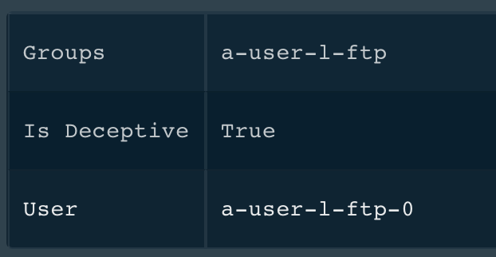
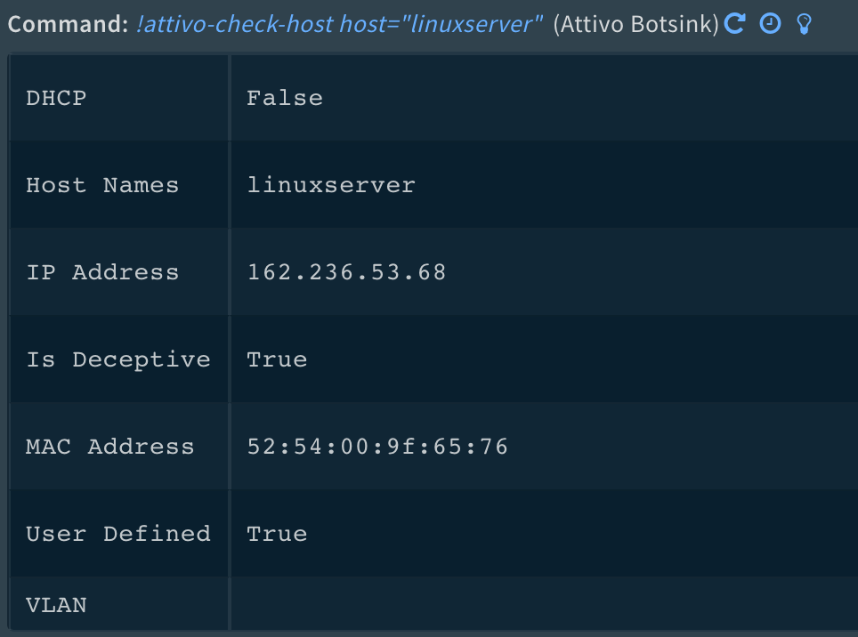
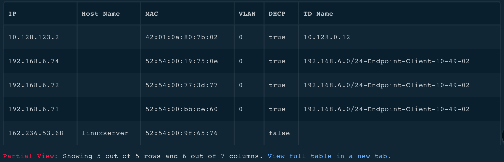
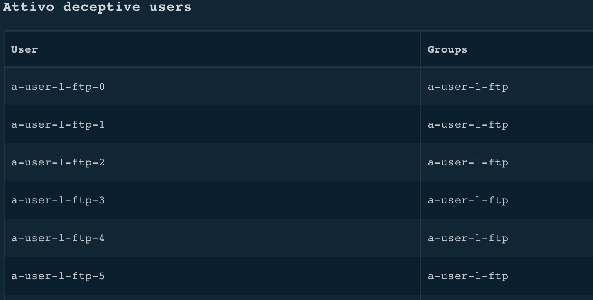

<!-- HTML_DOC -->

Use the Attivo BOTsink integration to pull Attivo events into Cortex XSOAR to initiate investigations, manage deception environments, and to deploy decoy systems.

This integration was tested with version Attivo BOTsink v4.1.1 and v4.1.3.

<h2>Use Cases</h2>
<ul>
<li>Determine if an artifact is part of the deception environment</li>
<li>Dynamically deploy decoy systems</li>
<li>Search for events related to a specific attacker</li>
</ul>
<h2>Configure Attivo Botsink on Cortex XSOAR</h2>
<ol>
<li>Navigate to <strong>Settings</strong> &gt; <strong>Integrations</strong> &gt; <strong>Servers &amp; Services</strong>.</li>
<li>Search for Attivo Botsink.</li>
<li>Click <strong>Add instance</strong> to create and configure a new integration instance. 
<ul>
<li>
<strong>Name</strong>: a textual name for the integration instance.</li>
<li><strong>Botsink name or address</strong></li>
<li><strong>BOTsink API credentials</strong></li>
<li><strong>SSL Verification toggle</strong></li>
<li>
<strong>Minimum severity when fetching events</strong> (Very High, High, Medium)</li>
<li><strong>Fetch incidents toggle</strong></li>
</ul>
</li>
<li>Click <strong>Test</strong> to validate the URLs, token, and connection.</li>
</ol>
<h2>Fetched Incidents Data</h2>

The Attivo BOTsink plugin for Cortex XSOAR can optionally pull Attivo events into Cortex XSOAR to initiate investigations. The <strong>fetch_severity</strong> parameter specifies the lowest severity of event to pull (Very High, High, or Medium).

<h2>Commands</h2>

You can execute these commands from the Cortex XSOAR CLI, as part of an automation, or in a playbook. After you successfully execute a command, a DBot message appears in the War Room with the command details.

<ol>
<li><a href="#h_35091384951544959425609">Verify if a user is part of a deception environment: attivo-check-user</a></li>
<li><a href="#h_751354897601544959429464">Verify if a host is part of the deception environment: attivo-check-host</a></li>
<li><a href="#h_8372857491141544959433947">Run a playbook configured on Attivo BOTsink: attivo-run-playbook</a></li>
<li><a href="#h_365551906321543920724958">Deploy a decoy system on a subnet: attivo-deploy-decoy</a></li>
<li><a href="#h_5165200802171544959442597">Get events for an attacker IP address: attivo-get-events</a></li>
<li><a href="#h_9330372011351545913868554">Get information for playbooks: attivo-list-playbooks</a></li>
<li><a href="#h_5588456511921545913911620">Get information for network decoys: attivo-list-hosts</a></li>
<li><a href="#h_923142110971545913776046">Get a list of all deceptive users: attivo-list-users</a></li>
</ol>
<h3 id="h_35091384951544959425609">1. Verify if a user is part of a deception environment</h3>

Checks whether a user is part of the deceptive environment.

<h5>Base Command</h5>

<code>attivo-check-user</code>

<h5>Input</h5>
<table style="width: 749px;">
<thead>
<tr>
<th style="width: 277px;"><strong>Argument Name</strong></th>
<th style="width: 266px;"><strong>Description</strong></th>
<th style="width: 165px;"><strong>Required</strong></th>
</tr>
</thead>
<tbody>
<tr>
<td style="width: 277px;">user</td>
<td style="width: 266px;">User to validate</td>
<td style="width: 165px;">Required</td>
</tr>
</tbody>
</table>

 

<h5>Context Output</h5>
<table style="width: 748px;">
<thead>
<tr>
<th style="width: 169px;"><strong>Path</strong></th>
<th style="width: 64px;"><strong>Type</strong></th>
<th style="width: 507px;"><strong>Description</strong></th>
</tr>
</thead>
<tbody>
<tr>
<td style="width: 169px;">Attivo.User.IsDeceptive</td>
<td style="width: 64px;">boolean</td>
<td style="width: 507px;">Is the user part of the Deception environment</td>
</tr>
<tr>
<td style="width: 169px;">Attivo.User.Groups</td>
<td style="width: 64px;">unknown</td>
<td style="width: 507px;">If the user is part of the Deception environment, the member is a member of these groups</td>
</tr>
</tbody>
</table>

 

<h5>Command Example</h5>
<pre>!attivo-check-user user="a-user-l-ftp-0"</pre>
<h5>Context Example</h5>
<pre>{
    "Attivo": {
        "User": {
            "IsDeceptive": true, 
            "Groups": [
                "a-user-l-ftp"
            ], 
            "Name": "a-user-l-ftp-0"
        }
    }
}
</pre>
<h5>Human Readable Output</h5>

<h3 id="h_751354897601544959429464">2. Verify if a host is part of a deception environment</h3>

Checks whether a host is part of the deception environment.

<h5>Base Command</h5>

<code>attivo-check-host</code>

<h5>Input</h5>
<table style="width: 747px;">
<thead>
<tr>
<th style="width: 224px;"><strong>Argument Name</strong></th>
<th style="width: 351px;"><strong>Description</strong></th>
<th style="width: 133px;"><strong>Required</strong></th>
</tr>
</thead>
<tbody>
<tr>
<td style="width: 224px;">host</td>
<td style="width: 351px;">Host name or IP address to validate</td>
<td style="width: 133px;">Required</td>
</tr>
</tbody>
</table>

 

<h5>Command Example</h5>
<pre>!attivo-check-host host="linuxserver"</pre>
<h5>Context Example</h5>
<pre>{
    "Attivo": {
        "Host": {
            "IsDeceptive": true, 
            "HostInfo": {
                "name": [
                    "linuxserver"
                ], 
                "ip": "162.236.53.68", 
                "vlan": null, 
                "user_defined": true, 
                "mac": "52:54:00:9f:65:76", 
                "dhcp": false
            }
        }
    }
}
</pre>
<h5>Human Readable Output</h5>

<h3 id="h_8372857491141544959433947">3. Run a playbook configured on Attivo BOTsink</h3>

Run a pre-built Attivo playbook on the BOTsink appliance.

<h5>Base Command</h5>

<code>attivo-run-playbook</code>

<h5>Input</h5>
<table style="width: 747px;">
<thead>
<tr>
<th style="width: 201px;"><strong>Argument Name</strong></th>
<th style="width: 382px;"><strong>Description</strong></th>
<th style="width: 125px;"><strong>Required</strong></th>
</tr>
</thead>
<tbody>
<tr>
<td style="width: 201px;">playbook_name</td>
<td style="width: 382px;">Name of the prebuilt playbook</td>
<td style="width: 125px;">Required</td>
</tr>
<tr>
<td style="width: 201px;">attacker_ip</td>
<td style="width: 382px;">Malicious source IP</td>
<td style="width: 125px;">Required</td>
</tr>
</tbody>
</table>

 

<h5>Context Output</h5>
<table style="width: 747px;">
<thead>
<tr>
<th style="width: 290px;"><strong>Path</strong></th>
<th style="width: 101px;"><strong>Type</strong></th>
<th style="width: 317px;"><strong>Description</strong></th>
</tr>
</thead>
<tbody>
<tr>
<td style="width: 290px;">Attivo.Playbook.Status</td>
<td style="width: 101px;">boolean</td>
<td style="width: 317px;">Was the playbook successful</td>
</tr>
<tr>
<td style="width: 290px;">Attivo.Playbook.Message</td>
<td style="width: 101px;">string</td>
<td style="width: 317px;">Complete status message</td>
</tr>
</tbody>
</table>

 

<h5>Command Example</h5>
<pre>!attivo-run-playbook attacker_ip=172.16.2.20 playbook_name="Endpoint Forensics"
</pre>
<h3 id="h_365551906321543920724958">4. Deploy a decoy system on a subnet</h3>

Deploy a new network decoy

<h5>Base Command</h5>

<code>attivo-deploy-decoy</code>

<h5>Input</h5>
<table style="width: 748px;">
<thead>
<tr>
<th style="width: 176px;"><strong>Argument Name</strong></th>
<th style="width: 456px;"><strong>Description</strong></th>
<th style="width: 108px;"><strong>Required</strong></th>
</tr>
</thead>
<tbody>
<tr>
<td style="width: 176px;">vulnerable_ip</td>
<td style="width: 456px;">Used to determine which subnet to deploy to</td>
<td style="width: 108px;">Required</td>
</tr>
<tr>
<td style="width: 176px;">decoy_number</td>
<td style="width: 456px;">The number of decoys to deploy</td>
<td style="width: 108px;">Optional</td>
</tr>
</tbody>
</table>

 

<h5>Context Output</h5>
<table style="width: 748px;">
<thead>
<tr>
<th style="width: 268px;"><strong>Path</strong></th>
<th style="width: 85px;"><strong>Type</strong></th>
<th style="width: 387px;"><strong>Description</strong></th>
</tr>
</thead>
<tbody>
<tr>
<td style="width: 268px;">Attivo.DeployDecoy.Status</td>
<td style="width: 85px;">boolean</td>
<td style="width: 387px;">Was the network decoy successfully deployed</td>
</tr>
<tr>
<td style="width: 268px;">Attivo.DeployDecoy.Message</td>
<td style="width: 85px;">string</td>
<td style="width: 387px;">Complete status message</td>
</tr>
</tbody>
</table>

 

<h5>Command Example</h5>
<pre>!attivo-deploy-decoy vulnerable_ip=172.16.40.55
</pre>
<h5>Human Readable Output</h5>

1 new Attivo decoy(s) deployed on the subnet with 172.16.40.55

<h3 id="h_5165200802171544959442597">5. Get events for an attacker IP address</h3>

Retrieves events for a specific source IP.

<h5>Base Command</h5>

<code>attivo-get-events</code>

<h5>Input</h5>
<table style="width: 746px;">
<thead>
<tr>
<th style="width: 138px;"><strong>Argument Name</strong></th>
<th style="width: 531px;"><strong>Description</strong></th>
<th style="width: 71px;"><strong>Required</strong></th>
</tr>
</thead>
<tbody>
<tr>
<td style="width: 138px;">attacker_ip</td>
<td style="width: 531px;">Source IP address</td>
<td style="width: 71px;">Required</td>
</tr>
<tr>
<td style="width: 138px;">severity</td>
<td style="width: 531px;">The minimum Attivo severity for the events, default is "Medium"; "VeryHigh", "High", "Medium", "Low", "VeryLow", "SystemActivity"</td>
<td style="width: 71px;">Optional</td>
</tr>
<tr>
<td style="width: 138px;">alerts_start_date</td>
<td style="width: 531px;">Date and time to start looking for events. For example: 2018-12-10 or 2018-12-10T13:59:05Z</td>
<td style="width: 71px;">Optional</td>
</tr>
<tr>
<td style="width: 138px;">alerts_end_date</td>
<td style="width: 531px;">Date and time to stop looking for events.  For example: 2018-12-10 or 2018-12-10T13:59:05Z</td>
<td style="width: 71px;">Optional</td>
</tr>
</tbody>
</table>

 

<h5>Context Output</h5>
<table style="width: 748px;">
<thead>
<tr>
<th style="width: 290px;"><strong>Path</strong></th>
<th style="width: 92px;"><strong>Type</strong></th>
<th style="width: 358px;"><strong>Description</strong></th>
</tr>
</thead>
<tbody>
<tr>
<td style="width: 290px;">Attivo.Events.Count</td>
<td style="width: 92px;">number</td>
<td style="width: 358px;">Total number of events retrieved</td>
</tr>
<tr>
<td style="width: 290px;">Attivo.Events.List.AttackName</td>
<td style="width: 92px;">unknown</td>
<td style="width: 358px;">Short name of the attack</td>
</tr>
<tr>
<td style="width: 290px;">Attivo.Events.List.Attack Phase</td>
<td style="width: 92px;">string</td>
<td style="width: 358px;">Kill chain phase of the attack</td>
</tr>
<tr>
<td style="width: 290px;">Attivo.Events.List.Server</td>
<td style="width: 92px;">string</td>
<td style="width: 358px;">Internal name of the target decoy</td>
</tr>
<tr>
<td style="width: 290px;">Attivo.Events.List.Target</td>
<td style="width: 92px;">string</td>
<td style="width: 358px;">Display name of the target decoy</td>
</tr>
<tr>
<td style="width: 290px;">Attivo.Events.List.TargetOS</td>
<td style="width: 92px;">string</td>
<td style="width: 358px;">Operating system of the target decoy</td>
</tr>
<tr>
<td style="width: 290px;">Attivo.Events.List.Attacker</td>
<td style="width: 92px;">string</td>
<td style="width: 358px;">Attacker IP address</td>
</tr>
<tr>
<td style="width: 290px;">Attivo.Events.List.Service</td>
<td style="width: 92px;">string</td>
<td style="width: 358px;">The attacked service</td>
</tr>
<tr>
<td style="width: 290px;">Attivo.Events.List.Timestamp</td>
<td style="width: 92px;">string</td>
<td style="width: 358px;">Time of the attack</td>
</tr>
<tr>
<td style="width: 290px;">Attivo.Events.List.TargetIP</td>
<td style="width: 92px;">string</td>
<td style="width: 358px;">IP address of the target decoy</td>
</tr>
<tr>
<td style="width: 290px;">Attivo.Events.List.Severity</td>
<td style="width: 92px;">string</td>
<td style="width: 358px;">Attivo severity of the attack</td>
</tr>
</tbody>
</table>

 

<h5>Command Example</h5>
<pre>!attivo-get-events attacker_ip=CentOS70 alerts_start_date=2018-11-30T23:59:05Z alerts_end_date=2018-12-01T00:02:05Z
</pre>
<h5>Context Example</h5>
<pre>{
    "Attivo": {
        "Events": {
            "Count": 2, 
            "List": [
                {
                    "geoip_src_latitude": null, 
                    "Severity": "Medium", 
                    "Service": "DNS SERVER", 
                    "VLAN": null, 
                    "AttackName": "DNS Response", 
                    "TargetIP": "SinkHole", 
                    "AttackPhase": "C&amp;C", 
                    "TargetOS": "CentOS 7.0", 
                    "Timestamp": "2018-12-01T00:01:43.500Z", 
                    "geoip_dest_city_name": null, 
                    "geoip_dest_country_code2": null, 
                    "geoip_dest_country_code3": null, 
                    "Attacker": "CentOS70", 
                    "Device": "0", 
                    "geoip_src_country_code3": null, 
                    "geoip_src_country_code2": null, 
                    "Target": "SinkHole", 
                    "Server": "ZZZ-BServer01", 
                    "geoip_dest_latitude": null, 
                    "geoip_src_country_name": null, 
                    "geoip_src_longitude": null, 
                    "geoip_dest_country_name": null, 
                    "geoip_dest_longitude": null
                }, 
                {
                    "geoip_src_latitude": null, 
                    "Severity": "Medium", 
                    "Service": "DNS SERVER", 
                    "VLAN": null, 
                    "AttackName": "DNS Response", 
                    "TargetIP": "SinkHole", 
                    "AttackPhase": "C&amp;C", 
                    "TargetOS": "CentOS 7.0", 
                    "Timestamp": "2018-12-01T00:01:38.500Z", 
                    "geoip_dest_city_name": null, 
                    "geoip_dest_country_code2": null, 
                    "geoip_dest_country_code3": null, 
                    "Attacker": "CentOS70", 
                    "Device": "0", 
                    "geoip_src_country_code3": null, 
                    "geoip_src_country_code2": null, 
                    "Target": "SinkHole", 
                    "Server": "ZZZ-BServer01", 
                    "geoip_dest_latitude": null, 
                    "geoip_src_country_name": null, 
                    "geoip_src_longitude": null, 
                    "geoip_dest_country_name": null, 
                    "geoip_dest_longitude": null
                }
            ]
        }
    }
}
</pre>
<h3 id="h_9330372011351545913868554">6. Get information for playbooks</h3>

List information about playbooks configured on the Attivo device

<h5>Base Command</h5>

<code>attivo-list-playbooks</code>

<h5>Input</h5>

There are no input arguments for this command.

<h5>Context Output</h5>

There is no context output for this command.

<h3 id="h_5588456511921545913911620">7. Get information for network decoys</h3>

List information about network decoys

<h5>Base Command</h5>

<code>attivo-list-hosts</code>

<h5>Input</h5>

There are no input arguments for this command.

<h5>Context Output</h5>

There is no context output for this command.

<h5>Human Readable Output</h5>

<h3 id="h_923142110971545913776046">8. Get a list of all deceptive users</h3>

Lists all deceptive users.

<h5>Base Command</h5>

<code>attivo-list-users</code>

<h5>Input</h5>

There are no input arguments for this command.

<h5>Context Output</h5>

There is no context output for this command.

<h5>Human Readable Output</h5>

<h2>Known Limitations</h2>

This integration works with the Attivo BOTsink. You can only run the <a href="#h_365551906321543920724958">attivo-deploy-decoy</a> using the physical appliance.
