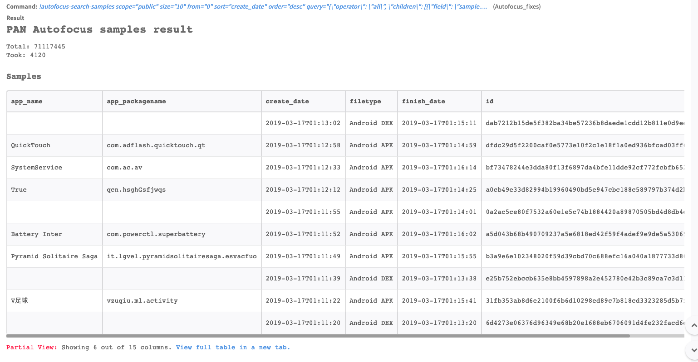
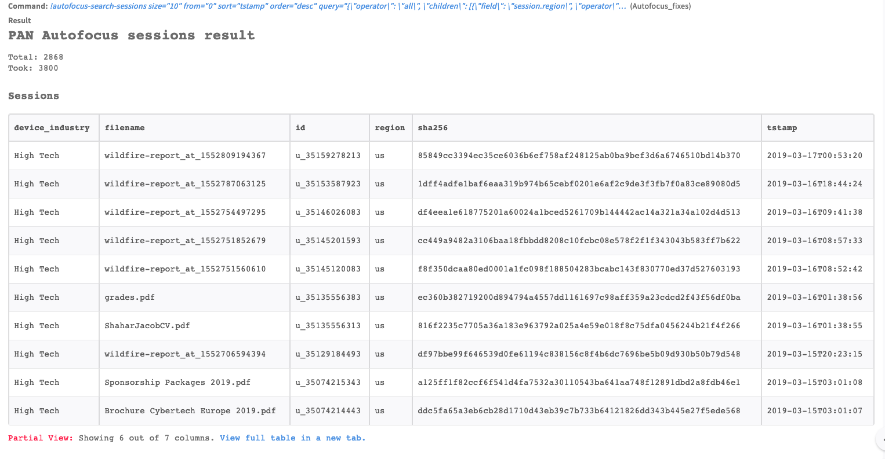
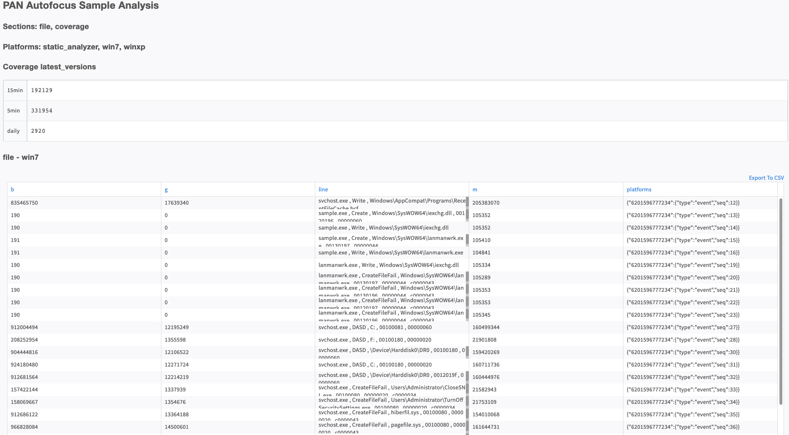
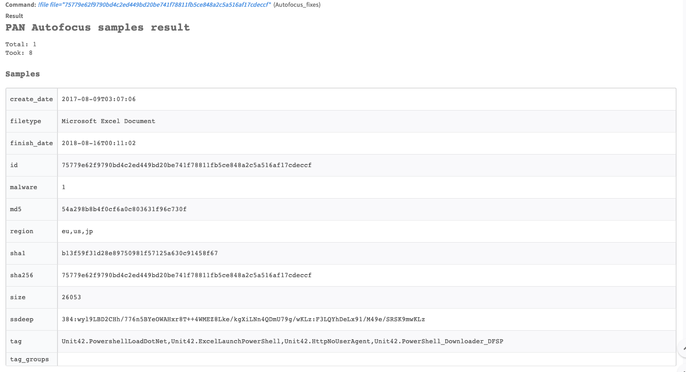

<!-- HTML_DOC -->

AutoFocus contextual threat intelligence brings speed, consistency and precision to threat investigation.

<h2 id="configure-autofocus-on-demisto">Configure Autofocus on Cortex XSOAR</h2>

<ol>
<li>Navigate to <strong>Settings</strong> &gt; <strong>Integrations</strong> &gt; <strong>Servers &amp; Services</strong>.</li>
<li>Search for Autofocus.</li>
<li>Click <strong>Add instance</strong> to create and configure a new integration instance.
<ul>
<li>
<strong>Name</strong>: a textual name for the integration instance.</li>
<li><strong>Server URL</strong></li>
<li><strong>Version</strong></li>
<li><strong>API Key</strong></li>
<li><strong>Use system proxy settings</strong></li>
<li><strong>Trust any certificate (not secure)</strong></li>
</ul>
</li>
<li>Click <strong>Test</strong> to validate the URLs, token, and connection.</li>
</ol>

<h2 id="commands">Commands</h2>

You can execute these commands from the Cortex XSOAR CLI, as part of an automation, or in a playbook.  After you successfully execute a command, a DBot message appears in the War Room with the command details.

<ol>
<li><a href="#search-for-samples" target="_self">Search for samples: autofocus-search-samples</a></li>
<li><a href="#search-for-sessions" target="_self">Search for sessions: autofocus-search-sessions</a></li>
<li><a href="#get-details-of-a-session" target="_self">Get details of a session: autofocus-session</a></li>
<li><a href="#get-a-sample-analysis" target="_self">Get a sample analysis: autofocus-sample-analysis</a></li>
<li><a href="#get-the-reputation-of-a-file" target="_self">Get the reputation of a file: file</a></li>
</ol>

<h3 id="search-for-samples">1. Search for samples</h3>

Search for samples in Palo Alto Networks AutoFocus.

<h5 id="base-command">Base Command</h5>

<code>autofocus-search-samples</code>

<h5 id="input">Input</h5>

<table style="width: 749px;">
<thead>
<tr>
<th style="width: 182px;"><strong>Argument Name</strong></th>
<th style="width: 463px;"><strong>Description</strong></th>
<th style="width: 95px;"><strong>Required</strong></th>
</tr>
</thead>
<tbody>
<tr>
<td style="width: 182px;">scope</td>
<td style="width: 463px;">The scope for the search</td>
<td style="width: 95px;">Optional</td>
</tr>
<tr>
<td style="width: 182px;">size</td>
<td style="width: 463px;">Number of results</td>
<td style="width: 95px;">Optional</td>
</tr>
<tr>
<td style="width: 182px;">from</td>
<td style="width: 463px;">Sample number to start from</td>
<td style="width: 95px;">Optional</td>
</tr>
<tr>
<td style="width: 182px;">sort</td>
<td style="width: 463px;">Sort field</td>
<td style="width: 95px;">Optional</td>
</tr>
<tr>
<td style="width: 182px;">order</td>
<td style="width: 463px;">Order of sort</td>
<td style="width: 95px;">Optional</td>
</tr>
<tr>
<td style="width: 182px;">query</td>
<td style="width: 463px;">The query to retrieve samples</td>
<td style="width: 95px;">Required</td>
</tr>
<tr>
<td style="width: 182px;">sleep</td>
<td style="width: 463px;">Time to sleep between checking for results</td>
<td style="width: 95px;">Optional</td>
</tr>
<tr>
<td style="width: 182px;">checks</td>
<td style="width: 463px;">Number of checks before giving up on the query</td>
<td style="width: 95px;">Optional</td>
</tr>
<tr>
<td style="width: 182px;">cookie</td>
<td style="width: 463px;">The af_cookie for retrieving previous search results</td>
<td style="width: 95px;">Optional</td>
</tr>
</tbody>
</table>

 

<h5 id="context-output">Context Output</h5>

<table style="width: 749px;">
<thead>
<tr>
<th style="width: 334px;"><strong>Path</strong></th>
<th style="width: 74px;"><strong>Type</strong></th>
<th style="width: 332px;"><strong>Description</strong></th>
</tr>
</thead>
<tbody>
<tr>
<td style="width: 334px;">Autofocus.Cookie</td>
<td style="width: 74px;">string</td>
<td style="width: 332px;">The cookie for the results</td>
</tr>
<tr>
<td style="width: 334px;">Autofocus.Samples.id</td>
<td style="width: 74px;">string</td>
<td style="width: 332px;">The ID of the sample.</td>
</tr>
<tr>
<td style="width: 334px;">Autofocus.Samples.md5</td>
<td style="width: 74px;">string</td>
<td style="width: 332px;">The MD5 hash of the sample.</td>
</tr>
<tr>
<td style="width: 334px;">Autofocus.Samples.sha1</td>
<td style="width: 74px;">string</td>
<td style="width: 332px;">The SHA-1 of the sample.</td>
</tr>
<tr>
<td style="width: 334px;">Autofocus.Samples.sha256</td>
<td style="width: 74px;">string</td>
<td style="width: 332px;">The SHA-256 of the sample.</td>
</tr>
<tr>
<td style="width: 334px;">Autofocus.Samples.app_name</td>
<td style="width: 74px;">string</td>
<td style="width: 332px;">The application name (if exists).</td>
</tr>
<tr>
<td style="width: 334px;">Autofocus.Samples.size</td>
<td style="width: 74px;">number</td>
<td style="width: 332px;">The size of the sample.</td>
</tr>
<tr>
<td style="width: 334px;">Autofocus.Samples.ssdeep</td>
<td style="width: 74px;">string</td>
<td style="width: 332px;">The SSDeep of the sample.</td>
</tr>
<tr>
<td style="width: 334px;">Autofocus.Samples.create_date</td>
<td style="width: 74px;">string</td>
<td style="width: 332px;">The create date for the sample.</td>
</tr>
<tr>
<td style="width: 334px;">Autofocus.Samples.finish_date</td>
<td style="width: 74px;">string</td>
<td style="width: 332px;">The finish date for the sample.</td>
</tr>
<tr>
<td style="width: 334px;">Autofocus.Samples.malware</td>
<td style="width: 74px;">string</td>
<td style="width: 332px;">Is this malware (0 or 1).</td>
</tr>
<tr>
<td style="width: 334px;">Autofocus.Samples.app_packagename</td>
<td style="width: 74px;">string</td>
<td style="width: 332px;">The sample package name (if exists).</td>
</tr>
<tr>
<td style="width: 334px;">Autofocus.Samples.filetype</td>
<td style="width: 74px;">string</td>
<td style="width: 332px;">The sample type.</td>
</tr>
<tr>
<td style="width: 334px;">Autofocus.Samples.region</td>
<td style="width: 74px;">number</td>
<td style="width: 332px;">Where this sample was seen.</td>
</tr>
<tr>
<td style="width: 334px;">Autofocus.Samples.tag</td>
<td style="width: 74px;">string</td>
<td style="width: 332px;">The tags of the sample.</td>
</tr>
</tbody>
</table>

 

<h5 id="command-example">Command Example</h5>

<code>!autofocus-search-samples scope="public" size="10" sort="create_date" order="desc" query="{\"operator\": \"all\", \"children\": [{\"field\": \"sample.malware\", \"operator\": \"is\", \"value\": 1}]}"</code>

<h5 id="human-readable-output">Human Readable Output</h5>

<h3 id="search-for-sessions">2. Search for sessions</h3>

Search for sessions in Palo Alto Networks AutoFocus.

<h5 id="base-command-1">Base Command</h5>

<code>autofocus-search-sessions</code>

<h5 id="input-1">Input</h5>

<table style="width: 749px;">
<thead>
<tr>
<th style="width: 178px;"><strong>Argument Name</strong></th>
<th style="width: 468px;"><strong>Description</strong></th>
<th style="width: 94px;"><strong>Required</strong></th>
</tr>
</thead>
<tbody>
<tr>
<td style="width: 178px;">size</td>
<td style="width: 468px;">The number of results to return.</td>
<td style="width: 94px;">Optional</td>
</tr>
<tr>
<td style="width: 178px;">from</td>
<td style="width: 468px;">The sample number to start from.</td>
<td style="width: 94px;">Optional</td>
</tr>
<tr>
<td style="width: 178px;">sort</td>
<td style="width: 468px;">The sort field.</td>
<td style="width: 94px;">Optional</td>
</tr>
<tr>
<td style="width: 178px;">order</td>
<td style="width: 468px;">The sort order.</td>
<td style="width: 94px;">Optional</td>
</tr>
<tr>
<td style="width: 178px;">query</td>
<td style="width: 468px;">The query to retrieve samples.</td>
<td style="width: 94px;">Required</td>
</tr>
<tr>
<td style="width: 178px;">sleep</td>
<td style="width: 468px;">The time to sleep between checking for results.</td>
<td style="width: 94px;">Optional</td>
</tr>
<tr>
<td style="width: 178px;">checks</td>
<td style="width: 468px;">The number of checks before stopping the query.</td>
<td style="width: 94px;">Optional</td>
</tr>
<tr>
<td style="width: 178px;">cookie</td>
<td style="width: 468px;">The <em>af_cookie</em> for retrieving previous search results.</td>
<td style="width: 94px;">Optional</td>
</tr>
</tbody>
</table>

 

<h5 id="context-output-1">Context Output</h5>

<table style="width: 749px;">
<thead>
<tr>
<th style="width: 358px;"><strong>Path</strong></th>
<th style="width: 64px;"><strong>Type</strong></th>
<th style="width: 318px;"><strong>Description</strong></th>
</tr>
</thead>
<tbody>
<tr>
<td style="width: 358px;">Autofocus.Cookie</td>
<td style="width: 64px;">string</td>
<td style="width: 318px;">The cookie for the results.</td>
</tr>
<tr>
<td style="width: 358px;">Autofocus.Sessions.id</td>
<td style="width: 64px;">string</td>
<td style="width: 318px;">The ID of the session.</td>
</tr>
<tr>
<td style="width: 358px;">Autofocus.Sessions.device_industry</td>
<td style="width: 64px;">string</td>
<td style="width: 318px;">The device industry.</td>
</tr>
<tr>
<td style="width: 358px;">Autofocus.Sessions.filename</td>
<td style="width: 64px;">string</td>
<td style="width: 318px;">The name of the file.</td>
</tr>
<tr>
<td style="width: 358px;">Autofocus.Sessions.region</td>
<td style="width: 64px;">string</td>
<td style="width: 318px;">The region for the session.</td>
</tr>
<tr>
<td style="width: 358px;">Autofocus.Sessions.sha256</td>
<td style="width: 64px;">string</td>
<td style="width: 318px;">The SHA-256 of the file.</td>
</tr>
<tr>
<td style="width: 358px;">Autofocus.Sessions.tstamp</td>
<td style="width: 64px;">string</td>
<td style="width: 318px;">The timestamp for the session.</td>
</tr>
<tr>
<td style="width: 358px;">Autofocus.Sessions.upload_src</td>
<td style="width: 64px;">string</td>
<td style="width: 318px;">Where did we get the file</td>
</tr>
</tbody>
</table>

 

<h5 id="command-example-1">Command Example</h5>

<code>!autofocus-search-sessions size="10" sort="tstamp" order="desc" query="{\"operator\": \"all\", \"children\": [{\"field\": \"session.region\", \"operator\": \"is\", \"value\": \"us\"}]}"</code>

<h5 id="human-readable-output-1">Human Readable Output</h5>

<h3 id="get-details-of-a-session">3. Get details of a session</h3>

Returns details of a specific session.

<h5 id="base-command-2">Base Command</h5>

<code>autofocus-session</code>

<h5 id="input-2">Input</h5>

<table style="width: 749px;">
<thead>
<tr>
<th style="width: 223px;"><strong>Argument Name</strong></th>
<th style="width: 401px;"><strong>Description</strong></th>
<th style="width: 116px;"><strong>Required</strong></th>
</tr>
</thead>
<tbody>
<tr>
<td style="width: 223px;">id</td>
<td style="width: 401px;">The session ID to retrieve details for.</td>
<td style="width: 116px;">Required</td>
</tr>
</tbody>
</table>

 

<h5 id="context-output-2">Context Output</h5>

<table style="width: 749px;">
<thead>
<tr>
<th style="width: 374px;"><strong>Path</strong></th>
<th style="width: 72px;"><strong>Type</strong></th>
<th style="width: 294px;"><strong>Description</strong></th>
</tr>
</thead>
<tbody>
<tr>
<td style="width: 374px;">Autofocus.Sessions.id</td>
<td style="width: 72px;">string</td>
<td style="width: 294px;">The ID of the session.</td>
</tr>
<tr>
<td style="width: 374px;">Autofocus.Sessions.device_industry</td>
<td style="width: 72px;">string</td>
<td style="width: 294px;">The device industry.</td>
</tr>
<tr>
<td style="width: 374px;">Autofocus.Sessions.filename</td>
<td style="width: 72px;">string</td>
<td style="width: 294px;">The name of the file.</td>
</tr>
<tr>
<td style="width: 374px;">Autofocus.Sessions.region</td>
<td style="width: 72px;">string</td>
<td style="width: 294px;">The region for the session.</td>
</tr>
<tr>
<td style="width: 374px;">Autofocus.Sessions.sha256</td>
<td style="width: 72px;">string</td>
<td style="width: 294px;">The SHA-256 of the file.</td>
</tr>
<tr>
<td style="width: 374px;">Autofocus.Sessions.tstamp</td>
<td style="width: 72px;">string</td>
<td style="width: 294px;">The timestamp for session.</td>
</tr>
<tr>
<td style="width: 374px;">Autofocus.Sessions.upload_src</td>
<td style="width: 72px;">string</td>
<td style="width: 294px;">The origin of the file.</td>
</tr>
</tbody>
</table>

 

<h3 id="get-a-sample-analysis">4. Get a sample analysis</h3>

Retrieves the sample analysis.

<h5 id="base-command-3">Base Command</h5>

<code>autofocus-sample-analysis</code>

<h5 id="input-3">Input</h5>

<table style="width: 749px;">
<thead>
<tr>
<th style="width: 131px;"><strong>Argument Name</strong></th>
<th style="width: 538px;"><strong>Description</strong></th>
<th style="width: 71px;"><strong>Required</strong></th>
</tr>
</thead>
<tbody>
<tr>
<td style="width: 131px;">id</td>
<td style="width: 538px;">The ID of the sample.</td>
<td style="width: 71px;">Required</td>
</tr>
<tr>
<td style="width: 131px;">coverage</td>
<td style="width: 538px;">Whether coverage should be displayed.</td>
<td style="width: 71px;">Optional</td>
</tr>
<tr>
<td style="width: 131px;">sections</td>
<td style="width: 538px;">A CSV list of sections to display: apk_app_icon, apk_app_name, apk_cert_file, apk_certificate_id, apk_defined_activity, apk_defined_intent_filter, apk_defined_receiver, apk_defined_sensor, apk_defined_service, apk_digital_signer, apk_embedded_library, apk_embeded_url, apk_internal_file, apk_isrepackaged, apk_packagename, apk_requested_permission, apk_sensitive_api_call, apk_suspicious_behavior, apk_suspicious_file, apk_suspicious_pattern, apk_suspicious_action_monitored, apk_suspicious_file, apk_suspicious_string, apk_version_num, behavior_type, connection, coverage, dns, file, http, japi, mac_embedded_url, misc, mutex, process, registry, service, user_agent</td>
<td style="width: 71px;">Optional</td>
</tr>
<tr>
<td style="width: 131px;">platforms</td>
<td style="width: 538px;">A CSV list of platforms: win7, winxp, android, staticAnalyzer, mac</td>
<td style="width: 71px;">Optional</td>
</tr>
</tbody>
</table>

 

<h5 id="context-output-3">Context Output</h5>

There is no context output for this command.

<h5 id="command-example-2">Command Example</h5>

<code>!autofocus-sample-analysis id="7ebf30b8f908ce574fda70af1f94ebcb071c2e5f0e22f2ec349a2290f243a036" coverage=true sections=file</code>

<h5 id="human-readable-output-2">Human Readable Output</h5>

<h3 id="get-the-reputation-of-a-file">5. Get the reputation of a file</h3>

Checks the file reputation of the given hash.

<h5 id="base-command-4">Base Command</h5>

<code>file</code>

<h5 id="input-4">Input</h5>

<table style="width: 749px;">
<thead>
<tr>
<th style="width: 146px;"><strong>Argument Name</strong></th>
<th style="width: 515px;"><strong>Description</strong></th>
<th style="width: 79px;"><strong>Required</strong></th>
</tr>
</thead>
<tbody>
<tr>
<td style="width: 146px;">file</td>
<td style="width: 515px;">The hash of the file to query. Supports MD5, SHA-1, and SHA-256.</td>
<td style="width: 79px;">Required</td>
</tr>
</tbody>
</table>

 

<h5 id="context-output-4">Context Output</h5>

<table style="width: 749px;">
<thead>
<tr>
<th style="width: 197px;"><strong>Path</strong></th>
<th style="width: 49px;"><strong>Type</strong></th>
<th style="width: 494px;"><strong>Description</strong></th>
</tr>
</thead>
<tbody>
<tr>
<td style="width: 197px;">File.MD5</td>
<td style="width: 49px;">string</td>
<td style="width: 494px;">The MD5 hash of the file.</td>
</tr>
<tr>
<td style="width: 197px;">File.SHA1</td>
<td style="width: 49px;">string</td>
<td style="width: 494px;">The SHA-1 hash of the file.</td>
</tr>
<tr>
<td style="width: 197px;">File.SHA256</td>
<td style="width: 49px;">string</td>
<td style="width: 494px;">The SHA-256 hash of the file.</td>
</tr>
<tr>
<td style="width: 197px;">File.Malicious.Vendor</td>
<td style="width: 49px;">string</td>
<td style="width: 494px;">For malicious files, the vendor that made the decision.</td>
</tr>
<tr>
<td style="width: 197px;">File.Malicious.Description</td>
<td style="width: 49px;">string</td>
<td style="width: 494px;">For malicious files, the reason that the vendor made the decision.</td>
</tr>
<tr>
<td style="width: 197px;">DBotScore.Indicator</td>
<td style="width: 49px;">string</td>
<td style="width: 494px;">The indicator that was tested.</td>
</tr>
<tr>
<td style="width: 197px;">DBotScore.Type</td>
<td style="width: 49px;">string</td>
<td style="width: 494px;">The indicator type.</td>
</tr>
<tr>
<td style="width: 197px;">DBotScore.Vendor</td>
<td style="width: 49px;">string</td>
<td style="width: 494px;">The vendor used to calculate the score.</td>
</tr>
<tr>
<td style="width: 197px;">DBotScore.Score</td>
<td style="width: 49px;">number</td>
<td style="width: 494px;">The actual score.</td>
</tr>
<tr>
<td style="width: 197px;">DBotScore.Description</td>
<td style="width: 49px;">string</td>
<td style="width: 494px;">The reason for the score (if any).</td>
</tr>
</tbody>
</table>

 

<h5 id="command-example-3">Command Example</h5>

<code>!file file="75779e62f9790bd4c2ed449bd20be741f78811fb5ce848a2c5a516af17cdeccf" using-brand="Autofocus"</code>

<h5 id="human-readable-output-3">Human Readable Output</h5>

