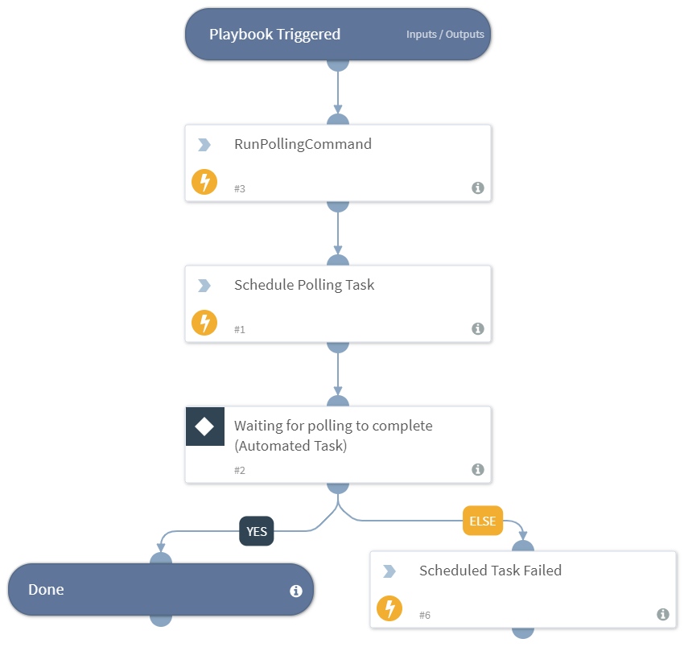

Queries the PANW Autofocus Threat Intelligence System. This sub-playbook is the same as the generic polling sub-playbook besides that it provides outputs in the playbook. The reason for that is that in Autofocus its impossible to query the results of the same query more than once so the outputs have to be in the polling context.

This playbook implements polling by continuously running the command in Step #2 until the operation completes.
The remote action should have the following structure:

1. Initiate the operation.
2. Poll to check if the operation completed.
3. (optional) Get the results of the operation.

## Dependencies
This playbook uses the following sub-playbooks, integrations, and scripts.

## Sub-playbooks
This playbook does not use any sub-playbooks.

## Integrations
This playbook does not use any integrations.

## Scripts
* PrintErrorEntry
* RunPollingCommand
* ScheduleGenericPolling

## Commands
This playbook does not use any commands.

## Playbook Inputs
---

| **Name** | **Description** | **Default Value** | **Required** |
| --- | --- | --- | --- | 
| Ids | The list of IDs to poll. | - | Required |
| PollingCommandName | The name of the polling command to run. | - | Required |
| PollingCommandArgName | The argument name of the polling command. | ids | Required |
| Interval | The frequency that the polling command will run (in minutes). | 1 | Required |
| Timeout | The amount of time to poll before declaring a timeout and resuming the playbook (in minutes). | 10 | Required |
| dt | The DT filter for polling IDs. Polling will stop when no results are returned. Use single quotes. For example, `WildFire.Report(val.Status!==''Success'').SHA256`. | - |Required |
| AdditionalPollingCommandArgNames | The Names of additional arguments for the polling command. For example, "arg1,arg2,...". | - | Optional |
| AdditionalPollingCommandArgValues | The values of the additional arguments for the polling command. For example, "value1,value2,...". | - | Optional |

## Playbook Outputs
---

| **Path** | **Description** | **Type** |
| --- | --- | --- |
| AutoFocus.SessionsResults | The results of Autofocus sessions search. | string |
| AutoFocus.SamplesResults | The results of Autofocus sample search. | string |
| AutoFocus.TopTagResults | The results of Autofocus tags search. | string |

<!-- Playbook PNG image comes here -->
## Playbook Image
---

