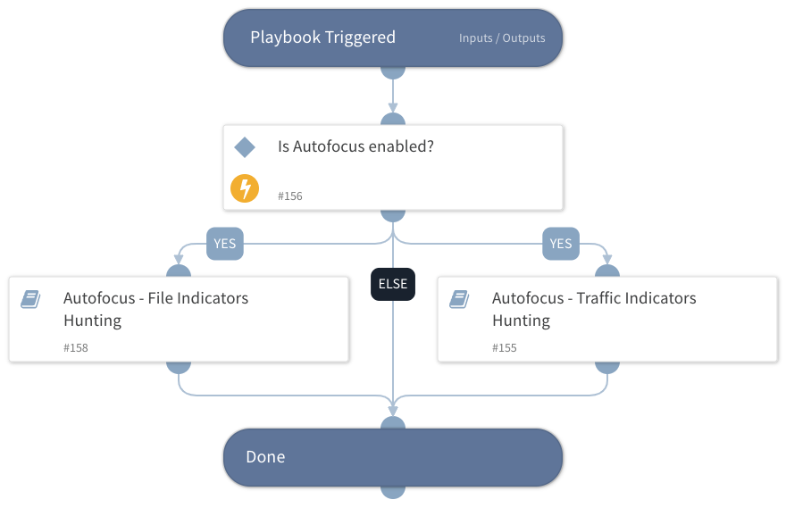

The playbook queries the PANW Autofocus session and samples log data for file and traffic indicators, such as SHA256, SHA1, MD5, IP addresses, URLs, and domains. 

A simple search mode queries Autofocus based on the indicators specified in the playbook inputs. Advanced queries can also use with multiple query parameters, but require all field names, parameters, and operators (JSON format) to be specified. 
We recommended using the Autofocus UI to create an advanced query, exporting it, and pasting it into the relevant playbook inputs. 

Note that multiple search values should be separated by commas only (without spaces or any special characters).

## Dependencies
This playbook uses the following sub-playbooks, integrations, and scripts.

### Sub-playbooks
* Autofocus - File Indicators Hunting
* Autofocus - Traffic Indicators Hunting

### Integrations
This playbook does not use any integrations.

### Scripts
* IsIntegrationAvailable

### Commands
This playbook does not use any commands.

## Playbook Inputs
---

| **Name** | **Description** | **Default Value** | **Required** |
| --- | --- | --- | --- |
| IPAddress | One or more IP addresses to search for in Autofocus simple mode search.  Separate multiple search values by commas only \(without spaces or any special characters\). |  | Optional |
| URLDomain | One or more URLs and/or domains to search for in Autofocus simple mode search.  Separate multiple search values by commas only \(without spaces or any special characters\). |  | Optional |
| MD5 | One or more MD5 file hashes to search for in Autofocus simple mode search.  Separate multiple search values by commas only \(without spaces or any special characters\). |  | Optional |
| SHA256 | One or more SHA256 file hashes to search for in Autofocus simple mode search.  Separate multiple search values by commas only \(without spaces or any special characters\). |  | Optional |
| SHA1 | One or more SHA1 file hashes to search for in Autofocus simple mode search.  Separate multiple search values by commas only \(without spaces or any special characters\). |  | Optional |
| Search Type | Which Autofocus search types should be executed.   Possible values are session, sample, tag, or all. Session and sample are the recommended search types for this playbook.   Sample-based search detects threat indicators or identifiers within samples sent to WildFire for analysis.   Session-based search detects threat indicators or identifiers within various context details and session data provided by samples during sample submission.   Tag-based search identifies the most popular tags. |  | Required |
| Scope | Search scope for sample and session. Possible values are industry, organization, global, or all. |  | Required |
| SampleQuery | Use the Autofocus advanced search mode to leverage a variety of query options within a sample search. Advanced search requires you to specify all field names, parameters, and operators.  The query currently supports only JSON format which can be extracted from the Autofocus web console API radio button. |  | Optional |
| Sample first seen | Narrow down a sample-based search by specifying the timestamp samples were first uploaded to WildFire for analysis \(indicators will be searched within samples after this timestamp\).  Specify the time in ISO 8601 format, for example, 2019-09-12T00:00:00. |  | Optional |
| Sample last modified | Narrow down a sample-based search by specifying the timestamp samples were last modified \(indicators will be searched within samples after this timestamp\).  Specify the time in ISO 8601 format, for example, 2019-09-12T00:00:00. |  | Optional |
| SessionQuery | Use the Autofocus advanced search mode to leverage a variety of query options within a session search. Advanced search requires you to specify all field names, parameters, and operators.  The query currently supports only JSON format which can be extracted from the Autofocus web console API radio button. |  | Optional |
| Sessions time before | Narrow down a session-based search by specifying the query end timestamp \(indicators will be searched within sessions before this timestamp\).  Specify the time in ISO 8601 format, for example, 2019-09-12T00:00:00. |  | Optional |
| Sessions time after | Narrow down a session-based search by specifying the query start timestamp \(indicators will be searched within sessions after this timestamp\).  Specify the time in ISO 8601 format, for example, 2019-09-12T00:00:00. |  | Optional |
| Wildfire Verdict | Filter results by WildFire classification assigned to samples based on properties, behaviors, and activities observed for files or email links during static and dynamic analysis.  Possible values are malware, benign, phishing, and greyware.  |  | Optional |

## Playbook Outputs
---

| **Path** | **Description** | **Type** |
| --- | --- | --- |
| Autofocus.Samples.HuntingResults | Sample objects containing relevant fields. | string |
| Autofocus.Samples.HuntingResults.Created | The date the file was created. | date |
| Autofocus.Samples.HuntingResults.Finished | The date the file was finished. | date |
| Autofocus.Samples.HuntingResults.FileName | The name of the file. | string |
| Autofocus.Samples.HuntingResults.FileType | The file type. | string |
| Autofocus.Samples.HuntingResults.SHA1 | The SHA1 hash of the file. | string |
| Autofocus.Samples.HuntingResults.SHA256 | The SHA256 hash of the file. | string |
| Autofocus.Samples.HuntingResults.MD5 | The MD5 hash of the file. | string |
| Autofocus.Samples.HuntingResults.Region | The region of the sample. | string |
| Autofocus.Samples.HuntingResults.Tags | The tags attached to the sample. | string |
| Autofocus.Samples.HuntingResults.TagGroups | The groups of relevant tags. | string |
| Autofocus.Samples.HuntingResults.Verdict | The verdict of the sample. | number |
| Autofocus.Samples.HuntingResults.Artifact.confidence | The decision confidence. | string |
| Autofocus.Samples.HuntingResults.Artifact.indicator | The indicator that was tested. | string |
| Autofocus.Samples.HuntingResults.Artifact.indicator_type | The indicator type, for example: Mutex, User agent, IPv4, Domain. | string |
| Autofocus.Samples.HuntingResults.Artifact.b | How many set the artifact as benign. | string |
| Autofocus.Samples.HuntingResults.Artifact.g | How many set the artifact as grayware. | string |
| Autofocus.Samples.HuntingResults.Artifact.m | How many set the artifact as malicious. | string |
| Autofocus.Sessions.HuntingResults | Session objects containing relevant fields. | string |
| Autofocus.Sessions.HuntingResults.Seen | The seen date. | date |
| Autofocus.Sessions.HuntingResults.UploadSource | The source of the uploaded sample. | string |
| Autofocus.Sessions.HuntingResults.ID | The ID of the session. Used to get session details. | string |
| Autofocus.Sessions.HuntingResults.FileName | The name of the file. | string |
| Autofocus.Sessions.HuntingResults.FileURL | The URL of the file. | string |
| Autofocus.Sessions.HuntingResults.SHA256 | The SHA256 hash of the file. | string |
| Autofocus.Sessions.HuntingResults.Industry | The related industry. | string |
| Autofocus.Sessions.HuntingResults.Region | The regions of the sessions. | string |
| Autofocus.Sessions.HuntingResults.Tags | The relevant tags. | string |
| Autofocus.Sessions.HuntingResults.app | The associated application name. | string |
| Autofocus.Sessions.HuntingResults.dst_ip | The associated destination IP. | string |
| Autofocus.Sessions.HuntingResults.src_ip | The associated source IP. | string |
| Autofocus.Sessions.HuntingResults.dst_countrycode | The associated destination country code. | string |
| Autofocus.Sessions.HuntingResults.src_countrycode | The associated source country code. | string |
| Autofocus.Sessions.HuntingResults.dst_port | The associated destination port number. | number |
| Autofocus.Sessions.HuntingResults.src_port | The associated source port number. | number |
| Autofocus.Sessions.HuntingResults.user_id | The recipient user ID. | string |

## Playbook Image
---
