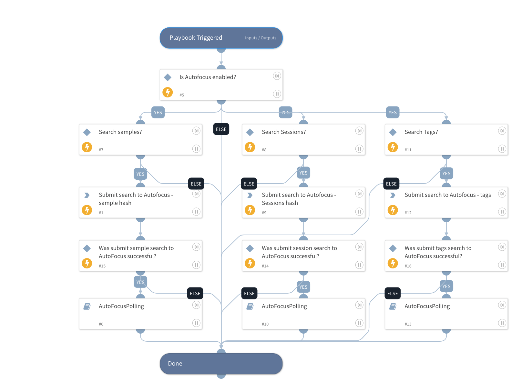

This playbook is used for querying the PANW threat intelligence Autofocus system. The playbook accepts indicators such as IP's, hashes, domains to run basic queries or mode advanced queries that can leverage several query parameters. In order to run the more advanced queries its recommended to use the Autofocus UI https://autofocus.paloaltonetworks.com/#/dashboard/organization to created a query and than use the export search button. The result can be used as a playbook input.

The playbook supports searching both the Samples API and the sessions API.

## Dependencies
This playbook uses the following sub-playbooks, integrations, and scripts.

### Sub-playbooks
* AutoFocusPolling

### Integrations
* Autofocus
* AutofocusV2

### Scripts
This playbook does not use any scripts.

### Commands
* autofocus-search-sessions
* autofocus-top-tags-search
* autofocus-search-samples

## Playbook Inputs
---

| **Name** | **Description** | **Default Value** | **Required** |
| --- | --- | --- | --- |
| Scope | Scope can be Private Public Global |  | Optional |
| SampleQuery | Query needs to be provided in order to determine what to search for. Query is currently only in JSON format which can be extracted from the Autofocus web console API radio button.  Query example for searching hashes can be  \{"operator":"any","children":\[\{"field":"sample.sha256","operator":"is","value":"4f79697b40d0932e91105bd496908f8e02c130a0e36f6d3434d6243e79ef82e0"\},\{"field":"sample.sha256","operator":"is","value":"7e93723c0c34ef98444e5ce9013fef220975b96291a79053fd4c9b3d3550aeb3"\}\]\}  Another example for searching for an IP \{"operator":"any","children":\[\{"field":"sample.src_ip","operator":"is","value":"1.1.1.1"\},\{"field":"sample.dst_ip","operator":"is","value":"1.1.1.1"\},\{"field":"sample.src_ip","operator":"is","value":"2.2.2.2"\},\{"field":"sample.dst_ip","operator":"is","value":"2.2.2.2"\}\]\}  |  | Optional |
| SessionQuery | Query needs to be provided in order to determine what to search for. Query is currently only in JSON format which can be extracted from the Autofocus web console API radio button.  Query example for searching hashes can be  \{"operator":"any","children":\[\{"field":"session.sha256","operator":"is","value":"4f79697b40d0932e91105bd496908f8e02c130a0e36f6d3434d6243e79ef82e0"\},\{"field":"session.sha256","operator":"is","value":"7e93723c0c34ef98444e5ce9013fef220975b96291a79053fd4c9b3d3550aeb3"\}\]\}  Another example for searching for an IP \{"operator":"any","children":\[\{"field":"session.src_ip","operator":"is","value":"1.1.1.1"\},\{"field":"session.dst_ip","operator":"is","value":"1.1.1.1"\},\{"field":"session.src_ip","operator":"is","value":"2.2.2.2"\},\{"field":"session.dst_ip","operator":"is","value":"2.2.2.2"\}\]\}  |  | Optional |
| IP | IP to query |  | Optional |
| Hash | Hash to query |  | Optional |
| URL | URL to query |  | Optional |
| Domain | Domain to query |  | Optional |
| Search Type | Values can be session, sample, tag,all  |  | Required |
| Wildfire Verdict | Values can be Malware,Benign,Phishing,Greyware |  | Optional |
| Sessions time before | Timestamp in the following format 2019-09-12T00:00:00 This parameter checks for sessions prior to this timestamp |  | Optional |
| Sessions time after | Timestamp in the following format 2019-09-12T00:00:00 This parameter checks for sessions after this timestamp |  | Optional |
| Sample first seen | Timestamp in the following format 2019-09-12T00:00:00 This parameter checks for when the sample was first seen after this date. |  | Optional |
| Sample last modified | Timestamp in the following format 2019-09-12T00:00:00 This parameter checks for when the sample was last modified after this date. |  | Optional |
| Tags scope | Values can be industry, organization, all, global. |  | Optional |
| Tags class | Values can be Actor, Campaign, Exploit, Malicious Behavior, Malware Family |  | Optional |
| Tags private | Values can be True, False. If true the search will only focus on private \(non public\) objects. Default is false |  | Optional |
| Tags public | Values can be True, False. If true the search will only focus on public \(non private\) objects. Default is false. |  | Optional |
| Commodity | Values can be True, False. Default is false. |  | Optional |
| Unit 42 | Values can be True, False. Default is false objects that have been analyzed by Palo Alto's Unit 42 global threat intelligence team. |  | Optional |

## Playbook Outputs
---

| **Path** | **Description** | **Type** |
| --- | --- | --- |
| AutoFocus.SessionsResults | Results of Autofocus sessions search. | string |
| AutoFocus.SamplesResults | Results of Autofocus samples search. | string |
| AutoFocus.TopTagResults | Results of Autofocus tags search. | string |

## Playbook Image
---
