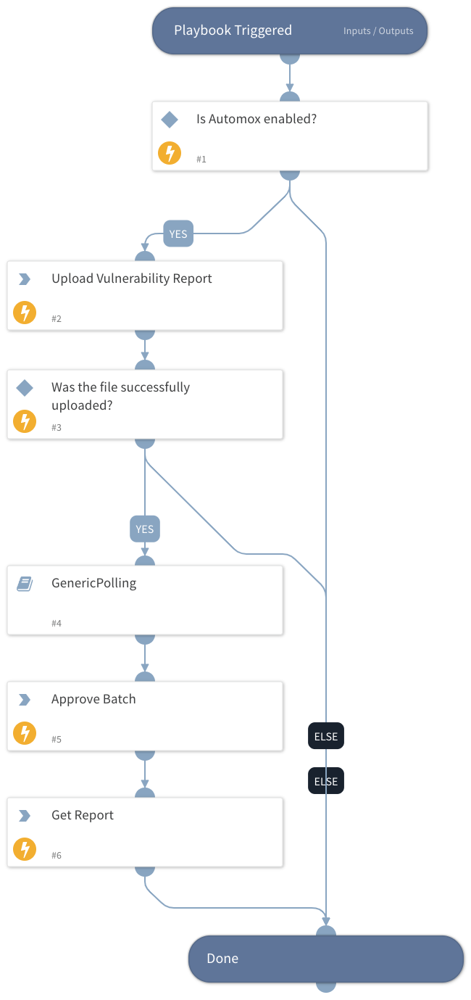

This sub-playbook takes the entryId of a vendor-generated vulnerability report CSV and uploads it to Automox for remediation.

Information about supported CSV formats can be found in the [Automox Support Documentation](https://support.automox.com/help/exporting-vulnerability-scanner-reports)

## Dependencies
This playbook uses the following sub-playbooks, integrations, and scripts.

### Sub-playbooks
* GenericPolling

### Integrations
* Automox

### Scripts
This playbook does not use any scripts.

### Commands
* automox-vulnerability-sync-file-upload
* automox-vulnerability-sync-batch-get
* automox-vulnerability-sync-batch-action

## Playbook Inputs
---

| **Name** | **Description** | **Default Value** | **Required** |
| --- | --- | --- | --- |
| entry_id | The entryId of a vendor-generated vulnerability report. |  | Required |

## Playbook Outputs
---
There are no outputs for this playbook.

## Playbook Image
---

