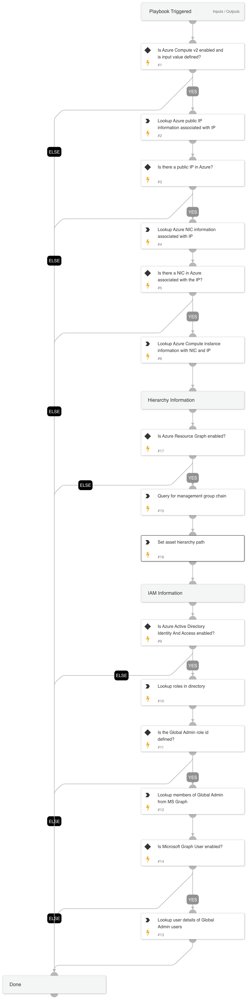

Given the IP address, this playbook enriches Azure Compute, Azure asset hierarchy path, IAM, and User information.

## Dependencies

This playbook uses the following sub-playbooks, integrations, and scripts.

### Sub-playbooks

This playbook does not use any sub-playbooks.

### Integrations

* Azure Active Directory Identity And Access
* Azure Active Directory Users
* Azure Compute v2
* Azure Resource Graph

### Scripts

This playbook does not use any scripts.

### Commands

* azure-rg-query 
* azure-vm-get-public-ip-details
* azure-vm-get-nic-details
* azure-vm-get-instance-details
* msgraph-identity-directory-roles-list
* msgraph-identity-directory-role-members-list
* msgraph-user-get

## Playbook Inputs

---

| **Name** | **Description** | **Default Value** | **Required** |
| --- | --- | --- | --- |
| AzureIP | Azure IP in alert | alert.remoteip | Required |

## Playbook Outputs

---
| **Path** | **Description** | **Type** |
| --- | --- | --- |
| Azure.Compute | Azure Compute information. | unknown |
| Azure.Network | Azure NIC information. | unknown |
| MSGraphIdentity.Role | Microsoft Graph Role object that contains role ID and user IDs | unknown |
| Account | Microsoft Graph User account objects for found user IDs. | unknown |
| MSGraphUser | Microsoft Graph User objects for found user IDs. | unknown |
| AzureAssetHierarchy | Azure Compute Hierarchy Path. | unknown |

## Playbook Image

---

