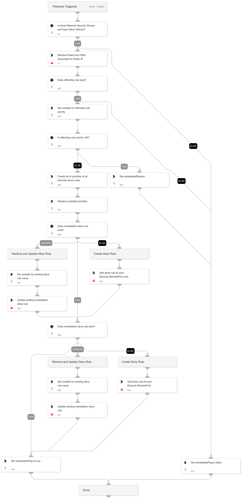

This playbook adds new Azure Network Security Groups (NSG) rules to NSGs attached to a NIC. The new rules will give access only to a private ip address range and block traffic that's exposed to the public internet ([using the private IP of the VM as stated in Azure documentation](https://learn.microsoft.com/en-us/azure/virtual-network/network-security-groups-overview)). For example, if RDP is exposed to the public internet, this playbook adds new firewall rules that only allow traffic from a private IP address and blocks the rest of the RDP traffic.

Conditions and limitations:
- Limited to one resource group.
- 200 Azure rules viewed at once to find offending rule.
- 2 priorities lower than the offending rule priority must be available.
- Adds rules to NSGs associated to NICs.

## Dependencies

This playbook uses the following sub-playbooks, integrations, and scripts.

### Sub-playbooks

This playbook does not use any sub-playbooks.

### Integrations

* Azure Network Security Groups

### Scripts

* AzureFindAvailableNSGPriorities
* Set

### Commands

* azure-nsg-security-rule-create
* azure-nsg-security-rules-list
* azure-nsg-security-rule-update

## Playbook Inputs

---

| **Name** | **Description** | **Default Value** | **Required** |
| --- | --- | --- | --- |
| AzureSecurityGroup | The Azure Network Security Group that will have new rules created or updated. |  | Required |
| AzureVMPrivateIP | The private IP of the Azure Virtual Machine. |  | Required |
| RemoteProtocol | The remote protocol that is publicly exposed. |  | Required |
| RemotePort | The remote port that is publicly exposed. |  | Required |
| SubscriptionID | This is the Azure Subscription ID \(optional\). |  | Optional |
| ResourceGroup | This is the Azure ResourceGroup \(optional\). |  | Optional |

## Playbook Outputs

---

| **Path** | **Description** | **Type** |
| --- | --- | --- |
| remediatedFlag | Output key to determine if remediation was successfully done. | boolean |
| remediatedReason | Reason remediation was done or not done. | string |

## Playbook Image

---

