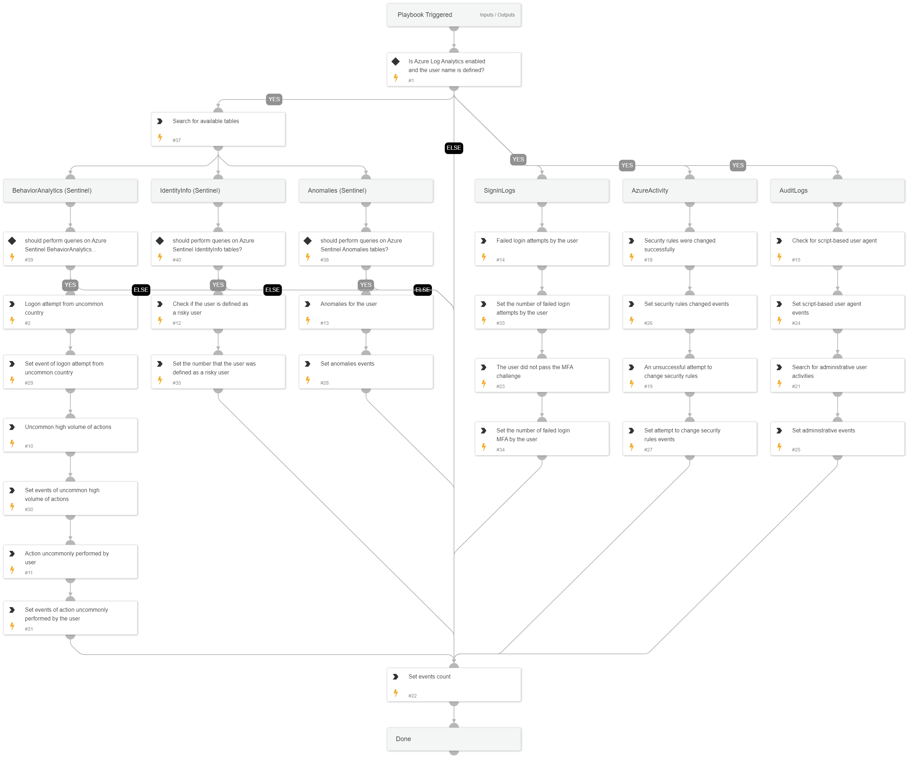

This playbook performs an investigation on a specific user in Azure environments, using queries and logs from Azure Log Analytics to locate the following activities performed by the user:
- Script-based user agent usage
- Administrative user activities
- Security rules and policies changes
- Failed login attempt
- MFA failed login attempt
- Login attempt from an uncommon country.
- Anomalies activities
- Risky users
- Uncommon high volume of actions
- Action uncommonly performed by the user

## Dependencies

This playbook uses the following sub-playbooks, integrations, and scripts.

### Sub-playbooks

This playbook does not use any sub-playbooks.

### Integrations

Azure Log Analytics

### Scripts

* SetMultipleValues
* SetAndHandleEmpty

### Commands

azure-log-analytics-execute-query

## Playbook Inputs

---

| **Name** | **Description** | **Default Value** | **Required** |
| --- | --- | --- | --- |
| Username | The username to investigate. |  | Optional |
| AzureSearchTime | The Search Time for the Azure Log Analytics search query. Default value: ago\(1d\) | ago(7d) | Optional |
| failedLogonThreshold | The threshold number of failed logons by the user. Required to determine how many failed logon events count as suspicious events. | 20 | Optional |
| MfaAttemptThreshold | The threshold number of MFA failed logons by the user. Required to determine how many MFA failed logon events count as suspicious events. | 10 | Optional |

## Playbook Outputs

---

| **Path** | **Description** | **Type** |
| --- | --- | --- |
| AzureScriptBasedUserAgentEvents | Script-based user agent events used by the user in the Azure environment. | unknown |
| CountAzureEvents.AzureScriptBasedUserAgentCount | The number of script-based user agent usages by the user in the Azure environment. | unknown |
| AzureAdminActivitiesEvents | Administrative activities performed by the user in the Azure environment. | unknown |
| CountAzureEvents.AzureAdminActivitiesCount | The number of administrative activities performed by the user in the Azure environment. | unknown |
| AzureSecurityRulesChangeEvents | Security rules that were changed by the user in the Azure environment. | unknown |
| CountAzureEvents.AzureSecurityRulesChangeCount | The number of security rules that were changed by the user in the Azure environment. | unknown |
| AzureUnsuccessSecurityRulesChangeEvents | Unsuccessful attempts to change security rules by the user in the Azure environment. | unknown |
| CountAzureEvents.AzureUnsuccessSecurityRulesChangeCount | The number of unsuccessful attempts to change security rules by the user in the Azure environment. | unknown |
| AzureFailLoginCount | The number of failed logins by the user in the Azure environment. | unknown |
| AzureFailLoginMFACount | The number of failed logins by the user using MFA in the Azure environment. | unknown |
| AzureAnomaliesEvents | Anomaly events on the user in the Azure environment. | unknown |
| CountAzureEvents.AzureAnomaliesCount | The number of anomaly events on the user in the Azure environment. | unknown |
| AzureRiskyUserCount | The number of events where the user was defined as a risky user in the Azure environment. | unknown |
| AzureUncommonCountryLogonEvents | Uncommon country logon events by the user in the Azure environment. | unknown |
| CountAzureEvents.AzureUncommonCountryLogonCount | The number of uncommon country logon events by the user in the Azure environment. | unknown |
| AzureUncommonVolumeEvents | Uncommon volume events by the user in the Azure environment. | unknown |
| CountAzureEvents.AzureUncommonVolumeCount | The number of uncommon volume events by the user in the Azure environment. | unknown |
| AzureUncommonActivitiesEvents | Uncommon activity events by the user in the Azure environment. | unknown |
| CountAzureEvents.AzureUncommonActivitiesCount | The number of uncommon activity events by the user in the Azure environment. | unknown |

## Playbook Image

---

