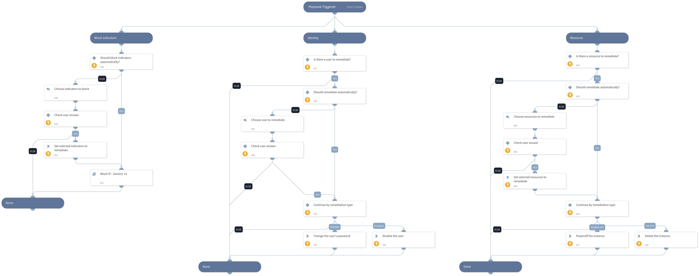

This playbook provides response actions to Azure. The following are available for execution automatically/manually:
- Resource remediation    
   - Delete the instance
   - Power off the instance
- Identity remediation:
   - Disable the user
   - Delete the user
- Block indicators

## Dependencies
This playbook uses the following sub-playbooks, integrations, and scripts.

### Sub-playbooks
* Block IP - Generic v3

### Integrations
This playbook does not use any integrations.

### Scripts
* Set

### Commands
* azure-vm-poweroff-instance
* azure-vm-delete-instance
* msgraph-user-delete
* msgraph-user-account-disable

## Playbook Inputs
---

| **Name** | **Description** | **Default Value** | **Required** |
| --- | --- | --- | --- |
| resourceRemediationType | Choose the remediation type for the instances created. Poweroff - for shutting down the instances. Delete - for deleting the instances. | Poweroff | Optional |
| userRemediationType | Choose the remediation type for the user involved. Disable - for disabling the user. Delete - for deleting the user. | Disable | Optional |
| autoResourceRemediation | Whether to execute the resource remediation flow automatically. | False | Optional |
| autoUserRemediation | Whether to execute the user remediation flow automatically. | False | Optional |
| autoBlockIndicators | Whether to block the indicators automatically. | False | Optional |
| resourceName | The resource name to take action on. |  | Optional |
| resourceGroup | The resource group. |  | Optional |
| username | The username to take action on. |  | Optional |
| sourceIP | The source IP address of the attacker. |  | Optional |

## Playbook Outputs
---
There are no outputs for this playbook.

## Playbook Image
---
