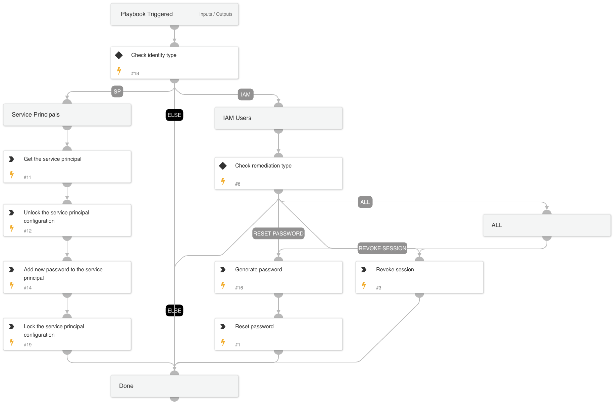

##### What does this pack do?

The pack contains Azure playbooks and scripts that conduct enrichment and/or remediation and can use multiple other Azure 
content packs.

There are multiple Azure content packs for multiple Azure products (Compute, MSGraphUsers, etc).  The intent was so that 
users can install and use only the packs they need.  However, if an Azure playbook uses multiple pack integrations (such 
as Compute and MSGraphUsers), they can't reside in one of the current packs because they include content from multiple integrations.  This pack was created as a place to put Azure playbooks that use Azure integrations from multiple packs with a focus on enrichment and remediation.

### Scripts

#### AzureFindAvailableNSGPriorities

This script takes in a list of numbers that represent Azure priorities for NSG rules, a target priority number, and a number of available priorities to return available priorities from the provided list.

### Playbooks

Users are only able to run playbooks in v6.5.0 or higher as it requires commands to execute the task.
This content pack includes the following playbook:

#### Azure - Enrichment

#### Azure - Network Security Group Remediation

#### Azure - User Investigation

#### Cloud Credentials Rotation - Azure

#### Cloud Response - Azure

