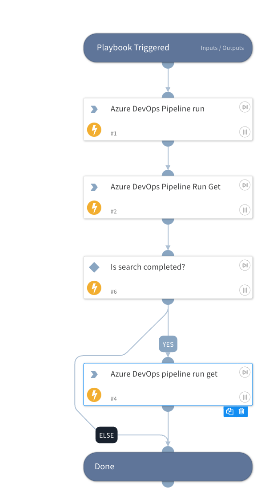

Deprecated. Use azure-devops-pipeline-run command instead.

## Dependencies

This playbook uses the following sub-playbooks, integrations, and scripts.

### Sub-playbooks

This playbook does not use any sub-playbooks.

### Integrations

* AzureDevOps

### Scripts

This playbook does not use any scripts.

### Commands

* azure-devops-pipeline-run
* azure-devops-pipeline-run-get

## Playbook Inputs

---

| **Name** | **Description** | **Default Value** | **Required** |
| --- | --- | --- | --- |
| Project Name | The name of the pipeline project. | xsoar | Required |
| Pipeline ID | The ID of the pipeline. | 1 | Required |
| Branch Name | The name of the repository branch which runs the pipeline. | main | Required |
| interval | Indicates how long to wait between each poll. (In seconds) | 1 | Required |
| Timeout | The amount of time until the playbook stops waiting for the process to finish. After this time has passed, the playbook finishes its run, even if it didn't receive confirmation that the remote process completed. (In seconds) | 60 | Required |

## Playbook Outputs

---

| **Path** | **Description** | **Type** |
| --- | --- | --- |
| AzureDevOps.Project | The result of the search. | unknown |
| AzureDevOps.Project.Pipeline | AzureDevOps Pipeline Object. | unknown |
| AzureDevOps.Project.Pipeline.Run | AzureDevOps Pipeling Run. | unknown |

## Playbook Image

---

