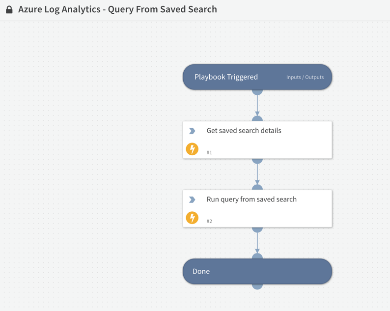

Executes a query from a saved search in Azure Log Analytics.

## Dependencies
This playbook uses the following sub-playbooks, integrations, and scripts.

### Sub-playbooks
This playbook does not use any sub-playbooks.

### Integrations
* AzureLogAnalytics

### Scripts
This playbook does not use any scripts.

### Commands
* azure-log-analytics-get-saved-search-by-id
* azure-log-analytics-execute-query

## Playbook Inputs
---

| **Name** | **Description** | **Default Value** | **Required** |
| --- | --- | --- | --- |
| saved_search_id | The ID of the saved search to run. |  | Required |
| timespan | The timespan over which to query data. This is an ISO8601 time period value. This timespan is applied in addition to timespans that are specified in the query expression. |  | Optional |

## Playbook Outputs
---

| **Path** | **Description** | **Type** |
| --- | --- | --- |
| AzureLogAnalytics.Query.Query | The executed query. | string |
| AzureLogAnalytics.Query.TableName | The name of the query table. | string |

## Playbook Image
---
