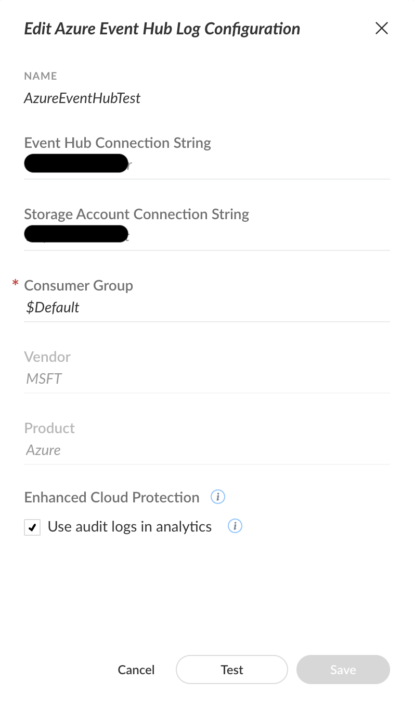

# Azure Web Application Firewall 

<~XSOAR> [Azure WAF Integration](https://xsoar.pan.dev/docs/reference/integrations/azure-waf) </~XSOAR>

## Overview

Azure Web Application Firewall (WAF) is designed to actively shield your web applications from common web exploits and vulnerabilities, such as SQL injection and cross-site scripting. 

It operates as an application-level firewall, focusing on web application traffic. 

Azure WAF integrates with Azure services like Azure Application Gateway, Azure Front Door, and Azure CDN.

<~XSIAM>

### This pack includes:

- Log Normalization - XDM mapping for key event types.

### Supported log categories

| Category | Category Display Name |
|:----------------------------|:--------------------------------------|
| ApplicationGatewayAccessLog | [Application Gateway Access Log](https://learn.microsoft.com/en-us/azure/application-gateway/monitor-application-gateway-reference#access-log-category) |
| ApplicationGatewayFirewallLog | [Application Gateway Firewall Log](https://learn.microsoft.com/en-us/azure/application-gateway/monitor-application-gateway-reference#firewall-log-category) |
| FrontDoorAccessLog | [Frontdoor Access Log](https://learn.microsoft.com/en-us/azure/frontdoor/monitor-front-door?pivots=front-door-standard-premium#access-log) |
| FrontDoorWebApplicationFirewallLog | [Frontdoor Web Application Firewall Log](https://learn.microsoft.com/en-us/azure/web-application-firewall/afds/waf-front-door-monitor?pivots=front-door-standard-premium) |

### Supported Timestamp Formats:

1. MMM dd yyyy HH:mm:ss
2. yyyy-MM-ddThh:mm:ssEz
3. yyyy-MM-ddThh:mm:ssZ
4. yyyy-MM-ddThh:mm:ss.E7SZ

For *msft_azure_waf_raw*, timestamp ingestion is according to the fields below in UTC (00:00) time zone. 

- timeStamp
- timeStamp_t
- time
- TimeGenerated

Examples:

- May 03 2025 04:00:00
- 2025-05-03T00:27:53+00:00
- 2025-05-03T00:27:53Z
- 2025-05-02T13:26:25.3391768Z

#### Time offsets from UTC is supported. 

See [RFC 3339](https://datatracker.ietf.org/doc/html/rfc3339) for more information.

***

## Data Collection

To configure Microsoft Azure WAF to send logs to Cortex XSIAM, follow the below steps.

### Prerequisites

- Create an **Azure event hub**. For more information, refer to Microsoft's official [documentation](https://learn.microsoft.com/en-us/azure/event-hubs/event-hubs-create).
- Make sure that you have at least a Security Administrator role.
- For Azure WAF Front Door event logs you will need to [Create an Azure Front Door profile](https://learn.microsoft.com/en-us/azure/frontdoor/create-front-door-portal?tabs=quick)

### Stream logs to an event hub

1. Sign in to the **Microsoft Entra admin center**.
2. Navigate to **Identity** &rarr; **Monitoring & health** &rarr; **Diagnostic settings**.
    - To stream Front Door logs, select the relevant Front Door profile 
    - Within the profile, navigate to **Monitoring**, and select **Diagnostic Setting**.
3. Select **+ Add diagnostic setting** to create a new integration or select **Edit setting** for an existing integration.
4. Enter a **Diagnostic setting name**. If you're editing an existing integration, you can't change the name.
5. Select the log categories that you want to stream. Refer to the **Log Normalization** section for the supported log categories for normalization.
6. Select the streaming and storing method.

   6.1. Select the Stream to an event hub checkbox to use the Event Hub and storage account to save the diagnostic logs.
   
   6.2. Select the Send To Log Analytics checkbox and choose Log Analytics Workspace to use a Log Analytics workspace to store the logs.
8. Select the Azure subscription, Event Hubs namespace, and optional event hub where you want to route the logs.

For more information, refer to Microsoft's official [documentation](https://learn.microsoft.com/en-us/entra/identity/monitoring-health/howto-stream-logs-to-event-hub).

For more information on creating a Log Analytics workspace, see [Create a Log Analytics workspace](https://learn.microsoft.com/en-us/azure/azure-monitor/logs/quick-create-workspace?tabs=azure-portal).

### Cortex XSIAM side

To connect Cortex XSIAM to the Azure Event Hub, follow the below steps.

#### Azure Event Hub Collector

1. Navigate to **Settings** &rarr; **Data Sources**.
2. If you have already configured an **Azure Event Hub Collector**, select the **3 dots**, and then select **+ Add New Instance**. If not, select **+ Add Data Source**, search for "Azure Event Hub" and then select **Connect**.
3. Fill in the attributes based on the Azure Event Hub you streamed your data to.
4. Leave the **Use audit logs in analytics** checkbox selected, unless you were told otherwise.

More information can be found [here](https://docs-cortex.paloaltonetworks.com/r/Cortex-XSIAM/Cortex-XSIAM-Administrator-Guide/Ingest-Logs-from-Microsoft-Azure-Event-Hub?tocId=yjPDSlvRYtlNncGBLHOzvw).

</~XSIAM>
