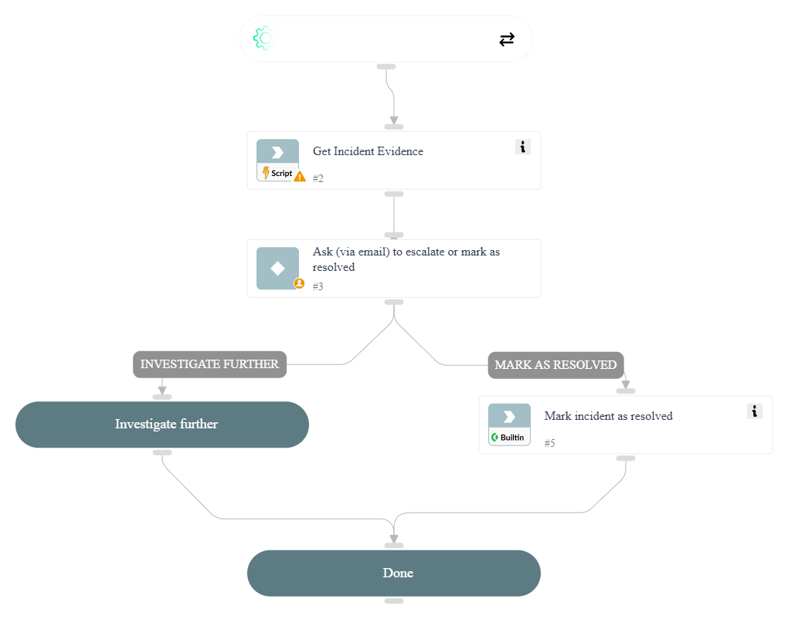

Sends an email to the specified email addresses with the option to either mark the issue as resolved or investigate further.

## Dependencies

This playbook uses the following sub-playbooks, integrations, and scripts.

### Sub-playbooks

This playbook does not use any sub-playbooks.

### Integrations

This playbook does not use any integrations.

### Scripts

* SearchIncidentsV2

### Commands

* closeInvestigation

## Playbook Inputs

---

| **Name** | **Description** | **Default Value** | **Required** |
| --- | --- | --- | --- |
| IssueID | Issue ID | ${issue.id} | Optional |
| Severity | Issue Severity | ${issue.severity} | Optional |
| Details | Issue Details | ${issue.details} | Optional |
| IssueUsername | Username as reported from the Dark Web Scan Integration Evidence | ${issue.labels.username} | Optional |
| SendMailTo | Send emails to | -bogus@example.org | Optional |

## Playbook Outputs

---
There are no outputs for this playbook.

## Playbook Image

---

