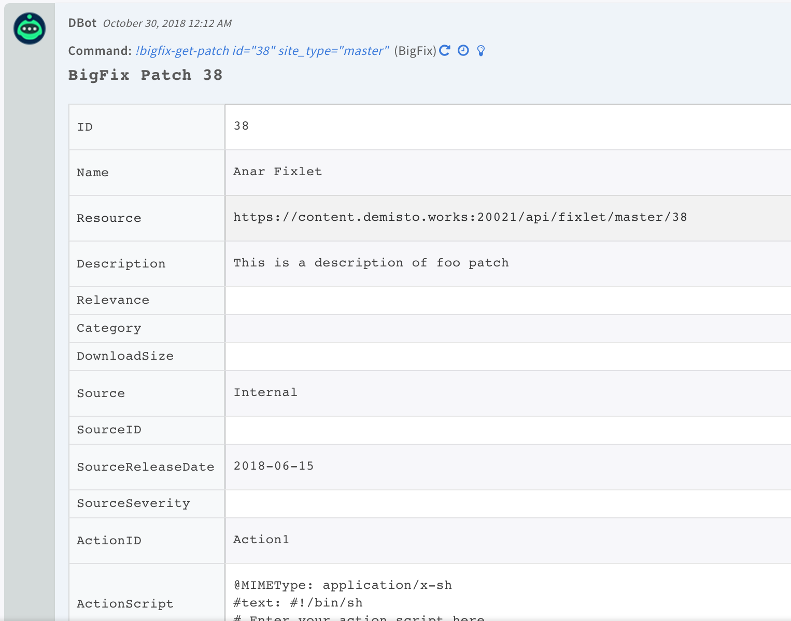

<!-- HTML_DOC -->
<h2>Overview</h2>

Use the BigFix integration to manage patching processes.

 

<h2>Configure BigFix on Cortex XSOAR</h2>

<ol>
<li>Navigate to <strong>Settings</strong> &gt; <strong>Integrations</strong> &gt; <strong>Servers &amp; Services</strong>.</li>
<li>Search for BigFix.</li>
<li>Click <strong>Add instance</strong> to create and configure a new integration instance. 
<ul>
<li>
<strong>Name</strong>: a textual name for the integration instance.</li>
<li><strong>Server url (e.g <a href="https://192.168.10.1:52311/" rel="nofollow">https://192.168.10.1:52311</a>)</strong></li>
<li><strong>Username</strong></li>
<li><strong>Trust any certificate (not secure)</strong></li>
<li><strong>Use system proxy</strong></li>
</ul>
</li>
<li>Click <strong>Test</strong> to validate the URLs, token, and connection.</li>
</ol>
<h2>Commands</h2>

You can execute these commands from the Cortex XSOAR CLI, as part of an automation, or in a playbook. After you successfully execute a command, a DBot message appears in the War Room with the command details.

<ol>
<li><a href="#h_57438930141540901765692">Get all sites: bigfix-get-sites</a></li>
<li><a href="#h_8123010261041540901803930">Get a single site: bigfix-get-site</a></li>
<li><a href="#h_1621334852051540901856934">Get all patches for a site: bigfix-get-patches</a></li>
<li><a href="#h_7616200173051540902077626">Get all endpoints: bigfix-get-endpoints</a></li>
<li><a href="#h_9228939254021540902117120">Get the details of an endpoint: bigfix-get-endpoint</a></li>
<li><a href="#h_3195022465001540902236656">Create an action to run on target computers: bigfix-deploy-patch</a></li>
<li><a href="#h_6492125645971540902329729">Get a patch by fixlet ID: bigfix-get-patch</a></li>
<li><a href="#h_7402382876931540902368673">Delete an action: bigfix-action-delete</a></li>
<li><a href="#h_9949485537861540902463288">Get the status of an action: bigfix-action-status</a></li>
<li><a href="#h_6364690108801540902492473">Stop an action: bigfix-action-stop</a></li>
<li><a href="#h_11901861510551540902590354">Evaluate an expression and get the result: bigfix-query</a></li>
</ol>
<h3 id="h_57438930141540901765692">1. Get all sites</h3>

Retrieves all the sites.

<h5>Base Command</h5>
<pre><code>bigfix-get-sites</code></pre>
<h5>Context Output</h5>
<table style="width: 748px;" border="2" cellpadding="6">
<thead>
<tr>
<th style="width: 245px;"><strong>Path</strong></th>
<th style="width: 76px;"><strong>Type</strong></th>
<th style="width: 387px;"><strong>Description</strong></th>
</tr>
</thead>
<tbody>
<tr>
<td style="width: 245px;">Bigfix.Site</td>
<td style="width: 76px;">unknown</td>
<td style="width: 387px;">Site</td>
</tr>
<tr>
<td style="width: 245px;">Bigfix.Site.Name</td>
<td style="width: 76px;">string</td>
<td style="width: 387px;">Name of the site</td>
</tr>
<tr>
<td style="width: 245px;">Bigfix.Site.Description</td>
<td style="width: 76px;">string</td>
<td style="width: 387px;">Description of the site</td>
</tr>
<tr>
<td style="width: 245px;">Bigfix.Site.Resource</td>
<td style="width: 76px;">string</td>
<td style="width: 387px;">Link to the endpoint resource</td>
</tr>
<tr>
<td style="width: 245px;">Bigfix.Site.Type</td>
<td style="width: 76px;">string</td>
<td style="width: 387px;">Type of the site ("master", "custom", "external", "operator")</td>
</tr>
<tr>
<td style="width: 245px;">Bigfix.Site.Domain</td>
<td style="width: 76px;">string</td>
<td style="width: 387px;">Site domain</td>
</tr>
<tr>
<td style="width: 245px;">Bigfix.Site.GatherURL</td>
<td style="width: 76px;">string</td>
<td style="width: 387px;">Gather URL</td>
</tr>
<tr>
<td style="width: 245px;">Bigfix.Site.GlobalReadPermission</td>
<td style="width: 76px;">string</td>
<td style="width: 387px;">Whether the Global Read Permission is available</td>
</tr>
</tbody>
</table>
<h5> </h5>
<h5>Command Example</h5>
<pre>!bigfix-get-sites</pre>
<h5>Context Example</h5>
<pre><code>{
    "Bigfix": {
        "Site": [
            {
                "Resource": "https://xsoar-example:20021/api/site/master/ActionSite", 
                "Description": null, 
                "GatherURL": "http://WIN-CQD6UQJIA7J:52311/cgi-bin/bfgather.exe/actionsite", 
                "GlobalReadPermission": "false", 
                "Name": "ActionSite", 
                "Type": "master", 
                "Subscription": {
                    "Mode": "All"
                }
            }, 
            {
                "Resource": "https://xsoar-example:20021/api/site/external/BES Support", 
                "Description": null, 
                "GatherURL": "http://sync.bigfix.com/cgi-bin/bfgather/bessupport", 
                "GlobalReadPermission": "true", 
                "Name": "BES Support", 
                "Type": "external", 
                "Subscription": {
                    "Mode": "All"
                }
            }, 
            {
                "Resource": "https://xsoar-example:20021/api/site/external/BES Inventory and License", 
                "Description": null, 
                "GatherURL": "http://sync.bigfix.com/cgi-bin/bfgather/besinventory", 
                "GlobalReadPermission": "false", 
                "Name": "BES Inventory and License", 
                "Type": "external", 
                "Subscription": {
                    "Mode": "None"
                }
            }, 
            {
                "Resource": "https://xsoar-example:20021/api/site/external/BES Asset Discovery", 
                "Description": null, 
                "GatherURL": "http://sync.bigfix.com/cgi-bin/bfgather/assetdiscovery", 
                "GlobalReadPermission": "false", 
                "Name": "BES Asset Discovery", 
                "Type": "external", 
                "Subscription": {
                    "Mode": "None"
                }
            }, 
            {
                "GatherURL": "http://WIN-CQD6UQJIA7J:52311/cgi-bin/bfgather.exe/actionsite", 
                "Type": "operator", 
                "Resource": "https://xsoar-example:20021/api/site/operator/admin", 
                "Name": "admin"
            }
        ]
    }
}
</code></pre>
<h5>Human Readable Output</h5>

<h3 id="h_8123010261041540901803930">2. Get a single site</h3>

Retrieves a single site by name and type.

<h5>Base Command</h5>
<pre><code>bigfix-get-site</code></pre>
<h5>Input</h5>
<table style="width: 748px;" border="2" cellpadding="6">
<thead>
<tr>
<th style="width: 132px;"><strong>Argument Name</strong></th>
<th style="width: 505px;"><strong>Description</strong></th>
<th style="width: 71px;"><strong>Required</strong></th>
</tr>
</thead>
<tbody>
<tr>
<td style="width: 132px;">site_name</td>
<td style="width: 505px;">Name of the site. If the site is external or operator then the site must be specified.</td>
<td style="width: 71px;">Optional</td>
</tr>
<tr>
<td style="width: 132px;">site_type</td>
<td style="width: 505px;">Site type ("external", "operator", "master", "custom")</td>
<td style="width: 71px;">Required</td>
</tr>
</tbody>
</table>
<h5> </h5>
<h5>Context Output</h5>
<table style="width: 748px;" border="2" cellpadding="6">
<thead>
<tr>
<th style="width: 247px;"><strong>Path</strong></th>
<th style="width: 74px;"><strong>Type</strong></th>
<th style="width: 387px;"><strong>Description</strong></th>
</tr>
</thead>
<tbody>
<tr>
<td style="width: 247px;">Bigfix.Site</td>
<td style="width: 74px;">unknown</td>
<td style="width: 387px;">Site</td>
</tr>
<tr>
<td style="width: 247px;">Bigfix.Site.Name</td>
<td style="width: 74px;">string</td>
<td style="width: 387px;">Name of the site</td>
</tr>
<tr>
<td style="width: 247px;">Bigfix.Site.Description</td>
<td style="width: 74px;">string</td>
<td style="width: 387px;">Description of the site</td>
</tr>
<tr>
<td style="width: 247px;">Bigfix.Site.Resource</td>
<td style="width: 74px;">string</td>
<td style="width: 387px;">Link to the endpoint resource.</td>
</tr>
<tr>
<td style="width: 247px;">Bigfix.Site.Type</td>
<td style="width: 74px;">string</td>
<td style="width: 387px;">Type of the site ("master", "custom", "external", "operator")</td>
</tr>
<tr>
<td style="width: 247px;">Bigfix.Site.Domain</td>
<td style="width: 74px;">string</td>
<td style="width: 387px;">Site domain</td>
</tr>
<tr>
<td style="width: 247px;">Bigfix.Site.GatherURL</td>
<td style="width: 74px;">string</td>
<td style="width: 387px;">Gather URL</td>
</tr>
<tr>
<td style="width: 247px;">Bigfix.Site.GlobalReadPermission</td>
<td style="width: 74px;">string</td>
<td style="width: 387px;">Whether the Global Read Permission is available</td>
</tr>
</tbody>
</table>
<h5> </h5>
<h5>Command Example</h5>
<pre>!bigfix-get-site site_type=master</pre>
<pre>!bigfix-get-site site_type=external site_name="BES Support"</pre>
<h5>Context Example</h5>
<pre><code>{
    "Bigfix": {
        "Site": {
            "Resource": "https://xsoar-example:20021/api/site/master/None", 
            "Description": null, 
            "GatherURL": "http://WIN-CQD6UQJIA7J:52311/cgi-bin/bfgather.exe/actionsite", 
            "GlobalReadPermission": "false", 
            "Name": "ActionSite", 
            "Type": "master", 
            "Subscription": {
                "Mode": "All"
            }
        }
    }
}
</code></pre>
<h5>Human Readable Output</h5>

<h3 id="h_1621334852051540901856934">3. Get all patches for a site</h3>

Retrieves all the patches (fixlets) of site.

<h5>Base Command</h5>
<pre><code>bigfix-get-patches</code></pre>
<h5>Input</h5>
<table style="width: 748px;" border="2" cellpadding="6">
<thead>
<tr>
<th style="width: 132px;"><strong>Argument Name</strong></th>
<th style="width: 505px;"><strong>Description</strong></th>
<th style="width: 71px;"><strong>Required</strong></th>
</tr>
</thead>
<tbody>
<tr>
<td style="width: 132px;">site_type</td>
<td style="width: 505px;">Type of the site ("external", "operator", "master", "custom")</td>
<td style="width: 71px;">Required</td>
</tr>
<tr>
<td style="width: 132px;">site_name</td>
<td style="width: 505px;">Name of the site. If the site is external or operator then the site must be specified.</td>
<td style="width: 71px;">Optional</td>
</tr>
</tbody>
</table>
<h5> </h5>
<h5>Context Output</h5>
<table style="width: 748px;" border="2" cellpadding="6">
<thead>
<tr>
<th style="width: 267px;"><strong>Path</strong></th>
<th style="width: 54px;"><strong>Type</strong></th>
<th style="width: 387px;"><strong>Description</strong></th>
</tr>
</thead>
<tbody>
<tr>
<td style="width: 267px;">Bigfix.Patch.ID</td>
<td style="width: 54px;">string</td>
<td style="width: 387px;">Patch (fixlet) ID</td>
</tr>
<tr>
<td style="width: 267px;">Bigfix.Patch.LastModified</td>
<td style="width: 54px;">date</td>
<td style="width: 387px;">Last modified timestamp</td>
</tr>
<tr>
<td style="width: 267px;">Bigfix.Patch.Name</td>
<td style="width: 54px;">string</td>
<td style="width: 387px;">Name of the patch requested</td>
</tr>
<tr>
<td style="width: 267px;">Bigfix.Patch.Resource</td>
<td style="width: 54px;">string</td>
<td style="width: 387px;">The link for the patch</td>
</tr>
<tr>
<td style="width: 267px;">Bigfix.Patch.Description</td>
<td style="width: 54px;">string</td>
<td style="width: 387px;">Description of the requested patch</td>
</tr>
<tr>
<td style="width: 267px;">Bigfix.Patch.Relevance</td>
<td style="width: 54px;">string</td>
<td style="width: 387px;">Relevance of the requested patch</td>
</tr>
<tr>
<td style="width: 267px;">Bigfix.Patch.Category</td>
<td style="width: 54px;">string</td>
<td style="width: 387px;">Category of the requested patch</td>
</tr>
<tr>
<td style="width: 267px;">Bigfix.Patch.DownloadSize</td>
<td style="width: 54px;">string</td>
<td style="width: 387px;">Download size</td>
</tr>
<tr>
<td style="width: 267px;">Bigfix.Patch.Source</td>
<td style="width: 54px;">string</td>
<td style="width: 387px;">Source where the patch originates</td>
</tr>
<tr>
<td style="width: 267px;">Bigfix.Patch.SourceID</td>
<td style="width: 54px;">string</td>
<td style="width: 387px;">Source ID of the requested patch</td>
</tr>
<tr>
<td style="width: 267px;">Bigfix.Patch.SourceSeverity</td>
<td style="width: 54px;">string</td>
<td style="width: 387px;">Source severity of the requested patch</td>
</tr>
<tr>
<td style="width: 267px;">Bigfix.Patch.SourceReleaseDate</td>
<td style="width: 54px;">string</td>
<td style="width: 387px;">Source release date of the requested patch</td>
</tr>
<tr>
<td style="width: 267px;">Bigfix.Patch.ActionID</td>
<td style="width: 54px;">string</td>
<td style="width: 387px;">Action ID of the patch requested.</td>
</tr>
<tr>
<td style="width: 267px;">Bigfix.Patch.ActionScript</td>
<td style="width: 54px;">string</td>
<td style="width: 387px;">Action script of the patch requested.</td>
</tr>
</tbody>
</table>
<h5> </h5>
<h5>Command Example</h5>
<pre>!bigfix-get-patches site_type="master"</pre>
<h5>Context Example</h5>
<pre><code>{
    "Bigfix": {
        "Patch": [
            {
                "Category": null, 
                "Resource": "https://xsoar-example:20021/api/fixlet/master/38", 
                "Description": "This is a description of foo patch", 
                "DownloadSize": null, 
                "SourceID": null, 
                "LastModified": "Fri, 15 Jun 2018 13:31:17 +0000", 
                "SourceReleaseDate": "2018-06-15", 
                "Source": "Internal", 
                "ActionID": "Action1", 
                "ActionScript": {
                    "@MIMEType": "application/x-sh", 
                    "#text": "#!/bin/sh\n# Enter your action script here\necho \"Hello World\""
                }, 
                "Relevance": null, 
                "SourceSeverity": null, 
                "ID": "38", 
                "Name": "Anar Fixlet"
            }, 
            {
                "Category": null, 
                "Resource": "https://xsoar-example:20021/api/fixlet/master/39", 
                "Description": "Test Fixlet", 
                "DownloadSize": null, 
                "SourceID": null, 
                "LastModified": "Fri, 15 Jun 2018 19:37:29 +0000", 
                "SourceReleaseDate": "2018-06-15", 
                "Source": "Internal", 
                "ActionID": "Action1", 
                "ActionScript": {
                    "@MIMEType": "application/x-Fixlet-Windows-Shell", 
                    "#text": "// Enter your action script here"
                }, 
                "Relevance": "true", 
                "SourceSeverity": null, 
                "ID": "39", 
                "Name": "Custom Fixlet"
            }
        ]
    }
}
</code></pre>
<h5>Human Readable Output</h5>

<h3 id="h_7616200173051540902077626">4. Get all endpoints</h3>

Retrieves all endpoints (computers).

<h5>Base Command</h5>
<pre><code>bigfix-get-endpoints</code></pre>
<h5>Input</h5>
<table style="width: 748px;" border="2" cellpadding="6">
<thead>
<tr>
<th style="width: 132px;"><strong>Argument Name</strong></th>
<th style="width: 505px;"><strong>Description</strong></th>
<th style="width: 71px;"><strong>Required</strong></th>
</tr>
</thead>
<tbody>
<tr>
<td style="width: 132px;">get_endpoint_details</td>
<td style="width: 505px;">Whether to get endpoint full details of each endpoint or just basic details, such as ID and last reported time. We recommend setting this to false if there are many endpoints to retrieve.</td>
<td style="width: 71px;">Optional</td>
</tr>
</tbody>
</table>
<h5> </h5>
<h5>Context Output</h5>
<table style="width: 748px;" border="2" cellpadding="6">
<thead>
<tr>
<th style="width: 305px;"><strong>Path</strong></th>
<th style="width: 71px;"><strong>Type</strong></th>
<th style="width: 332px;"><strong>Description</strong></th>
</tr>
</thead>
<tbody>
<tr>
<td style="width: 305px;">Bigfix.Endpoint</td>
<td style="width: 71px;">unknown</td>
<td style="width: 332px;">Endpoint (computer)</td>
</tr>
<tr>
<td style="width: 305px;">Bigfix.Endpoint.ID</td>
<td style="width: 71px;">string</td>
<td style="width: 332px;">The IDof the endpoint (computer ID)</td>
</tr>
<tr>
<td style="width: 305px;">Bigfix.Endpoint.Resource</td>
<td style="width: 71px;">string</td>
<td style="width: 332px;">URL to the endpoint details</td>
</tr>
<tr>
<td style="width: 305px;">Bigfix.Endpoint.LastReportTime</td>
<td style="width: 71px;">date</td>
<td style="width: 332px;">Last report time of the endpoint</td>
</tr>
<tr>
<td style="width: 305px;">Bigfix.Endpoint.ActiveDirectoryPath</td>
<td style="width: 71px;">string</td>
<td style="width: 332px;">Active directory path of the endpoint device</td>
</tr>
<tr>
<td style="width: 305px;">Bigfix.Endpoint.AgentType</td>
<td style="width: 71px;">string</td>
<td style="width: 332px;">Agent Type of the endpoint</td>
</tr>
<tr>
<td style="width: 305px;">Bigfix.Endpoint.AgentVersion</td>
<td style="width: 71px;">string</td>
<td style="width: 332px;">Agent Version of the endpoint.</td>
</tr>
<tr>
<td style="width: 305px;">Bigfix.Endpoint.BESRelaySelectionMethod</td>
<td style="width: 71px;">unknown</td>
<td style="width: 332px;">Relay selection method of the endpoint</td>
</tr>
<tr>
<td style="width: 305px;">Bigfix.Endpoint.BESRelayServiceInstalled</td>
<td style="width: 71px;">unknown</td>
<td style="width: 332px;">Relay service installed of the endpoint.</td>
</tr>
<tr>
<td style="width: 305px;">Bigfix.Endpoint.BESRootServer</td>
<td style="width: 71px;">string</td>
<td style="width: 332px;">Root server of the endpoint.</td>
</tr>
<tr>
<td style="width: 305px;">Bigfix.Endpoint.BIOS</td>
<td style="width: 71px;">string</td>
<td style="width: 332px;">BIOS of the endpoint.</td>
</tr>
<tr>
<td style="width: 305px;">Bigfix.Endpoint.CPU</td>
<td style="width: 71px;">string</td>
<td style="width: 332px;">CPU of the endpoint</td>
</tr>
<tr>
<td style="width: 305px;">Bigfix.Endpoint.ClientSettings</td>
<td style="width: 71px;">unknown</td>
<td style="width: 332px;">Client settings of the endpoint</td>
</tr>
<tr>
<td style="width: 305px;">Bigfix.Endpoint.ComputerName</td>
<td style="width: 71px;">string</td>
<td style="width: 332px;">Computer name of the endpoint</td>
</tr>
<tr>
<td style="width: 305px;">Bigfix.Endpoint.ComputerType</td>
<td style="width: 71px;">string</td>
<td style="width: 332px;">Computer Type of the endpoint</td>
</tr>
<tr>
<td style="width: 305px;">Bigfix.Endpoint.DNSName</td>
<td style="width: 71px;">string</td>
<td style="width: 332px;">DNS Name of the endpoint</td>
</tr>
<tr>
<td style="width: 305px;">Bigfix.Endpoint.DeviceType</td>
<td style="width: 71px;">string</td>
<td style="width: 332px;">Device Type of the endpoint device</td>
</tr>
<tr>
<td style="width: 305px;">Bigfix.Endpoint.DistancetoBESRelay</td>
<td style="width: 71px;">unknown</td>
<td style="width: 332px;">Distance to BES Relay of the endpoint</td>
</tr>
<tr>
<td style="width: 305px;">Bigfix.Endpoint.FreeSpaceonSystemDrive</td>
<td style="width: 71px;">unknown</td>
<td style="width: 332px;">Free space on sytem drive of the endpoint</td>
</tr>
<tr>
<td style="width: 305px;">Bigfix.Endpoint.IPAddress</td>
<td style="width: 71px;">string</td>
<td style="width: 332px;">IP of the endpoint</td>
</tr>
<tr>
<td style="width: 305px;">Bigfix.Endpoint.LicenseType</td>
<td style="width: 71px;">unknown</td>
<td style="width: 332px;">License of the endpoint</td>
</tr>
<tr>
<td style="width: 305px;">Bigfix.Endpoint.Locked</td>
<td style="width: 71px;">unknown</td>
<td style="width: 332px;">Locked of the endpoint</td>
</tr>
<tr>
<td style="width: 305px;">Bigfix.Endpoint.OS</td>
<td style="width: 71px;">string</td>
<td style="width: 332px;">OS of the endpoint</td>
</tr>
<tr>
<td style="width: 305px;">Bigfix.Endpoint.RAM</td>
<td style="width: 71px;">number</td>
<td style="width: 332px;">RAM of the endpoint</td>
</tr>
<tr>
<td style="width: 305px;">Bigfix.Endpoint.Relay</td>
<td style="width: 71px;">string</td>
<td style="width: 332px;">Relay of the endpoint</td>
</tr>
<tr>
<td style="width: 305px;">Bigfix.Endpoint.RelayNameOfClient</td>
<td style="width: 71px;">string</td>
<td style="width: 332px;">Relay Name of the client</td>
</tr>
<tr>
<td style="width: 305px;">Bigfix.Endpoint.SubnetAddress</td>
<td style="width: 71px;">string</td>
<td style="width: 332px;">Subnet Address of the endpoint</td>
</tr>
<tr>
<td style="width: 305px;">Bigfix.Endpoint.SubscribedSites</td>
<td style="width: 71px;">string</td>
<td style="width: 332px;">Subscribed sites</td>
</tr>
<tr>
<td style="width: 305px;">Bigfix.Endpoint.TotalSizeofSystemDrive</td>
<td style="width: 71px;">number</td>
<td style="width: 332px;">Total size of system drive</td>
</tr>
<tr>
<td style="width: 305px;">Bigfix.Endpoint.UserName</td>
<td style="width: 71px;">string</td>
<td style="width: 332px;">User name</td>
</tr>
</tbody>
</table>
<h5> </h5>
<h5>Command Example</h5>
<pre>!bigfix-get-endpoints</pre>
<h5>Context Example</h5>
<pre><code>{
    "Bigfix": {
        "Endpoint": [
            {
                "UserName": "Administrator", 
                "BESRootServer": "win-cqd6uqjia7j (0)", 
                "TotalSizeofSystemDrive": "101896 MB", 
                "AgentType": "Native", 
                "DNSName": "WIN-CQD6UQJIA7J", 
                "Resource": "https://xsoar-example:20021/api/computer/2696130", 
                "CPU": "2200 MHz Xeon Gold 5120", 
                "LicenseType": "Windows Server", 
                "Relay": "BES Root Server", 
                "BESRelayServiceInstalled": "Automatic", 
                "RAM": "8192 MB", 
                "BIOS": "07/28/2017", 
                "AgentVersion": "9.5.9.62", 
                "IPAddress": "192.168.1.57", 
                "RelayNameOfClient": "WIN-CQD6UQJIA7J", 
                "FreeSpaceonSystemDrive": "71399 MB", 
                "BESRelaySelectionMethod": "Automatic", 
                "ComputerName": "WIN-CQD6UQJIA7J", 
                "SubscribedSites": "http://sync.bigfix.com/cgi-bin/bfgather/bessupport", 
                "Locked": "No", 
                "ClientSettings": [
                    "CVE-2014-0160=rotated", 
                    "_BESClient_ActionManager_SkipVoluntaryOnForceShutdown=1", 
                    "_BESClient_LastShutdown_Reason=Service manager shutdown request", 
                    "_BESClient_Resource_StartupNormalSpeed=0", 
                    "_BESClient_Upgrade_UTF8Settings=1", 
                    "_BESClient_UploadManager_BufferDirectory=C:\\Program Files (x86)\\BigFix Enterprise\\BES Client\\__BESData\\__Global\\Upload", 
                    "_BESGather_Comm_UseDownloadService=0", 
                    "_BESGather_Download_CacheLimitMB=1024", 
                    "_BESGather_Download_CheckInternetFlag=1", 
                    "_BESGather_Download_CheckParentFlag=0", 
                    "_BESGather_Download_InactivityTimeout=300", 
                    "_BESRelay_HTTPServer_HttpLogDirectoryPath=", 
                    "_BESRelay_HTTPServer_LogFilePath=C:\\Program Files (x86)\\BigFix Enterprise\\BES Server\\BESRelay.log", 
                    "_BESRelay_HTTPServer_PortNumber=52311", 
                    "_BESRelay_HTTPServer_ServerRootPath=C:\\Program Files (x86)\\BigFix Enterprise\\BES Server\\wwwrootbes\\", 
                    "_BESRelay_UploadManager_BufferDirectory=C:\\Program Files (x86)\\BigFix Enterprise\\BES Server\\UploadManagerData\\BufferDir", 
                    "_BESRelay_UploadManager_ParentURL=", 
                    "_Enterprise Server_ClientRegister_RegistrationListReplicatePeriod=3600", 
                    "_Enterprise Server_ClientRegister_UDPMessagePort=52311", 
                    "_HTTPServer_Referrer_CheckEnabled=1", 
                    "_WebReports_HTTPRedirect_PortNumber=8080", 
                    "_WebReports_HTTPServer_HostName=http://WIN-CQD6UQJIA7J:52311", 
                    "_WebReports_HTTPServer_HttpLogDirectoryPath=", 
                    "_WebReports_HTTPServer_LogFilePath=C:\\Program Files (x86)\\BigFix Enterprise\\BES Server\\BESWebReportsServer.log", 
                    "_WebReports_HTTPServer_PortNumber=8083", 
                    "_WebReports_HTTPServer_ServerRootPath=C:\\Program Files (x86)\\BigFix Enterprise\\BES Server\\BESReportsServer\\wwwroot\\", 
                    "_WebReports_HTTPServer_SSLCertificateFilePath=C:\\Program Files (x86)\\BigFix Enterprise\\BES Server\\BESReportsData\\SelfWRCertificate.pem", 
                    "_WebReports_HTTPServer_UseSSLFlag=1", 
                    "__LockState=false", 
                    "__RelaySelect_Automatic=1", 
                    "__RelayServer1=", 
                    "__RelayServer2=", 
                    "__Relay_Control_Server1=", 
                    "__Relay_Control_Server2="
                ], 
                "SubnetAddress": "192.168.1.0", 
                "DeviceType": "Server", 
                "ID": "2696130", 
                "ActiveDirectoryPath": "&lt;none&gt;", 
                "LastReportTime": "Mon, 29 Oct 2018 22:12:04 +0000", 
                "DistancetoBESRelay": "0", 
                "OS": "Win2016 10.0.14393.2248 (1607)", 
                "ComputerType": "Virtual"
            }, 
            {
                "UserName": "Administrator", 
                "BESRootServer": "win-cqd6uqjia7j (0)", 
                "TotalSizeofSystemDrive": "101896 MB", 
                "AgentType": "Native", 
                "DNSName": "WIN-CQD6UQJIA7J", 
                "Resource": "https://xsoar-example:20021/api/computer/3385267", 
                "CPU": "2200 MHz Xeon", 
                "LicenseType": "Windows Server", 
                "Relay": "BES Root Server", 
                "BESRelayServiceInstalled": "Manual", 
                "RAM": "8192 MB", 
                "BIOS": "04/05/2016", 
                "AgentVersion": "9.5.9.62", 
                "IPAddress": "192.168.1.57", 
                "RelayNameOfClient": "WIN-CQD6UQJIA7J", 
                "FreeSpaceonSystemDrive": "70978 MB", 
                "BESRelaySelectionMethod": "Manual", 
                "ComputerName": "WIN-CQD6UQJIA7J", 
                "SubscribedSites": "http://sync.bigfix.com/cgi-bin/bfgather/bessupport", 
                "Locked": "No", 
                "ClientSettings": [
                    "_BESClient_ActionManager_SkipVoluntaryOnForceShutdown=1", 
                    "_BESClient_Resource_StartupNormalSpeed=0", 
                    "_BESClient_Upgrade_UTF8Settings=1", 
                    "_BESClient_UploadManager_BufferDirectory=C:\\Program Files (x86)\\BigFix Enterprise\\BES Client\\__BESData\\__Global\\Upload", 
                    "_BESGather_Comm_UseDownloadService=0", 
                    "_BESGather_Download_CacheLimitMB=1024", 
                    "_BESGather_Download_CheckInternetFlag=1", 
                    "_BESGather_Download_CheckParentFlag=0", 
                    "_BESGather_Download_InactivityTimeout=300", 
                    "_BESRelay_HTTPServer_HttpLogDirectoryPath=", 
                    "_BESRelay_HTTPServer_LogFilePath=C:\\Program Files (x86)\\BigFix Enterprise\\BES Server\\BESRelay.log", 
                    "_BESRelay_HTTPServer_PortNumber=52311", 
                    "_BESRelay_HTTPServer_ServerRootPath=C:\\Program Files (x86)\\BigFix Enterprise\\BES Server\\wwwrootbes\\", 
                    "_BESRelay_UploadManager_BufferDirectory=C:\\Program Files (x86)\\BigFix Enterprise\\BES Server\\UploadManagerData\\BufferDir", 
                    "_BESRelay_UploadManager_ParentURL=", 
                    "_Enterprise Server_ClientRegister_RegistrationListReplicatePeriod=3600", 
                    "_Enterprise Server_ClientRegister_UDPMessagePort=52311", 
                    "_HTTPServer_Referrer_CheckEnabled=1", 
                    "_WebReports_HTTPRedirect_PortNumber=8080", 
                    "_WebReports_HTTPServer_HostName=http://WIN-CQD6UQJIA7J:52311", 
                    "_WebReports_HTTPServer_HttpLogDirectoryPath=", 
                    "_WebReports_HTTPServer_LogFilePath=C:\\Program Files (x86)\\BigFix Enterprise\\BES Server\\BESWebReportsServer.log", 
                    "_WebReports_HTTPServer_PortNumber=8083", 
                    "_WebReports_HTTPServer_ServerRootPath=C:\\Program Files (x86)\\BigFix Enterprise\\BES Server\\BESReportsServer\\wwwroot\\", 
                    "_WebReports_HTTPServer_SSLCertificateFilePath=C:\\Program Files (x86)\\BigFix Enterprise\\BES Server\\BESReportsData\\SelfWRCertificate.pem", 
                    "_WebReports_HTTPServer_UseSSLFlag=1", 
                    "__LockState=false", 
                    "__RelayServer1=", 
                    "__RelayServer2=", 
                    "__Relay_Control_Server1=", 
                    "__Relay_Control_Server2="
                ], 
                "SubnetAddress": "192.168.1.0", 
                "DeviceType": "Server", 
                "ID": "3385267", 
                "ActiveDirectoryPath": "&lt;none&gt;", 
                "LastReportTime": "Wed, 27 Jun 2018 00:16:15 +0000", 
                "DistancetoBESRelay": "0", 
                "OS": "Win2016 10.0.14393.1944 (1607)", 
                "ComputerType": "Virtual"
            }
        ]
    }
}
</code></pre>
<h5>Human Readable Output</h5>

<h3 id="h_9228939254021540902117120">5. Get the details of an endpoint</h3>

Retrieves the details of an endpoint (computer).

<h5>Base Command</h5>
<pre><code>bigfix-get-endpoint</code></pre>
<h5>Input</h5>
<table style="width: 748px;" border="2" cellpadding="6">
<thead>
<tr>
<th style="width: 301px;"><strong>Argument Name</strong></th>
<th style="width: 228px;"><strong>Description</strong></th>
<th style="width: 179px;"><strong>Required</strong></th>
</tr>
</thead>
<tbody>
<tr>
<td style="width: 301px;">computer_id</td>
<td style="width: 228px;">Computer ID</td>
<td style="width: 179px;">Required</td>
</tr>
</tbody>
</table>
<h5> </h5>
<h5>Context Output</h5>
<table style="width: 748px;" border="2" cellpadding="6">
<thead>
<tr>
<th style="width: 305px;"><strong>Path</strong></th>
<th style="width: 71px;"><strong>Type</strong></th>
<th style="width: 332px;"><strong>Description</strong></th>
</tr>
</thead>
<tbody>
<tr>
<td style="width: 305px;">Bigfix.Endpoint</td>
<td style="width: 71px;">unknown</td>
<td style="width: 332px;">Endpoint (computer)</td>
</tr>
<tr>
<td style="width: 305px;">Bigfix.Endpoint.ID</td>
<td style="width: 71px;">string</td>
<td style="width: 332px;">The if of the endpoint (computer ID)</td>
</tr>
<tr>
<td style="width: 305px;">Bigfix.Endpoint.Resource</td>
<td style="width: 71px;">string</td>
<td style="width: 332px;">URL to the endpoint details</td>
</tr>
<tr>
<td style="width: 305px;">Bigfix.Endpoint.LastReportTime</td>
<td style="width: 71px;">date</td>
<td style="width: 332px;">Last report time of the endpoint</td>
</tr>
<tr>
<td style="width: 305px;">Bigfix.Endpoint.ActiveDirectoryPath</td>
<td style="width: 71px;">string</td>
<td style="width: 332px;">Active directory path of the endpoint device</td>
</tr>
<tr>
<td style="width: 305px;">Bigfix.Endpoint.AgentType</td>
<td style="width: 71px;">string</td>
<td style="width: 332px;">Agent Type of the endpoint</td>
</tr>
<tr>
<td style="width: 305px;">Bigfix.Endpoint.AgentVersion</td>
<td style="width: 71px;">string</td>
<td style="width: 332px;">Agent version of the endpoint</td>
</tr>
<tr>
<td style="width: 305px;">Bigfix.Endpoint.BESRelaySelectionMethod</td>
<td style="width: 71px;">unknown</td>
<td style="width: 332px;">Relay selection method of the endpoint</td>
</tr>
<tr>
<td style="width: 305px;">Bigfix.Endpoint.BESRelayServiceInstalled</td>
<td style="width: 71px;">unknown</td>
<td style="width: 332px;">Relay service installed of the endpoint</td>
</tr>
<tr>
<td style="width: 305px;">Bigfix.Endpoint.BESRootServer</td>
<td style="width: 71px;">string</td>
<td style="width: 332px;">Root server of the endpoint</td>
</tr>
<tr>
<td style="width: 305px;">Bigfix.Endpoint.BIOS</td>
<td style="width: 71px;">string</td>
<td style="width: 332px;">BIOS of the endpoint</td>
</tr>
<tr>
<td style="width: 305px;">Bigfix.Endpoint.CPU</td>
<td style="width: 71px;">string</td>
<td style="width: 332px;">CPU of the endpoint</td>
</tr>
<tr>
<td style="width: 305px;">Bigfix.Endpoint.ClientSettings</td>
<td style="width: 71px;">unknown</td>
<td style="width: 332px;">Client settings of the endpoint</td>
</tr>
<tr>
<td style="width: 305px;">Bigfix.Endpoint.ComputerName</td>
<td style="width: 71px;">string</td>
<td style="width: 332px;">Computer name of the endpoint</td>
</tr>
<tr>
<td style="width: 305px;">Bigfix.Endpoint.ComputerType</td>
<td style="width: 71px;">string</td>
<td style="width: 332px;">Computer type of the endpoint</td>
</tr>
<tr>
<td style="width: 305px;">Bigfix.Endpoint.DNSName</td>
<td style="width: 71px;">string</td>
<td style="width: 332px;">DNS name of the endpoint</td>
</tr>
<tr>
<td style="width: 305px;">Bigfix.Endpoint.DeviceType</td>
<td style="width: 71px;">string</td>
<td style="width: 332px;">Device type of the endpoint device</td>
</tr>
<tr>
<td style="width: 305px;">Bigfix.Endpoint.DistancetoBESRelay</td>
<td style="width: 71px;">unknown</td>
<td style="width: 332px;">Distance to BES Relay of the endpoint</td>
</tr>
<tr>
<td style="width: 305px;">Bigfix.Endpoint.FreeSpaceonSystemDrive</td>
<td style="width: 71px;">unknown</td>
<td style="width: 332px;">Free space on system drive of the endpoint</td>
</tr>
<tr>
<td style="width: 305px;">Bigfix.Endpoint.IPAddress</td>
<td style="width: 71px;">string</td>
<td style="width: 332px;">IP of the endpoint</td>
</tr>
<tr>
<td style="width: 305px;">Bigfix.Endpoint.LicenseType</td>
<td style="width: 71px;">unknown</td>
<td style="width: 332px;">License of the endpoint</td>
</tr>
<tr>
<td style="width: 305px;">Bigfix.Endpoint.Locked</td>
<td style="width: 71px;">unknown</td>
<td style="width: 332px;">Locked of the endpoint</td>
</tr>
<tr>
<td style="width: 305px;">Bigfix.Endpoint.OS</td>
<td style="width: 71px;">string</td>
<td style="width: 332px;">OS of the endpoint</td>
</tr>
<tr>
<td style="width: 305px;">Bigfix.Endpoint.RAM</td>
<td style="width: 71px;">number</td>
<td style="width: 332px;">RAM of the endpoint</td>
</tr>
<tr>
<td style="width: 305px;">Bigfix.Endpoint.Relay</td>
<td style="width: 71px;">string</td>
<td style="width: 332px;">Relay of the endpoint</td>
</tr>
<tr>
<td style="width: 305px;">Bigfix.Endpoint.RelayNameOfClient</td>
<td style="width: 71px;">string</td>
<td style="width: 332px;">Relay Name of the client</td>
</tr>
<tr>
<td style="width: 305px;">Bigfix.Endpoint.SubnetAddress</td>
<td style="width: 71px;">string</td>
<td style="width: 332px;">Subnet Address of the endpoint</td>
</tr>
<tr>
<td style="width: 305px;">Bigfix.Endpoint.SubscribedSites</td>
<td style="width: 71px;">string</td>
<td style="width: 332px;">Subscribed sites</td>
</tr>
<tr>
<td style="width: 305px;">Bigfix.Endpoint.TotalSizeofSystemDrive</td>
<td style="width: 71px;">number</td>
<td style="width: 332px;">Total size of system drive</td>
</tr>
<tr>
<td style="width: 305px;">Bigfix.Endpoint.UserName</td>
<td style="width: 71px;">string</td>
<td style="width: 332px;">User name</td>
</tr>
</tbody>
</table>
<h5> </h5>
<h5>Command Example</h5>
<pre>!bigfix-get-endpoint computer_id=3385267</pre>
<h5>Context Example</h5>
<pre><code>{
    "Bigfix": {
        "Endpoint": {
            "UserName": "Administrator", 
            "BESRootServer": "win-cqd6uqjia7j (0)", 
            "TotalSizeofSystemDrive": "101896 MB", 
            "AgentType": "Native", 
            "DNSName": "WIN-CQD6UQJIA7J", 
            "Resource": "https://xsoar-example:20021/api/computer/3385267", 
            "CPU": "2200 MHz Xeon", 
            "LicenseType": "Windows Server", 
            "Relay": "BES Root Server", 
            "BESRelayServiceInstalled": "Manual", 
            "RAM": "8192 MB", 
            "BIOS": "04/05/2016", 
            "AgentVersion": "9.5.9.62", 
            "IPAddress": "192.168.1.57", 
            "RelayNameOfClient": "WIN-CQD6UQJIA7J", 
            "FreeSpaceonSystemDrive": "70978 MB", 
            "BESRelaySelectionMethod": "Manual", 
            "ComputerName": "WIN-CQD6UQJIA7J", 
            "SubscribedSites": "http://sync.bigfix.com/cgi-bin/bfgather/bessupport", 
            "Locked": "No", 
            "ClientSettings": [
                "_BESClient_ActionManager_SkipVoluntaryOnForceShutdown=1", 
                "_BESClient_Resource_StartupNormalSpeed=0", 
                "_BESClient_Upgrade_UTF8Settings=1", 
                "_BESClient_UploadManager_BufferDirectory=C:\\Program Files (x86)\\BigFix Enterprise\\BES Client\\__BESData\\__Global\\Upload", 
                "_BESGather_Comm_UseDownloadService=0", 
                "_BESGather_Download_CacheLimitMB=1024", 
                "_BESGather_Download_CheckInternetFlag=1", 
                "_BESGather_Download_CheckParentFlag=0", 
                "_BESGather_Download_InactivityTimeout=300", 
                "_BESRelay_HTTPServer_HttpLogDirectoryPath=", 
                "_BESRelay_HTTPServer_LogFilePath=C:\\Program Files (x86)\\BigFix Enterprise\\BES Server\\BESRelay.log", 
                "_BESRelay_HTTPServer_PortNumber=52311", 
                "_BESRelay_HTTPServer_ServerRootPath=C:\\Program Files (x86)\\BigFix Enterprise\\BES Server\\wwwrootbes\\", 
                "_BESRelay_UploadManager_BufferDirectory=C:\\Program Files (x86)\\BigFix Enterprise\\BES Server\\UploadManagerData\\BufferDir", 
                "_BESRelay_UploadManager_ParentURL=", 
                "_Enterprise Server_ClientRegister_RegistrationListReplicatePeriod=3600", 
                "_Enterprise Server_ClientRegister_UDPMessagePort=52311", 
                "_HTTPServer_Referrer_CheckEnabled=1", 
                "_WebReports_HTTPRedirect_PortNumber=8080", 
                "_WebReports_HTTPServer_HostName=http://WIN-CQD6UQJIA7J:52311", 
                "_WebReports_HTTPServer_HttpLogDirectoryPath=", 
                "_WebReports_HTTPServer_LogFilePath=C:\\Program Files (x86)\\BigFix Enterprise\\BES Server\\BESWebReportsServer.log", 
                "_WebReports_HTTPServer_PortNumber=8083", 
                "_WebReports_HTTPServer_ServerRootPath=C:\\Program Files (x86)\\BigFix Enterprise\\BES Server\\BESReportsServer\\wwwroot\\", 
                "_WebReports_HTTPServer_SSLCertificateFilePath=C:\\Program Files (x86)\\BigFix Enterprise\\BES Server\\BESReportsData\\SelfWRCertificate.pem", 
                "_WebReports_HTTPServer_UseSSLFlag=1", 
                "__LockState=false", 
                "__RelayServer1=", 
                "__RelayServer2=", 
                "__Relay_Control_Server1=", 
                "__Relay_Control_Server2="
            ], 
            "SubnetAddress": "192.168.1.0", 
            "DeviceType": "Server", 
            "ID": "3385267", 
            "ActiveDirectoryPath": "&lt;none&gt;", 
            "LastReportTime": "Wed, 27 Jun 2018 00:16:15 +0000", 
            "DistancetoBESRelay": "0", 
            "OS": "Win2016 10.0.14393.1944 (1607)", 
            "ComputerType": "Virtual"
        }
    }
}
</code></pre>
<h5>Human Readable Output</h5>

<h3 id="h_3195022465001540902236656">6. Create an action to run on target computers</h3>

Create an action on BigFix that will run the given action from the given fixlet on target computers. The computerID parameter takes a comma-separated list of BigFix computer IDs. If no computers are specified, the action will be run on the default computers configured on BigFix. If the action should run on all computers set the computerID parameter to all.

<h5>Base Command</h5>
<pre><code>bigfix-deploy-patch</code></pre>
<h5>Input</h5>
<table style="width: 748px;" border="2" cellpadding="6">
<thead>
<tr>
<th style="width: 142px;"><strong>Argument Name</strong></th>
<th style="width: 495px;"><strong>Description</strong></th>
<th style="width: 71px;"><strong>Required</strong></th>
</tr>
</thead>
<tbody>
<tr>
<td style="width: 142px;">site_name</td>
<td style="width: 495px;">Name of the site. If the site is external or operator then the site must be specified</td>
<td style="width: 71px;">Required</td>
</tr>
<tr>
<td style="width: 142px;">computer_ids</td>
<td style="width: 495px;">Provide IDs of computers to deploy the patch. Pass 'all' to deploy to all the computers.</td>
<td style="width: 71px;">Required</td>
</tr>
<tr>
<td style="width: 142px;">fixlet_id</td>
<td style="width: 495px;">The Fixlet ID. To use the action script from the original Fixlet or Task Message.</td>
<td style="width: 71px;">Required</td>
</tr>
<tr>
<td style="width: 142px;">action_id</td>
<td style="width: 495px;">The action ID. The specified action will run on target computers.</td>
<td style="width: 71px;">Required</td>
</tr>
</tbody>
</table>
<h5> </h5>
<h5>Context Output</h5>
<table style="width: 748px;" border="2" cellpadding="6">
<thead>
<tr>
<th style="width: 217px;"><strong>Path</strong></th>
<th style="width: 81px;"><strong>Type</strong></th>
<th style="width: 410px;"><strong>Description</strong></th>
</tr>
</thead>
<tbody>
<tr>
<td style="width: 217px;">Bigfix.Action.ID</td>
<td style="width: 81px;">number</td>
<td style="width: 410px;">Action ID</td>
</tr>
<tr>
<td style="width: 217px;">Bigfix.Action.Name</td>
<td style="width: 81px;">string</td>
<td style="width: 410px;">Action name</td>
</tr>
<tr>
<td style="width: 217px;">Bigfix.Action.SiteName</td>
<td style="width: 81px;">string</td>
<td style="width: 410px;">Site name</td>
</tr>
<tr>
<td style="width: 217px;">Bigfix.Action.ComputerIDs</td>
<td style="width: 81px;">unknown</td>
<td style="width: 410px;">Computers IDs the patch was applied to</td>
</tr>
<tr>
<td style="width: 217px;">Bigfix.Action.AllComputers</td>
<td style="width: 81px;">boolean</td>
<td style="width: 410px;">true if patch was applied to all the computers</td>
</tr>
<tr>
<td style="width: 217px;">Bigfix.Action.Resource</td>
<td style="width: 81px;">string</td>
<td style="width: 410px;">Link to action in BigFix</td>
</tr>
</tbody>
</table>
<h5> </h5>
<h5>Command Example</h5>
<pre>!bigfix-deploy-patch site_name="BES Support" computer_ids="3385267" fixlet_id="1759" action_id="Action2"</pre>
<h5>Context Example</h5>
<h5>Human Readable Output</h5>

<h3 id="h_6492125645971540902329729">7. Get a patch by fixlet ID</h3>

Retrieves a patch (fixlet) by ID.

<h5>Base Command</h5>
<pre><code>bigfix-get-patch</code></pre>
<h5>Input</h5>
<table style="width: 748px;" border="2" cellpadding="6">
<thead>
<tr>
<th style="width: 137px;"><strong>Argument Name</strong></th>
<th style="width: 500px;"><strong>Description</strong></th>
<th style="width: 71px;"><strong>Required</strong></th>
</tr>
</thead>
<tbody>
<tr>
<td style="width: 137px;">id</td>
<td style="width: 500px;">Fixlet ID</td>
<td style="width: 71px;">Required</td>
</tr>
<tr>
<td style="width: 137px;">site_type</td>
<td style="width: 500px;">Type of the site ("external", "operator", "master", "custom"</td>
<td style="width: 71px;">Required</td>
</tr>
<tr>
<td style="width: 137px;">site_name</td>
<td style="width: 500px;">Name of the site. If the site is external or operator then site must be provided</td>
<td style="width: 71px;">Optional</td>
</tr>
</tbody>
</table>
<h5> </h5>
<h5>Context Output</h5>
<table style="width: 748px;" border="2" cellpadding="6">
<thead>
<tr>
<th style="width: 254px;"><strong>Path</strong></th>
<th style="width: 81px;"><strong>Type</strong></th>
<th style="width: 373px;"><strong>Description</strong></th>
</tr>
</thead>
<tbody>
<tr>
<td style="width: 254px;">Bigfix.Patch.ID</td>
<td style="width: 81px;">unknown</td>
<td style="width: 373px;">Patch(fixlet) ID</td>
</tr>
<tr>
<td style="width: 254px;">Bigfix.Patch.Name</td>
<td style="width: 81px;">unknown</td>
<td style="width: 373px;">Patch name</td>
</tr>
<tr>
<td style="width: 254px;">Bigfix.Patch.Resource</td>
<td style="width: 81px;">unknown</td>
<td style="width: 373px;">Link (URL) to the patch</td>
</tr>
<tr>
<td style="width: 254px;">Bigfix.Patch.Description</td>
<td style="width: 81px;">unknown</td>
<td style="width: 373px;">Description</td>
</tr>
<tr>
<td style="width: 254px;">Bigfix.Patch.Relevance</td>
<td style="width: 81px;">unknown</td>
<td style="width: 373px;">Relevance of the patch requested</td>
</tr>
<tr>
<td style="width: 254px;">Bigfix.Patch.Category</td>
<td style="width: 81px;">string</td>
<td style="width: 373px;">Category of the patch requested</td>
</tr>
<tr>
<td style="width: 254px;">Bigfix.Patch.DownloadSize</td>
<td style="width: 81px;">unknown</td>
<td style="width: 373px;">Download size</td>
</tr>
<tr>
<td style="width: 254px;">Bigfix.Patch.Source</td>
<td style="width: 81px;">unknown</td>
<td style="width: 373px;">Source from where the patch is coming from</td>
</tr>
<tr>
<td style="width: 254px;">Bigfix.Patch.SourceID</td>
<td style="width: 81px;">unknown</td>
<td style="width: 373px;">Source ID of the patch requested</td>
</tr>
<tr>
<td style="width: 254px;">Bigfix.Patch.SourceSeverity</td>
<td style="width: 81px;">unknown</td>
<td style="width: 373px;">Source severity of the patch requested</td>
</tr>
<tr>
<td style="width: 254px;">Bigfix.Patch.SourceReleaseDate</td>
<td style="width: 81px;">unknown</td>
<td style="width: 373px;">Source release date of the patch requested</td>
</tr>
<tr>
<td style="width: 254px;">Bigfix.Patch.ActionID</td>
<td style="width: 81px;">string</td>
<td style="width: 373px;">Action ID of the patch requested</td>
</tr>
<tr>
<td style="width: 254px;">Bigfix.Patch.ActionScript</td>
<td style="width: 81px;">string</td>
<td style="width: 373px;">Action script of the patch requested</td>
</tr>
</tbody>
</table>
<h5> </h5>
<h5>Command Example</h5>
<pre>!bigfix-get-patch id=38 site_type=master</pre>
<h5>Context Example</h5>
<pre><code>{
    "Bigfix": {
        "Patch": {
            "Category": null, 
            "Resource": "https://xsoar-example:20021/api/fixlet/master/38", 
            "Description": "This is a description of foo patch", 
            "DownloadSize": null, 
            "SourceID": null, 
            "SourceReleaseDate": "2018-06-15", 
            "Source": "Internal", 
            "ActionID": "Action1", 
            "ActionScript": {
                "@MIMEType": "application/x-sh", 
                "#text": "#!/bin/sh\n# Enter your action script here\necho \"Hello World\""
            }, 
            "Relevance": null, 
            "SourceSeverity": null, 
            "ID": "38", 
            "Name": "Anar Fixlet"
        }
    }
}
</code></pre>
<h5>Human Readable Output</h5>

<h3 id="h_7402382876931540902368673">8. Delete an action</h3>

Stops and deletes the specified action. Note: You cannot delete actions that are members of a Multiple Action Group. This note applies to HCL BigFix V9.2 and later.

<h5>Base Command</h5>
<pre><code>bigfix-action-delete</code></pre>
<h5>Input</h5>
<table style="width: 748px;" border="2" cellpadding="6">
<thead>
<tr>
<th style="width: 303px;"><strong>Argument Name</strong></th>
<th style="width: 225px;"><strong>Description</strong></th>
<th style="width: 180px;"><strong>Required</strong></th>
</tr>
</thead>
<tbody>
<tr>
<td style="width: 303px;">action_id</td>
<td style="width: 225px;">Action ID</td>
<td style="width: 180px;">Required</td>
</tr>
</tbody>
</table>
<h5> </h5>
<h5>Context Output</h5>

There is no context output for this command.

<h5>Command Example</h5>
<pre>!bigfix-action-delete action_id</pre>
<h5>Human Readable Output</h5>

<h3 id="h_9949485537861540902463288">9. Get the status of an action</h3>

Gets the status of an action against its targets.

<h5>Base Command</h5>
<pre><code>bigfix-action-status</code></pre>
<h5>Input</h5>
<table style="width: 748px;" border="2" cellpadding="6">
<thead>
<tr>
<th style="width: 300px;"><strong>Argument Name</strong></th>
<th style="width: 228px;"><strong>Description</strong></th>
<th style="width: 180px;"><strong>Required</strong></th>
</tr>
</thead>
<tbody>
<tr>
<td style="width: 300px;">action_id</td>
<td style="width: 228px;">Action ID</td>
<td style="width: 180px;">Required</td>
</tr>
</tbody>
</table>
<h5> </h5>
<h5>Context Output</h5>
<table style="width: 748px;" border="2" cellpadding="6">
<thead>
<tr>
<th style="width: 225px;"><strong>Path</strong></th>
<th style="width: 81px;"><strong>Type</strong></th>
<th style="width: 402px;"><strong>Description</strong></th>
</tr>
</thead>
<tbody>
<tr>
<td style="width: 225px;">Bigfix.Action.ID</td>
<td style="width: 81px;">string</td>
<td style="width: 402px;">Action ID</td>
</tr>
<tr>
<td style="width: 225px;">Bigfix.Action.Status</td>
<td style="width: 81px;">string</td>
<td style="width: 402px;">Action status (e.g., "Open", "Stopped")</td>
</tr>
</tbody>
</table>
<h5> </h5>
<h5>Command Example</h5>
<pre>!bigfix-action-status action_id=56</pre>
<h5>Context Example</h5>
<pre><code>{
    "Bigfix": {
        "Action": {
            "Status": "Open", 
            "ID": "56"
        }
    }
}
</code></pre>
<h5>Human Readable Output</h5>

<h3 id="h_6364690108801540902492473">10. Stop an action</h3>

Stops the specified action.

<h5>Base Command</h5>
<pre><code>bigfix-action-stop</code></pre>
<h5>Input</h5>
<table style="width: 748px;" border="2" cellpadding="6">
<thead>
<tr>
<th style="width: 303px;"><strong>Argument Name</strong></th>
<th style="width: 225px;"><strong>Description</strong></th>
<th style="width: 180px;"><strong>Required</strong></th>
</tr>
</thead>
<tbody>
<tr>
<td style="width: 303px;">action_id</td>
<td style="width: 225px;">Action ID</td>
<td style="width: 180px;">Required</td>
</tr>
</tbody>
</table>
<h5> </h5>
<h5>Context Output</h5>

There is no context output for this command.

<h5>Command Example</h5>
<pre>!bigfix-action-stop action_id</pre>
<h5>Human Readable Output</h5>

<h3 id="h_11901861510551540902590354">11. Evaluate an expression and get the result</h3>

Evaluates an expression and gets the result. The request is processed through the server to WebReports.

<h5>Base Command</h5>
<pre><code>bigfix-query</code></pre>
<h5>Input</h5>
<table style="width: 748px;" border="2" cellpadding="6">
<thead>
<tr>
<th style="width: 157px;"><strong>Argument Name</strong></th>
<th style="width: 461px;"><strong>Description</strong></th>
<th style="width: 90px;"><strong>Required</strong></th>
</tr>
</thead>
<tbody>
<tr>
<td style="width: 157px;">relevance</td>
<td style="width: 461px;">Relevance query (example: names of bes computers)</td>
<td style="width: 90px;">Required</td>
</tr>
</tbody>
</table>
<h5> </h5>
<h5>Context Output</h5>
<table style="width: 746px;" border="2" cellpadding="6">
<thead>
<tr>
<th style="width: 256px;"><strong>Path</strong></th>
<th style="width: 132px;"><strong>Type</strong></th>
<th style="width: 320px;"><strong>Description</strong></th>
</tr>
</thead>
<tbody>
<tr>
<td style="width: 256px;">Bigfix.QueryResults</td>
<td style="width: 132px;">unknown</td>
<td style="width: 320px;">The results of the query</td>
</tr>
</tbody>
</table>
<h5> </h5>
<h5>Command Example</h5>
<pre>!bigfix-query relevance="cpus of bes computers"</pre>
<pre>!bigfix-query relevance="names of bes computers"</pre>
<h5>Context Example</h5>
<pre><code>{
    "Bigfix": {
        "QueryResults": [
            "2200 MHz Xeon Gold 5120", 
            "2200 MHz Xeon"
        ]
    }
}
</code></pre>
<h5>Human Readable Output</h5>

