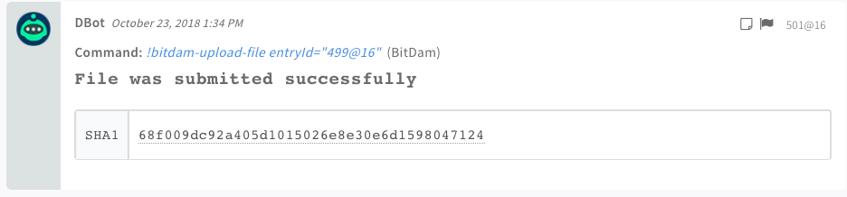
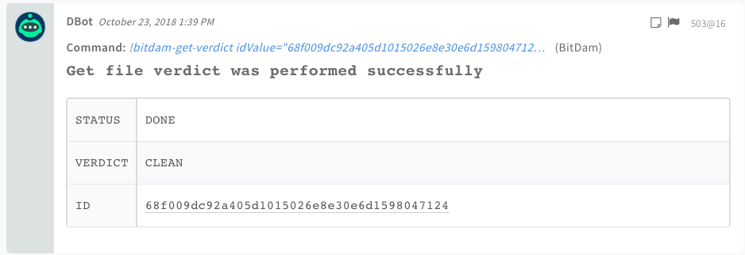

<!-- HTML_DOC -->
<h2>Overview</h2>

BitDam cyber security blocks advanced content-borne attacks across all enterprise communication channels, empowering organisations to collaborate safely. Founded by elite intelligence professionals, BitDam proactively stops malware from running, pre-delivery, preventing hardware and logical exploits, ransomware, phishing, N-Day and Zero-Day attacks contained in any type of attachment or URL. BitDam ensures the highest attack detection rates and delivers the fastest protection from today’s email borne attacks making enterprise communications safe to click.

For more information, see the <a href="https://cloud.bitdam.com/api/v1.0/ui/" target="_blank" rel="noopener">BitDam documentation</a>.

<h2>Use cases</h2>

Scan any supported time in a short time. The BitDam scan file playbook enables you to scan a file and return the result as soon as the file scan completes. This provides a decisive verdict, stating whether the file is benign or malicious.

<h2>Configure BitDam on Cortex XSOAR</h2>

<ol>
<li>Navigate to <strong>Settings</strong> &gt; <strong>Integrations</strong> &gt; <strong>Servers &amp; Services</strong>.</li>
<li>Search for BitDam.</li>
<li>Click <strong>Add instance</strong> to create and configure a new integration instance. 
<ul>
<li>
<strong>Name</strong>: a textual name for the integration instance.</li>
<li><strong>BitDam API URL</strong></li>
<li><strong>API Token</strong></li>
<li><strong>Trust any certificate</strong></li>
<li><strong>Use proxy settings</strong></li>
</ul>
</li>
<li>Click <strong>Test</strong> to validate the URLs, token, and connection.</li>
</ol>
<h2>Commands</h2>

You can execute these commands from the Cortex XSOAR CLI, as part of an automation, or in a playbook. After you successfully execute a command, a DBot message appears in the War Room with the command details.

<ol>
<li><a href="#h_92944668351540898353940">Upload a file: bitdam-upload-file</a></li>
<li><a href="#h_56122540381540898358695">Get the verdict for a file: bitdam-get-verdict</a></li>
</ol>
<h3 id="h_92944668351540898353940">1. Upload a file</h3>

Uploads and submits a file sample to the BitDam service.

<h4>Supported types</h4>
<ul>
<li>doc, dot, docx, docm, dotx, dotm</li>
<li>pdf</li>
<li>rtf</li>
<li>xls, xlt, xlsx, xlsm, xltx, xltm, xlsb, xlam</li>
<li>csv</li>
<li>ppt, pptx, pptm, potx, potm, ppam, ppsx, ppsm, pps</li>
</ul>
<h5>Base Command</h5>
<pre><code>bitdam-upload-file</code></pre>
<h5>Input</h5>
<table style="width: 748px;" border="2" cellpadding="6">
<thead>
<tr>
<th style="width: 218px;"><strong>Argument Name</strong></th>
<th style="width: 362px;"><strong>Description</strong></th>
<th style="width: 128px;"><strong>Required</strong></th>
</tr>
</thead>
<tbody>
<tr>
<td style="width: 218px;">entryId</td>
<td style="width: 362px;">File's entry ID from the War Room</td>
<td style="width: 128px;">Required</td>
</tr>
</tbody>
</table>
<h5> </h5>
<h5>Context Output</h5>
<table style="width: 748px;" border="2" cellpadding="6">
<thead>
<tr>
<th style="width: 369px;"><strong>Path</strong></th>
<th style="width: 116px;"><strong>Type</strong></th>
<th style="width: 223px;"><strong>Description</strong></th>
</tr>
</thead>
<tbody>
<tr>
<td style="width: 369px;">BitDam.FileScan.SHA1</td>
<td style="width: 116px;">string</td>
<td style="width: 223px;">SHA-1</td>
</tr>
</tbody>
</table>
<h5> </h5>
<h5>Command Example</h5>
<pre>!bitdam-upload-file entryId=499@16</pre>
<h5>Context Example</h5>

root:{} 3 items BitDam:{} 1 item FileScan:{} 1 item SHA1:68f009dc92a405d1015026e8e30e6d1598047124

<h5>Human Readable Output</h5>

<h3 id="h_56122540381540898358695">2. Get the verdict of a file</h3>

Returns the verdict of a scanned file.

<h5>Base Command</h5>
<pre><code>bitdam-get-verdict</code></pre>
<h5>Input</h5>
<table style="width: 748px;" border="2" cellpadding="6">
<thead>
<tr>
<th style="width: 143px;"><strong>Argument Name</strong></th>
<th style="width: 488px;"><strong>Description</strong></th>
<th style="width: 77px;"><strong>Required</strong></th>
</tr>
</thead>
<tbody>
<tr>
<td style="width: 143px;">idValue</td>
<td style="width: 488px;">The value of the file's unique identifier. Example: the file SHA-1.</td>
<td style="width: 77px;">Required</td>
</tr>
<tr>
<td style="width: 143px;">idType</td>
<td style="width: 488px;">Identifier type. Default is SHA-1.</td>
<td style="width: 77px;">Optional</td>
</tr>
</tbody>
</table>
<h5> </h5>
<h5>Context Output</h5>
<table style="width: 748px;" border="2" cellpadding="6">
<thead>
<tr>
<th style="width: 169px;"><strong>Path</strong></th>
<th style="width: 63px;"><strong>Type</strong></th>
<th style="width: 476px;"><strong>Description</strong></th>
</tr>
</thead>
<tbody>
<tr>
<td style="width: 169px;">BitDam.Analysis.Status</td>
<td style="width: 63px;">string</td>
<td style="width: 476px;">Status of the analysis ("DONE" or "IN_PROGRESS")</td>
</tr>
<tr>
<td style="width: 169px;">BitDam.Analysis.Verdict</td>
<td style="width: 63px;">string</td>
<td style="width: 476px;">Final verdict of the analysis ("Clean", "Malicious", or empty if the analysis is not finished.</td>
</tr>
<tr>
<td style="width: 169px;">BitDam.Analysis.ID</td>
<td style="width: 63px;">string</td>
<td style="width: 476px;">Unique identifier</td>
</tr>
<tr>
<td style="width: 169px;">DBotScore.Indicator</td>
<td style="width: 63px;">string</td>
<td style="width: 476px;">The Indicator</td>
</tr>
<tr>
<td style="width: 169px;">DBotScore.Score</td>
<td style="width: 63px;">number</td>
<td style="width: 476px;">The DBot score</td>
</tr>
<tr>
<td style="width: 169px;">DBotScore.Type</td>
<td style="width: 63px;">string</td>
<td style="width: 476px;">The indicator type</td>
</tr>
<tr>
<td style="width: 169px;">DBotScore.Vendor</td>
<td style="width: 63px;">string</td>
<td style="width: 476px;">The DBot score vendor</td>
</tr>
<tr>
<td style="width: 169px;">File.Malicious.Name</td>
<td style="width: 63px;">string</td>
<td style="width: 476px;">File name</td>
</tr>
<tr>
<td style="width: 169px;">File.Malicious.Vendor</td>
<td style="width: 63px;">string</td>
<td style="width: 476px;">For malicious files, the vendor that made the decision</td>
</tr>
<tr>
<td style="width: 169px;">File.Malicious.Description</td>
<td style="width: 63px;">string</td>
<td style="width: 476px;">For malicious files, the reason that the vendor made the decision</td>
</tr>
</tbody>
</table>
<h5> </h5>
<h5>Command Example</h5>
<pre>!bitdam-get-verdict idValue=68f009dc92a405d1015026e8e30e6d1598047124</pre>
<h5>Context Example</h5>

root:{} 4 items BitDam:{} 2 items Analysis:{} 3 items ID:68f009dc92a405d1015026e8e30e6d1598047124 Status:DONE Verdict:CLEAN FileScan:{} 1 item SHA1:68f009dc92a405d1015026e8e30e6d1598047124 DBotScore:{} 4 items Indicator:68f009dc92a405d1015026e8e30e6d1598047124 Score:1 Type:File Vendor:BitDam

<h5>Human Readable Output</h5>

