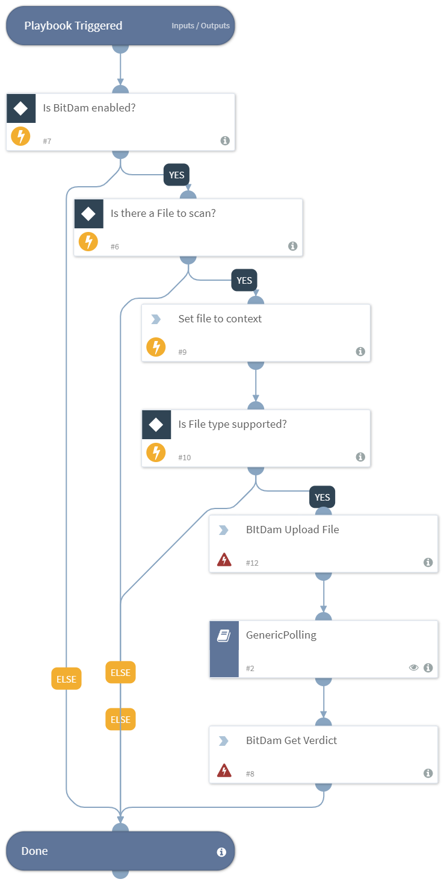

Detonates one or more files using BitDam integration.
Returns verdict to the War Room and file reputations to the context data.

Supported file types are mainly PDF & microsoft office software.

## Dependencies
This playbook uses the following sub-playbooks, integrations, and scripts.

## Sub-playbooks
* GenericPolling

## Integrations
This playbook does not use any integrations.

## Scripts
* Set

## Commands
* bitdam-get-verdict
* bitdam-upload-file

## Playbook Inputs
---

| **Name** | **Description** | **Default Value** | **Source** | **Required** |
| --- | --- | --- | --- | --- |
| File | The file object of the file to detonate. The File is taken from the context. | None | File | Optional |
| Interval | The duration for executing the pooling (in minutes). | 1 | - | Optional |
| Timeout | The duration after which to stop pooling and to resume the playbook (in minutes). | 10 | - | Optional |

## Playbook Outputs
---

| **Path** | **Description** | **Type** |
| --- | --- | --- |
| BitDam.Analysis.ID | The sample ID. | string |
| DBotScore.Vendor | The name of the vendor: BitDam. | string |
| BitDam.Analysis.Verdict | The analysis verdict. | string |
| BitDam.Analysis.Status | The analysis status. | string |
| DBotScore.Indicator | The name of the sample file or URL. | unknown |
| DBotScore.Type | The 'file' for file samples. | string |
| DBotScore.Score | The actual score. | number |

## Playbook Image
---

