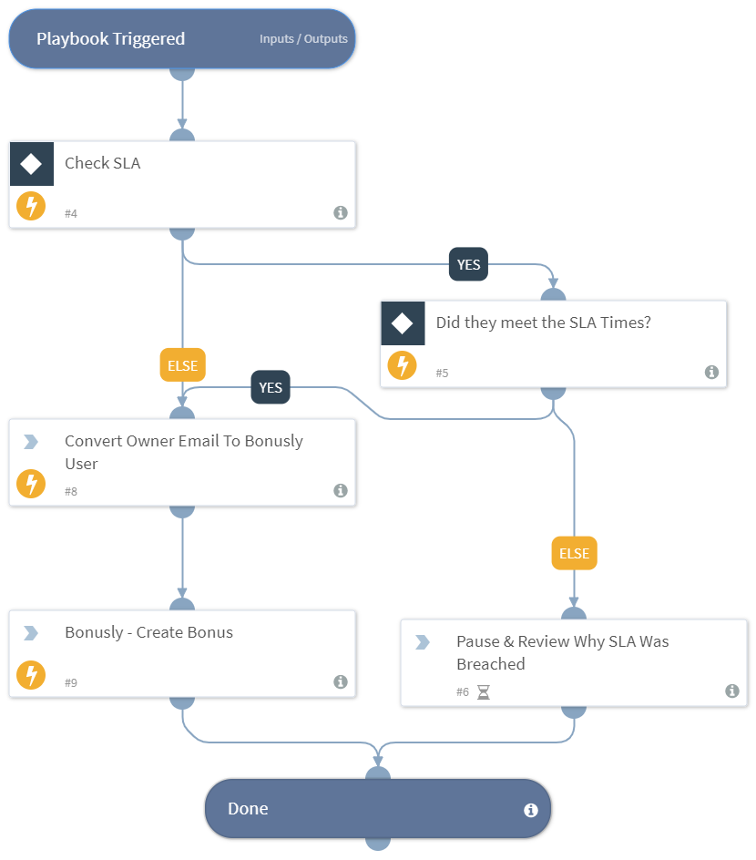

AutoGratitude is a playbook to give back a positive gratitude to security engineers and developers when they successfully complete an SLA

## Dependencies
This playbook uses the following sub-playbooks, integrations, and scripts.

### Sub-playbooks
This playbook does not use any sub-playbooks.

### Integrations
* Bonusly

### Scripts
* IncOwnerToBonuslyUser

### Commands
* bonusly-create-bonus

## Playbook Inputs
---

| **Name** | **Description** | **Default Value** | **Required** |
| --- | --- | --- | --- |
| BonuslyLookupList | Create a Lookup JSON List In The Lists Section Containing XSOAR Email To Bonusly User

\{
"xsoar\_user1@your\_company.com":"@bonusly\_user1", 
"xsoar\_user2@paloaltonetworks.com":"@bonusly\_user2"
\} | ${lists.Bonusly - Email To User Lookup} | Required |
| GiverEmail | Add a giver email or set this before hand.  | bonusly_admin_user@your_company.com | Required |
| GiverReason | Add a Bonusly reason like \+10 etc and a user name | +10 @bonusly.username #collaboration | Required |
| CheckSLA | If Check SLA is set to true then it will first see if the owner has met the SLA agreement.  | false | Optional |

## Playbook Outputs
---
There are no outputs for this playbook.

## Playbook Image
---
