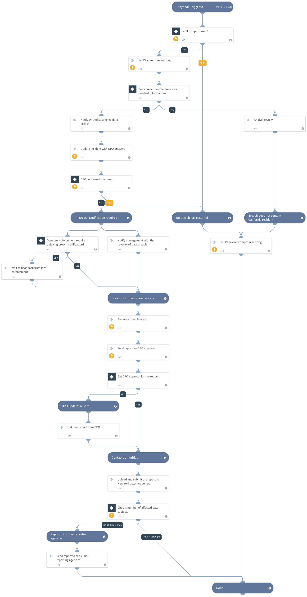

This playbook helps an analyst determine if the breached data meets the criteria for breach notification according to New York State law, and, if necessary, follows through with the notification procedures. 

DISCLAIMER: Please consult with your legal team before implementing this playbook.

**Sources:** 
https://ag.ny.gov/internet/data-breach
https://www.dos.ny.gov/consumerprotection/pdf/infosecbreach03.pdf
https://www.nysenate.gov/legislation/laws/GBS/899-AA

## Dependencies
This playbook uses the following sub-playbooks, integrations, and scripts.

### Sub-playbooks
This playbook does not use any sub-playbooks.

### Integrations
This playbook does not use any integrations.

### Scripts
* GenerateInvestigationSummaryReport
* Set

### Commands
* send-mail
* setIncident

## Playbook Inputs
---

| **Name** | **Description** | **Default Value** | **Required** |
| --- | --- | --- | --- |
| ContactName | In case of a breach, the contact details to send to the Attorney General and the affected residents. |  | Optional |
| ContactEmailAddress | In case of a breach, the contact details to send to the Attorney General and the affected residents. |  | Optional |
| ContactTelNumber | In case of a breach, the contact details to send to the Attorney General and the affected residents. |  | Optional |
| CompanyName |  |  | Optional |
| CompanyAddress | In case of a breach, the company details to display in the breach report. |  | Optional |
| CompanyCity | In case of a breach, the company details to display in the breach report. |  | Optional |
| CompanyCountry | In case of a breach, the company details to display in the breach report. |  | Optional |

## Playbook Outputs
---

| **Path** | **Description** | **Type** |
| --- | --- | --- |
| PIICompromised | Set a flag indicating that PII has been compromised. | boolean |
| HealthInsuranceBreached | Set a flag indicating that the breach contains PII of health insurance information. | unknown |
| MedicalInformationBreached | Set a flag indicating that the breach contains PII of medical information. | unknown |
| FinancialInformationBreached | Set a flag indicating that the breach contains PII of financial information. | unknown |
| AccountInformationBreached | Set a flag indicating that the breach contains PII of account information. | unknown |
| UniqueIdentificationNumberBreached | Set a flag indicating that the breach contains PII of unique identification number. | unknown |
| UniqueBiometricDataBreached | Set a flag indicating that the breach contains PII of unique biometric data. | unknown |
| Analyst review.Answers.1 | Explain, in your words, the incident origin, what you have checked, and any information related to this incident. | longText |

## Playbook Image
---

