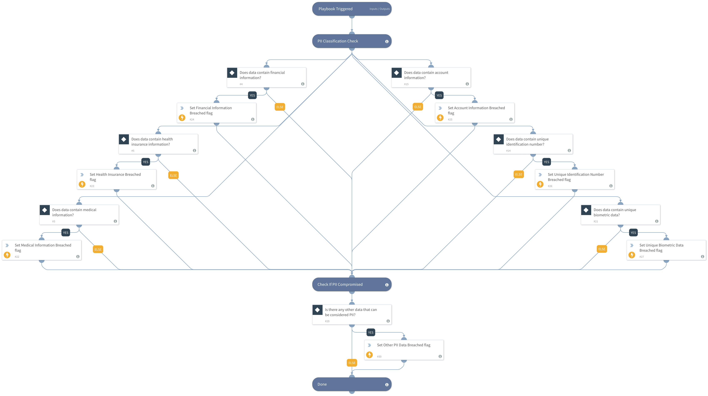

The playbook checks for all various types of PII, however, each state determines what is considered PII, and which PII requires notification.

DISCLAIMER: Please consult with your legal team before implementing this playbook.

**Sources:
 http://leginfo.legislature.ca.gov/faces/codes_displaySection.xhtml?lawCode=CIV&sectionNum=1798.82
https://www.nysenate.gov/legislation/laws/GBS/899-AA
and more for each state.

## Dependencies
This playbook uses the following sub-playbooks, integrations, and scripts.

### Sub-playbooks
This playbook does not use any sub-playbooks.

### Integrations
This playbook does not use any integrations.

### Scripts
* Set

### Commands
This playbook does not use any commands.

## Playbook Inputs
---
There are no inputs for this playbook.

## Playbook Outputs
---
There are no outputs for this playbook.

## Playbook Image
---

