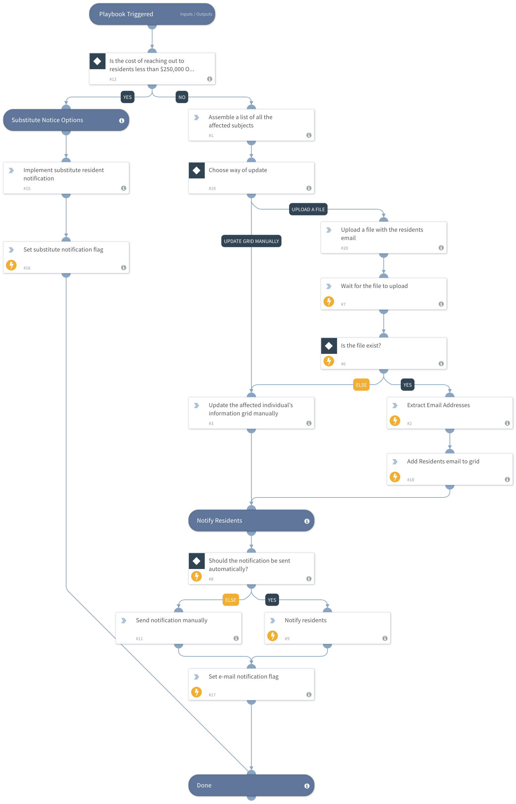

This playbook is triggered by a breach notification playbook and is responsible for the resident notification process.

## Dependencies
This playbook uses the following sub-playbooks, integrations, and scripts.

### Sub-playbooks
This playbook does not use any sub-playbooks.

### Integrations
This playbook does not use any integrations.

### Scripts
* Sleep
* SetGridField
* Set

### Commands
* extractIndicators
* send-mail

## Playbook Inputs
---

| **Name** | **Description** | **Default Value** | **Required** |
| --- | --- | --- | --- |
| AutoNotification | This input determines if the resident notification should be done automatically or manually.
Ture \- Automatically
False \- Manually. | False | Required |
| ResidentNotification_WhatCanTheyDo | An explanation to the resident's notification email of what can they do. | First, change your online login information, passwords, and security questions-and-answers. 
Second, if you used similar login information and passwords for different sites - change the login information, passwords, and security Q&A to them too.
Third, pay attention if you start receiving notices of password changes to your current accounts or find yourself locked out of your accounts.
Fourth, Consider implementing two-factor-authentication to your account to reduce the risk of unauthorized access in your account. | Optional |
| ContactName | In case of a breach, the contact details to send to the Attorney General and the affected residents. |  | Optional |
| ContactEmailAddress | In case of a breach, the contact details to send to the Attorney General and the affected residents. |  | Optional |
| ContactTelNumber | In case of a breach, the contact details to send to the Attorney General and the affected residents. |  | Optional |
| MeasuresToMitigate | An explanation to the resident's notification email of the company actions to mitigate the breach. |  | Optional |

## Playbook Outputs
---
There are no outputs for this playbook.

## Playbook Image
---

