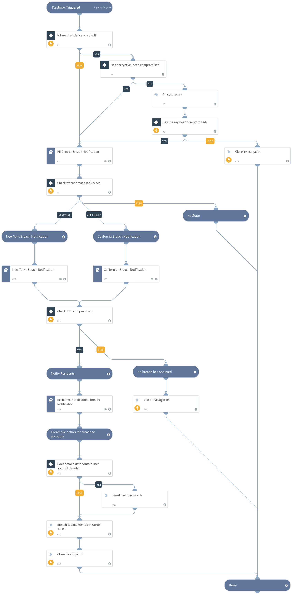

All 50 US states, Washington, DC, and most US territories (including Puerto Rico, Guam, and the Virgin Islands) have passed breach notification laws that require notifying state residents and the Attorney General in case of a personally identifiable information (PII) security breach.
This US Breach Notification content pack includes playbooks that help to determine if the breached data meets the criteria for breach notification for the relevant state, and, if necessary, follows through with the notification procedures.
With this package, it will be possible to understand whether a breach occurred and whether the notification is required. In addition, you can shorten the notification time in case of breach according to the state law.

##### What does this pack do?
The playbooks included in this pack help you automate repetitive tasks associated with US breach notification incidents:
- Checks whether the breached data was encrypted or if the encryption key was compromised.
- Checks the types of PII that were compromised, however, each state determines what is considered PII, and which PII requires notification.
- Checks if the PII that was compromised contained living residents in the selected state.
- Asks the DPO (Data Protection Officer) to confirm the breach.
- In case notification is required, the pack assists with the notification process to send a breach notification to the following: Affected residents, State Attorney General, Consumer Reporting Agencies, and State CISO (if required).

As part of this pack, you will also get out-of-the-box US breach notification incident views, and a full layout. All of these are easily customizable to suit the needs of your organization.

_For more information, visit our [Cortex XSOAR Developer Docs](https://xsoar.pan.dev/docs/reference/playbooks/us---breach-notification)_

