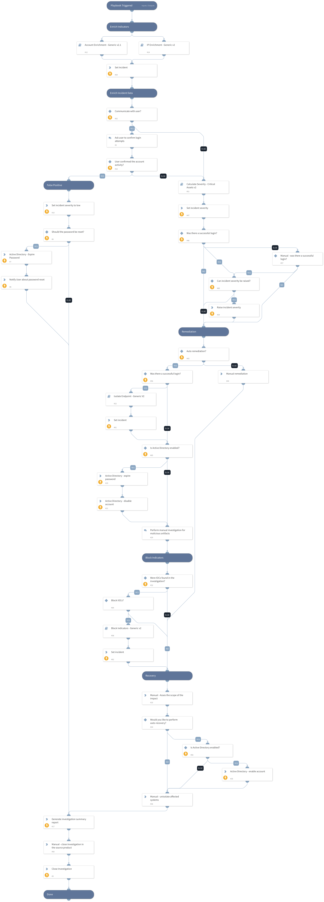

Brute Force investigations require security teams to reconcile data from many different sources. Valuable time is lost shuttling between screens and executing repeatable tasks while an attack continues to manifest.
This Brute Force content pack contains the ‘Brute Force Investigation - Generic’ playbook, that automates response to different Brute Force incidents. The pack also contains the corresponding custom Brute Force incident fields, views and layouts to facilitate analyst investigation.

##### What does this pack do?
The playbook  included in this pack handles the following use-cases:
- Brute Force IP Detected - A detection of source IPs that are exceeding a high threshold of rejected and/or invalid logins.
- Brute Force Increase Percentage - A detection of large increase percentages in various brute force statistics over different periods of time.
- Brute Force Potentially Compromised Accounts - A detection of accounts that have shown a high amount of failed logins with one successful login.
This playbook helps you save time and automate repetitive tasks associated with Brute Force incidents:
- Gather and enrich user and IP information.
- Interact with the suspected user to retrieve more information about the incident.
- Calculate the incident severity based on the enriched information, login data and information received from the user.
- Isolate the attacked endpoint.
- Remediate the incident by blocking malicious indicators, and disabling the account.
- Generate an investigation report to document the incident’s details.

As part of this pack, you will also get out-of-the-box Brute Force incident type views, with incident fields and a full layout. All of these are easily customizable to suit the needs of your organization.

_For more information, visit our  [Cortex XSOAR Developer Docs](https://xsoar.pan.dev/docs/reference/playbooks/brute-force-investigation---generic)_

