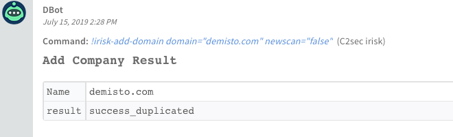
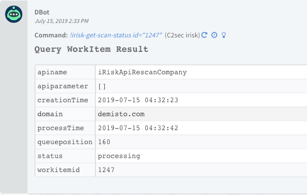
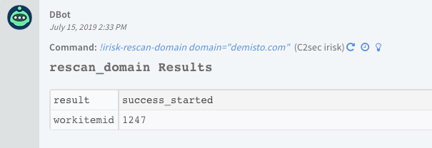
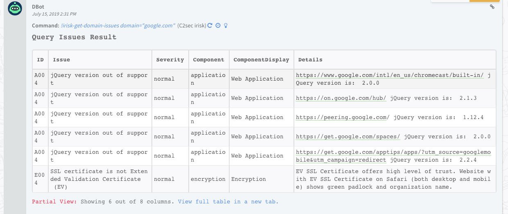
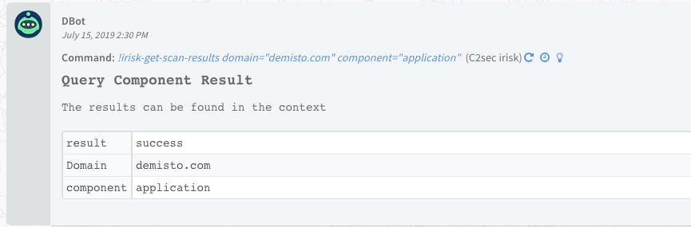

<!-- HTML_DOC -->

Use the C2sec irisk integration to scan domains and return scan results.

<h2>
C2sec irisk Playbooks</h2>
<ul>
<li>
<strong>C2SEC-Domain Scan</strong> - scans domains and waits for the full response from the C2sec irisk service.</li>
</ul>
<h2>
Configure C2sec irisk on Cortex XSOAR</h2>
<ol>
<li>Navigate to <strong>Settings</strong> &gt; <strong>Integrations</strong> &gt; <strong>Servers &amp; Services</strong>.</li>
<li>Search for C2sec irisk.</li>
<li>Click <strong>Add instance</strong> to create and configure a new integration instance.
<ul>
<li>
<strong>Name</strong>: a textual name for the integration instance.</li>
<li><strong>API URL (e.g. <a href="https://api.c2sec.com/api">https://api.c2sec.com/api</a>)</strong></li>
<li><strong>API Key</strong></li>
<li><strong>Default domain name</strong></li>
<li><strong>Trust any certificate (not secure)</strong></li>
<li><strong>Use system proxy settings</strong></li>
</ul>
</li>
<li>Click <strong>Test</strong> to validate the URLs, token, and connection.</li>
</ol>
<h2>
Commands</h2>

You can execute these commands from the Cortex XSOAR CLI, as part of an automation, or in a playbook. After you successfully execute a command, a DBot message appears in the War Room with the command details.

<ol>
<li><a href="#h_d792fb42-2504-4bc4-b174-6422ccdfa7a6" target="_self">Add a domain to a portfolio: irisk-add-domain</a></li>
<li><a href="#h_93a605e6-1ab9-4349-80c9-5968792eea44" target="_self">Get the status of a scan: irisk-get-scan-status</a></li>
<li><a href="#h_b8bb719e-d7a3-4032-8827-e358b59f6288" target="_self">Re-scan a domain: irisk-rescan-domain</a></li>
<li><a href="#h_cc2d5cfe-b44d-4489-a1cb-df741e9d682d" target="_self">Get the issues for a domain: irisk-get-domain-issues</a></li>
<li><a href="#h_496fd318-3fe1-49d8-b03a-51ba5bbbbed1" target="_self">Get the results of a scan: irisk-get-scan-results</a></li>
</ol>
<h3 id="h_d792fb42-2504-4bc4-b174-6422ccdfa7a6">
1. Add a domain to a portfolio</h3>

Adds a domain to a portfolio.

<h5>
Base Command</h5>

<code>irisk-add-domain</code>

<h5>
Input</h5>
<table class="table table-striped table-bordered" style="width: 749px;">
<thead>
<tr>
<th style="width: 146px;"><strong>Argument Name</strong></th>
<th style="width: 523px;"><strong>Description</strong></th>
<th style="width: 71px;"><strong>Required</strong></th>
</tr>
</thead>
<tbody>
<tr>
<td style="width: 146px;">domain</td>
<td style="width: 523px;">Domain to add to the portfolio. If empty, the default domain will be used.</td>
<td style="width: 71px;">Optional</td>
</tr>
<tr>
<td style="width: 146px;">newscan</td>
<td style="width: 523px;">Flag to indicate whether a new scan is always initiated for the specified domain.</td>
<td style="width: 71px;">Required</td>
</tr>
</tbody>
</table>

 

<h5>
Context Output</h5>
<table class="table table-striped table-bordered" style="width: 749px;">
<thead>
<tr>
<th style="width: 230px;"><strong>Path</strong></th>
<th style="width: 59px;"><strong>Type</strong></th>
<th style="width: 451px;"><strong>Description</strong></th>
</tr>
</thead>
<tbody>
<tr>
<td style="width: 230px;">C2Sec.Domain.result</td>
<td style="width: 59px;">string</td>
<td style="width: 451px;">Result status of adding the new company.</td>
</tr>
<tr>
<td style="width: 230px;">C2Sec.Domain.Name</td>
<td style="width: 59px;">string</td>
<td style="width: 451px;">The name of the searched domain.</td>
</tr>
</tbody>
</table>

 

<h5>
Command Example</h5>
<pre>!irisk-add-domain newscan=false domain=demisto.com</pre>
<h5>
Human Readable Output</h5>

<h3 id="h_93a605e6-1ab9-4349-80c9-5968792eea44">
2. Get the status of a scan</h3>

Queries the status of a scan.

<h5>
Base Command</h5>

<code>irisk-get-scan-status</code>

<h5>
Input</h5>
<table class="table table-striped table-bordered" style="width: 749px;">
<thead>
<tr>
<th style="width: 180px;"><strong>Argument Name</strong></th>
<th style="width: 464px;"><strong>Description</strong></th>
<th style="width: 96px;"><strong>Required</strong></th>
</tr>
</thead>
<tbody>
<tr>
<td style="width: 180px;">id</td>
<td style="width: 464px;">Domain workitemid for which to check the status.</td>
<td style="width: 96px;">Required</td>
</tr>
</tbody>
</table>

 

<h5>
Context Output</h5>
<table class="table table-striped table-bordered" style="width: 749px;">
<thead>
<tr>
<th style="width: 252px;"><strong>Path</strong></th>
<th style="width: 61px;"><strong>Type</strong></th>
<th style="width: 427px;"><strong>Description</strong></th>
</tr>
</thead>
<tbody>
<tr>
<td style="width: 252px;">C2sec.Domain.Scan.domain</td>
<td style="width: 61px;">string</td>
<td style="width: 427px;">The name of the scanned domain.</td>
</tr>
<tr>
<td style="width: 252px;">C2sec.Domain.Scan.workitemid</td>
<td style="width: 61px;">number</td>
<td style="width: 427px;">The ID of the current scan.</td>
</tr>
<tr>
<td style="width: 252px;">C2sec.Domain.Scan.completeTime</td>
<td style="width: 61px;">date</td>
<td style="width: 427px;">The time that the scan was completed.</td>
</tr>
<tr>
<td style="width: 252px;">C2sec.Domain.Scan.creationTime</td>
<td style="width: 61px;">date</td>
<td style="width: 427px;">The time that the scan was initiated.</td>
</tr>
<tr>
<td style="width: 252px;">C2sec.Domain.Scan.status</td>
<td style="width: 61px;">number</td>
<td style="width: 427px;">The status of the current scan (“processing”/“completed”).</td>
</tr>
</tbody>
</table>

 

<h5>
Command Example</h5>
<pre>!irisk-get-scan-status id=1247</pre>
<h5>
Human Readable Output</h5>

<h3 id="h_b8bb719e-d7a3-4032-8827-e358b59f6288">
3. Re-scan a domain</h3>

Initiates a re-scan for a domain within a portfolio.

<h5>
Base Command</h5>

<code>irisk-rescan-domain</code>

<h5>
Input</h5>
<table class="table table-striped table-bordered" style="width: 749px;">
<thead>
<tr>
<th style="width: 156px;"><strong>Argument Name</strong></th>
<th style="width: 501px;"><strong>Description</strong></th>
<th style="width: 83px;"><strong>Required</strong></th>
</tr>
</thead>
<tbody>
<tr>
<td style="width: 156px;">domain</td>
<td style="width: 501px;">Domain to re-scan. If empty, the default domain will be used.</td>
<td style="width: 83px;">Optional</td>
</tr>
</tbody>
</table>

 

<h5>
Context Output</h5>
<table class="table table-striped table-bordered" style="width: 749px;">
<thead>
<tr>
<th style="width: 315px;"><strong>Path</strong></th>
<th style="width: 82px;"><strong>Type</strong></th>
<th style="width: 343px;"><strong>Description</strong></th>
</tr>
</thead>
<tbody>
<tr>
<td style="width: 315px;">C2sec.Domain.Scan.domain</td>
<td style="width: 82px;">string</td>
<td style="width: 343px;">The name of the scanned domain.</td>
</tr>
<tr>
<td style="width: 315px;">C2sec.Domain.Scan.workitemid</td>
<td style="width: 82px;">number</td>
<td style="width: 343px;">Scan ID.</td>
</tr>
<tr>
<td style="width: 315px;">C2sec.Domain.Scan.result</td>
<td style="width: 82px;">string</td>
<td style="width: 343px;">The scan result status.</td>
</tr>
</tbody>
</table>

 

<h5>
Command Example</h5>
<pre>!irisk-rescan-domain domain=demisto.com</pre>
<h5>
Human Readable Output</h5>

<h3 id="h_cc2d5cfe-b44d-4489-a1cb-df741e9d682d">
4. Get the issues for a domain</h3>

Returns the issues located under the specified domain.

<h5>
Base Command</h5>

<code>irisk-get-domain-issues</code>

<h5>
Input</h5>
<table class="table table-striped table-bordered" style="width: 749px;">
<thead>
<tr>
<th style="width: 150px;"><strong>Argument Name</strong></th>
<th style="width: 510px;"><strong>Description</strong></th>
<th style="width: 80px;"><strong>Required</strong></th>
</tr>
</thead>
<tbody>
<tr>
<td style="width: 150px;">domain</td>
<td style="width: 510px;">The domain to query. If empty, the default domain it will be used.</td>
<td style="width: 80px;">Optional</td>
</tr>
<tr>
<td style="width: 150px;">severity</td>
<td style="width: 510px;">Filter query results by issue severity…</td>
<td style="width: 80px;">Optional</td>
</tr>
</tbody>
</table>

 

<h5>
Context Output</h5>
<table class="table table-striped table-bordered" style="width: 749px;">
<thead>
<tr>
<th style="width: 281px;"><strong>Path</strong></th>
<th style="width: 46px;"><strong>Type</strong></th>
<th style="width: 413px;"><strong>Description</strong></th>
</tr>
</thead>
<tbody>
<tr>
<td style="width: 281px;">C2sec.Domain.Name</td>
<td style="width: 46px;">string</td>
<td style="width: 413px;">The name of the domain against which it was checked.</td>
</tr>
<tr>
<td style="width: 281px;">C2sec.Domain.Issue.ID</td>
<td style="width: 46px;">string</td>
<td style="width: 413px;">Issue ID.</td>
</tr>
<tr>
<td style="width: 281px;">C2sec.Domain.Issue.Asset</td>
<td style="width: 46px;">string</td>
<td style="width: 413px;">Asset associated with the issues. For example, IP addresses, website URLs, and so on.</td>
</tr>
<tr>
<td style="width: 281px;">C2sec.Domain.Issue.Component</td>
<td style="width: 46px;">string</td>
<td style="width: 413px;">The component used in the issue.</td>
</tr>
<tr>
<td style="width: 281px;">C2sec.Domain.Issue.ComponentDisplay</td>
<td style="width: 46px;">string</td>
<td style="width: 413px;">The display name of the component being used.</td>
</tr>
<tr>
<td style="width: 281px;">C2sec.Domain.Issue.Details</td>
<td style="width: 46px;">string</td>
<td style="width: 413px;">The details for the issue.</td>
</tr>
<tr>
<td style="width: 281px;">C2sec.Domain.Issue.Issue</td>
<td style="width: 46px;">string</td>
<td style="width: 413px;">The name of the issue.</td>
</tr>
<tr>
<td style="width: 281px;">C2sec.Domain.Issue.Severity</td>
<td style="width: 46px;">string</td>
<td style="width: 413px;">The severity of the issue.</td>
</tr>
</tbody>
</table>

 

<h5>
Command Example</h5>
<pre>!irisk-get-domain-issues domain=google.com</pre>
<h5>
Human Readable Output</h5>

<h3 id="h_496fd318-3fe1-49d8-b03a-51ba5bbbbed1">
5. Get the results of a scan</h3>

Queries data for a specific component for companies in the portfolio.

<h5>
Base Command</h5>

<code>irisk-get-scan-results</code>

<h5>
Input</h5>
<table class="table table-striped table-bordered" style="width: 749px;">
<thead>
<tr>
<th style="width: 160px;"><strong>Argument Name</strong></th>
<th style="width: 495px;"><strong>Description</strong></th>
<th style="width: 85px;"><strong>Required</strong></th>
</tr>
</thead>
<tbody>
<tr>
<td style="width: 160px;">domain</td>
<td style="width: 495px;">The domain to query. If empty, default domain will be used.</td>
<td style="width: 85px;">Required</td>
</tr>
<tr>
<td style="width: 160px;">component</td>
<td style="width: 495px;">The component to query.</td>
<td style="width: 85px;">Required</td>
</tr>
</tbody>
</table>

 

<h5>
Context Output</h5>
<table class="table table-striped table-bordered" style="width: 749px;">
<thead>
<tr>
<th style="width: 301px;"><strong>Path</strong></th>
<th style="width: 46px;"><strong>Type</strong></th>
<th style="width: 393px;"><strong>Description</strong></th>
</tr>
</thead>
<tbody>
<tr>
<td style="width: 301px;">C2sec.Domain.application.result</td>
<td style="width: 46px;">string</td>
<td style="width: 393px;">Query status.</td>
</tr>
<tr>
<td style="width: 301px;">C2sec.Domain.application.Domain</td>
<td style="width: 46px;">string</td>
<td style="width: 393px;">The domain name being queried.</td>
</tr>
<tr>
<td style="width: 301px;">C2sec.Domain.application.data.appdetail</td>
<td style="width: 46px;">string</td>
<td style="width: 393px;">Details about the application being checked.</td>
</tr>
<tr>
<td style="width: 301px;">C2sec.Domain.application.data.info</td>
<td style="width: 46px;">string</td>
<td style="width: 393px;">Information regarding the data being processed.</td>
</tr>
<tr>
<td style="width: 301px;">C2sec.Domain.application.data.website</td>
<td style="width: 46px;">string</td>
<td style="width: 393px;">Website address being processed.</td>
</tr>
<tr>
<td style="width: 301px;">C2sec.Domain.credential.result</td>
<td style="width: 46px;">string</td>
<td style="width: 393px;">Query status.</td>
</tr>
<tr>
<td style="width: 301px;">C2sec.Domain.credential.Domain</td>
<td style="width: 46px;">string</td>
<td style="width: 393px;">The domain name being queried.</td>
</tr>
<tr>
<td style="width: 301px;">C2sec.Domain.credential.data.user</td>
<td style="width: 46px;">string</td>
<td style="width: 393px;">User name.</td>
</tr>
<tr>
<td style="width: 301px;">C2sec.Domain.credential.data.pw</td>
<td style="width: 46px;">string</td>
<td style="width: 393px;">User password.</td>
</tr>
<tr>
<td style="width: 301px;">C2sec.Domain.network.result</td>
<td style="width: 46px;">string</td>
<td style="width: 393px;">Query status.</td>
</tr>
<tr>
<td style="width: 301px;">C2sec.Domain.network.Domain</td>
<td style="width: 46px;">string</td>
<td style="width: 393px;">The domain name being queried.</td>
</tr>
<tr>
<td style="width: 301px;">C2sec.Domain.network.data.firewall</td>
<td style="width: 46px;">string</td>
<td style="width: 393px;">Firewall status.</td>
</tr>
<tr>
<td style="width: 301px;">C2sec.Domain.network.data.port</td>
<td style="width: 46px;">string</td>
<td style="width: 393px;">Port number.</td>
</tr>
<tr>
<td style="width: 301px;">C2sec.Domain.network.data.IP</td>
<td style="width: 46px;">string</td>
<td style="width: 393px;">IP address.</td>
</tr>
<tr>
<td style="width: 301px;">C2sec.Domain.network.data.Name</td>
<td style="width: 46px;">string</td>
<td style="width: 393px;">Name of the user.</td>
</tr>
<tr>
<td style="width: 301px;">C2sec.Domain.network.data.service</td>
<td style="width: 46px;">string</td>
<td style="width: 393px;">Name of the service being used.</td>
</tr>
<tr>
<td style="width: 301px;">C2sec.Domain.network.data.protocol</td>
<td style="width: 46px;">string</td>
<td style="width: 393px;">Name of the protocol being used.</td>
</tr>
<tr>
<td style="width: 301px;">C2sec.Domain.network.data.state</td>
<td style="width: 46px;">string</td>
<td style="width: 393px;">State of the network application (“open” or “closed”).</td>
</tr>
</tbody>
</table>

 

<h5>
Command Example</h5>
<pre>!irisk-get-scan-results component=application domain=demisto.com</pre>
<h5>
Human Readable Output</h5>

