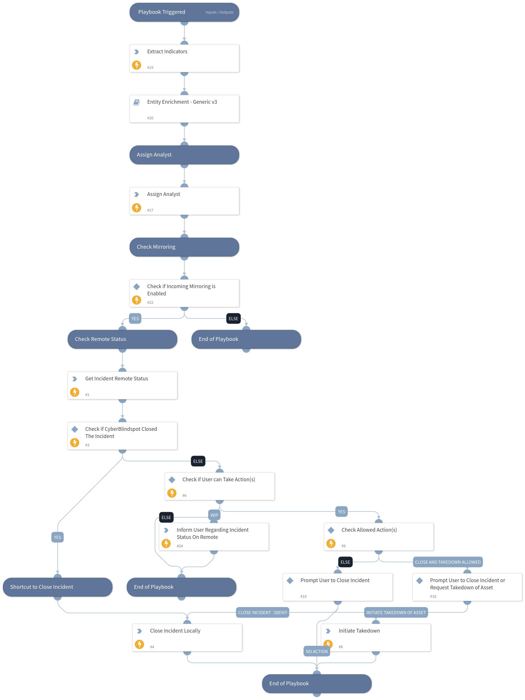

This playbook runs the incidents through a enrichment and CyberBlindspot actions.

## Dependencies

This playbook uses the following sub-playbooks, integrations, and scripts.

### Sub-playbooks

* Entity Enrichment - Generic v3

### Integrations

* CTM360_CyberBlindspot

### Scripts

* AssignAnalystToIncident
* Print

### Commands

* ctm360-cbs-incident-details
* extractIndicators
* closeInvestigation
* ctm360-cbs-incident-request-takedown

## Playbook Inputs

---
There are no inputs for this playbook.

## Playbook Outputs

---
There are no outputs for this playbook.

## Playbook Image

---

