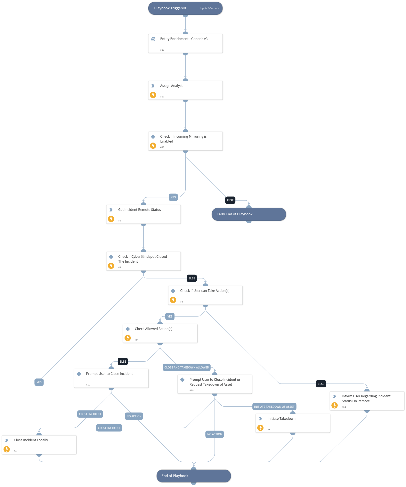

This playbook runs the incidents through indicator enrichment, then based on the mirroring settings, it can communicate with the remote server to assist the user in the next course of action (Whether it be closing the incident, initiating the takedown of an online asset or simply waiting for a process on the remote server to end) to take on the incident if any.

## Dependencies

This playbook uses the following sub-playbooks, integrations, and scripts.

### Sub-playbooks

Entity Enrichment - Generic v3

### Integrations

CTM360_CyberBlindspot

### Scripts

* AssignAnalystToIncident
* Print

### Commands

* closeInvestigation
* ctm360-cbs-incident-details
* ctm360-cbs-incident-request-takedown

## Playbook Inputs

---
There are no inputs for this playbook.

## Playbook Outputs

---
There are no outputs for this playbook.

## Playbook Image

---

