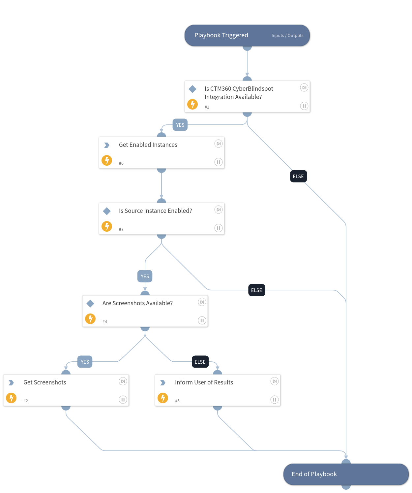

This playbook retrieves screenshot evidence from the CyberBlindspot API and adds it to the incident.

## Dependencies

This playbook uses the following sub-playbooks, integrations, and scripts.

### Sub-playbooks

This playbook does not use any sub-playbooks.

### Integrations

* CTM360_CyberBlindspot

### Scripts

* GetEnabledInstances
* IsIntegrationAvailable
* Print

### Commands

* ctm360-cbs-incident-retrieve-screenshots

## Playbook Inputs

---
There are no inputs for this playbook.

## Playbook Outputs

---
There are no outputs for this playbook.

## Playbook Image

---

