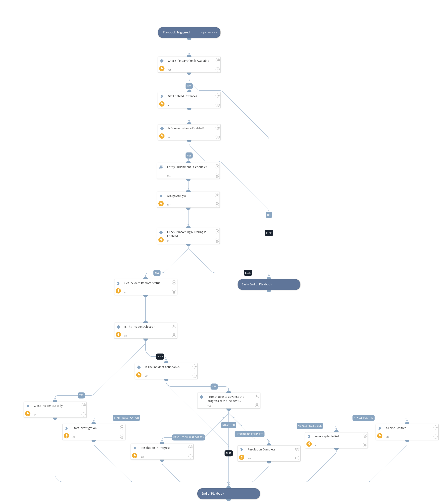

This playbook runs the incidents through indicator enrichment, then based on the mirroring settings, it can communicate with the remote server to track the progress of the investigation.

## Dependencies

This playbook uses the following sub-playbooks, integrations, and scripts.

### Sub-playbooks

* Entity Enrichment - Generic v3

### Integrations

* CTM360_HackerView

### Scripts

* AssignAnalystToIncident
* GetEnabledInstances
* IsIntegrationAvailable

### Commands

* closeInvestigation
* ctm360-hv-incident-details
* ctm360-hv-incident-status-change

## Playbook Inputs

---
There are no inputs for this playbook.

## Playbook Outputs

---
There are no outputs for this playbook.

## Playbook Image

---

