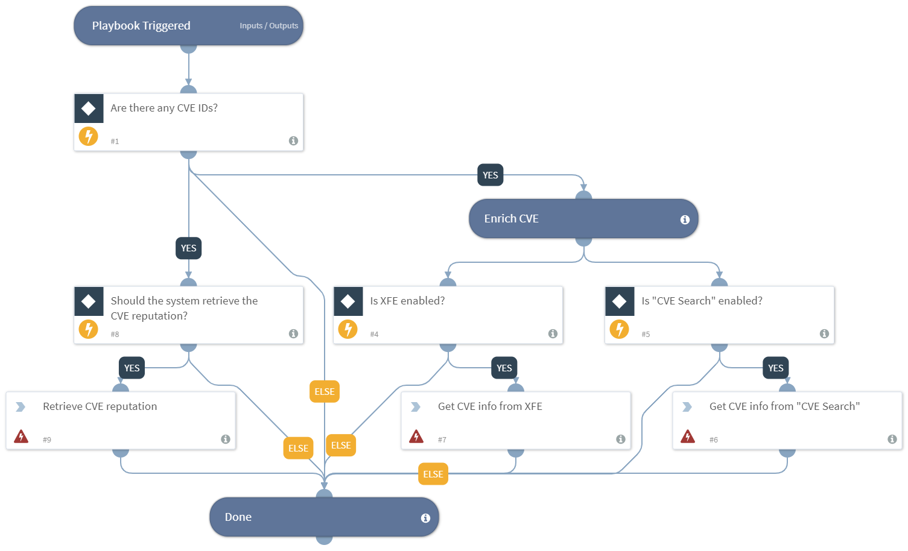

Deprecated. Use CVE Enrichment - Generic v2 instead.
Enriches CVE using one or more integrations.

## Dependencies
This playbook uses the following sub-playbooks, integrations, and scripts.

## Sub-playbooks
This playbook does not use any sub-playbooks.

## Integrations
* CVE Search
* XFE

## Scripts
* cveReputation

## Commands
* cve-search

## Playbook Inputs
---

| **Name** | **Description** | **Default Value** | **Source** | **Required** |
| --- | --- | --- | --- | --- |
| CVE | The CVE to enrich. | None | CVE | Optional |
| GetReputation | Whether the playbook retrieves the reputation of the CVE. | True | - | Required |

## Playbook Outputs
---

| **Path** | **Description** | **Type** |
| --- | --- | --- |
| CVE | The CVE object. | unknown |
| CVE.ID | The ID of the CVE. | string |
| CVE.CVSS | The CVSS score of the CVE. | number |
| CVE.Published | The date this was published. | date |
| CVE.Modified | The last time the CVE was modified. | date |
| CVE.Description | The CVE description. | string |

## Playbook Image
---

