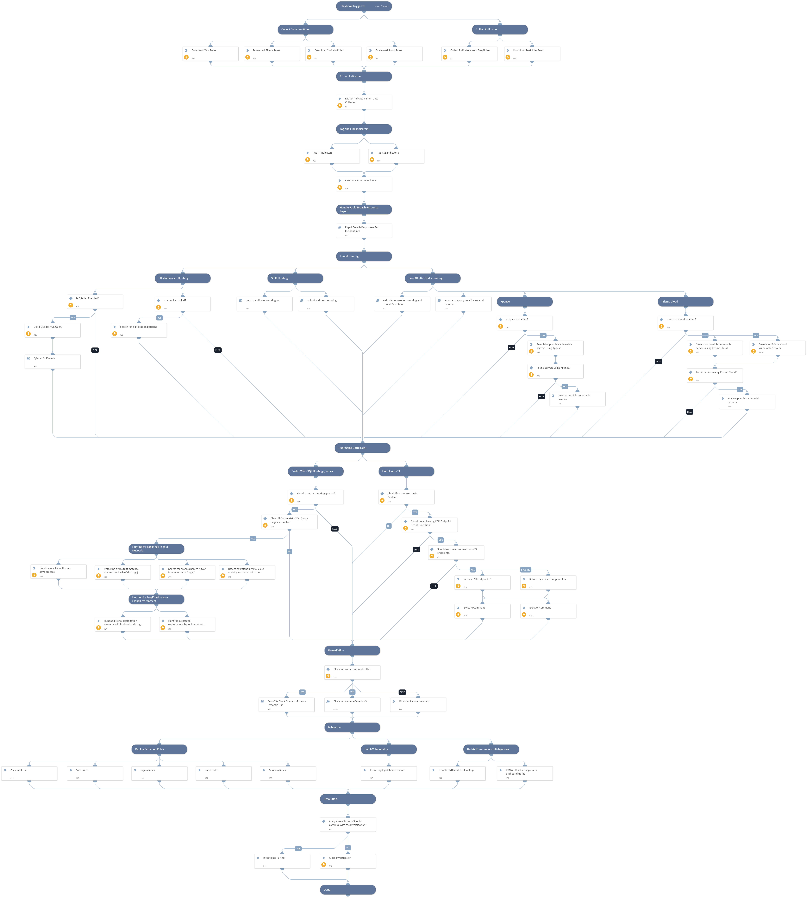

Critical RCE Vulnerability: log4j - CVE-2021-44228

On Dec. 9, 2021, a remote code execution (RCE) vulnerability in Apache log4j 2 was identified being exploited in the wild. Public proof of concept (PoC) code was released and subsequent investigation revealed that exploitation was incredibly easy to perform. 

On Dec. 14 2021, another vulnerability was discovered related to the log4j 0-day exploit known as CVE-2021-45046.

On Dec 18 2021, yet another vulnerability was discovered related to the log4j 0-day exploit known as CVE-2021-45105 that allows an attacker with control over Thread Context Map data to cause a denial of service when a crafted string is interpreted. This issue was fixed in Log4j 2.17.0 and 2.12.3.

On Dec 28 2021, another RCE vulnerability was published for Apache Log4j2, versions 2.0-beta7 through 2.17.0 (excluding security fix releases 2.3.2 and 2.12.4).
In order to exploit this vulnerability, an attacker with permission to modify the logging configuration file can construct a malicious configuration using a JDBC Appender with a data source referencing a JNDI URI which can execute remote code. This issue is fixed by limiting JNDI data source names to the java protocol in Log4j2 versions 2.17.1, 2.12.4, and 2.3.2.

**Affected Version**

Apache Log4j 2.x <= 2.17.0

This playbook should be triggered manually or can be configured as a job.
Please create a new incident and choose the **CVE-2021-44228 - Log4j RCE** playbook and **Rapid Breach Response** incident type.

**The playbook includes the following tasks:**

* Collect related known indicators from several sources.
* Indicators and exploitation patterns hunting using PAN-OS, Cortex XDR and SIEM products.
*Search for possible vulnerable servers using Xpanse and Prisma Cloud.
* Block indicators automatically or manually.

**Mitigations:**
* Apache official CVE-2021-44228 patch.
* Unit42 recommended mitigations.
* Detection Rules.
    * Snort
    * Suricata
    * Sigma
    * Yara
    * Zeek Intel

More information:
[Apache Log4j Vulnerability Is Actively Exploited in the Wild (CVE-2021-44228)](https://unit42.paloaltonetworks.com/apache-log4j-vulnerability-cve-2021-44228/)

Note: This is a beta playbook, which lets you implement and test pre-release software. Since the playbook is beta, it might contain bugs. Updates to the pack during the beta phase might include non-backward compatible features. We appreciate your feedback on the quality and usability of the pack to help us identify issues, fix them, and continually improve.

## Dependencies

This playbook uses the following sub-playbooks, integrations, and scripts.

### Sub-playbooks

* QRadar Indicator Hunting V2
* QRadarFullSearch
* Palo Alto Networks - Hunting And Threat Detection
* Panorama Query Logs for Related Session
* Splunk Indicator Hunting
* Block Indicators - Generic v3
* Rapid Breach Response - Set Incident Info

### Integrations

This playbook does not use any integrations.

### Scripts

* IsIntegrationAvailable
* http
* QRadarCreateAQLQuery
* ParseHTMLIndicators

### Commands

* extractIndicators
* xdr-script-commands-execute
* associateIndicatorsToIncident
* redlock-get-rql-response
* createNewIndicator
* xdr-get-endpoints
* expanse-get-issues
* prisma-cloud-config-search
* closeInvestigation
* xdr-xql-generic-query
* splunk-search

## Playbook Inputs

---

| **Name** | **Description** | **Default Value** | **Required** |
| --- | --- | --- | --- |
| SplunkIndex | The Splunk index field to search in. Default is "\*" | * | Optional |
| SplunkSourcetype | The Splunk sourcetype field to search in. Default is "\*" | * | Optional |
| SplunkEarliestTime | The earliest time for Splunk query. | -1d@d | Optional |
| SplunkLatestTime | The latest time for the Splunk search query. | now | Optional |
| XDRScriptExecution | Whether to investigate automatically the endpoint logs "/var/log" using XDR Endpoint Script Execution or manually. | False | Optional |
| XDREndpointIDs | The Endpoint IDs to search using XDR Endpoint Script Execution in a comma delimited format. If you would like the playbook to execute the command on all known Linux OS endpoints Set to "ALL". |  | Optional |
| PlaybookDescription | The playbook description for Rapid Breach Response layout. | Critical RCE Vulnerability: log4j - CVE-2021-44228  On Dec. 9, 2021, a remote code execution (RCE) vulnerability in Apache log4j 2 was identified being exploited in the wild. Public proof of concept (PoC) code was released and subsequent investigation revealed that exploitation was incredibly easy to perform.   On Dec. 14 2021, another vulnerability was discovered related the log4j 0-day exploit known as CVE-2021-45046.  On Dec 18 2021, yet another vulnerability was discovered related the log4j 0-day exploit known as CVE-2021-45105 that allows an attacker with control over Thread Context Map data to cause a denial of service when a crafted string is interpreted. This issue was fixed in Log4j 2.17.0 and 2.12.3.  On Dec 28 2021, another RCE vulnerability was published for Apache Log4j2, versions 2.0-beta7 through 2.17.0 (excluding security fix releases 2.3.2 and 2.12.4). In order to exploit this vulnerability, an attacker with permission to modify the logging configuration file can construct a malicious configuration using a JDBC Appender with a data source referencing a JNDI URI which can execute remote code. This issue is fixed by limiting JNDI data source names to the java protocol in Log4j2 versions 2.17.1, 2.12.4, and 2.3.2.  **Affected Version**  Apache Log4j 2.x &lt;= 2.17.0  This playbook should be triggered manually or can be configured as a job. Please create a new incident and choose the **CVE-2021-44228 - Log4j RCE** playbook and **Rapid Breach Response** incident type.  **The playbook includes the following tasks:**  * Collect related known indicators from several sources. * Indicators and exploitation patterns hunting using PAN-OS, Cortex XDR and SIEM products. *Search for possible vulnerable servers using Xpanse and Prisma Cloud. * Block indicators automatically or manually.  **Mitigations:** * Apache official CVE-2021-44228 patch. * Unit42 recommended mitigations. * Detection Rules.     * Snort     * Suricata     * Sigma     * Yara     * Zeek Intel  More information: [Apache Log4j Vulnerability Is Actively Exploited in the Wild (CVE-2021-44228)](https://unit42.paloaltonetworks.com/apache-log4j-vulnerability-cve-2021-44228/)  Note: This is a beta playbook, which lets you implement and test pre-release software. Since the playbook is beta, it might contain bugs. Updates to the pack during the beta phase might include non-backward compatible features. We appreciate your feedback on the quality and usability of the pack to help us identify issues, fix them, and continually improve. | Optional |
| EDLDomainBlocklist | The EDL domain blocklist name. |  | Optional |
| BlockIndicatorsAutomatically | Whether to block the indicators automatically or not. | True | Optional |
| CollectedIndicatorsSeverity | The verdict of the collected indicators. Default is "Malicious".  Other options can be "Suspicious" and "Unknown". | Malicious | Optional |
| RunXQLHuntingQueries | Whether to perform XQL hunting queries. Default is "False". | False | Optional |
| RelatedCVEs | The log4j related CVEs. | CVE-2021-44228, CVE-2021-45046, CVE-2021-45105, CVE-2021-44832 | Optional |
| QRadarTimeRange | The time range for QRadar query. | Last 1 DAYS | Optional |
| UserVerification | Possible values: True/False. Whether to provide user verification for blocking IPs.   False - No prompt will be displayed to the user. True - The server will ask the user for blocking verification and will display the blocking list. | False | Optional |
| AutoBlockIndicators |  Should the given indicators be automatically blocked, or should the user be given the option to choose?  If set to False - no prompt will appear, and all provided indicators will be blocked automatically. If set to True - the user will be prompted to select which indicators to block. | True | Optional |

## Playbook Outputs

---
There are no outputs for this playbook.

## Playbook Image

---

