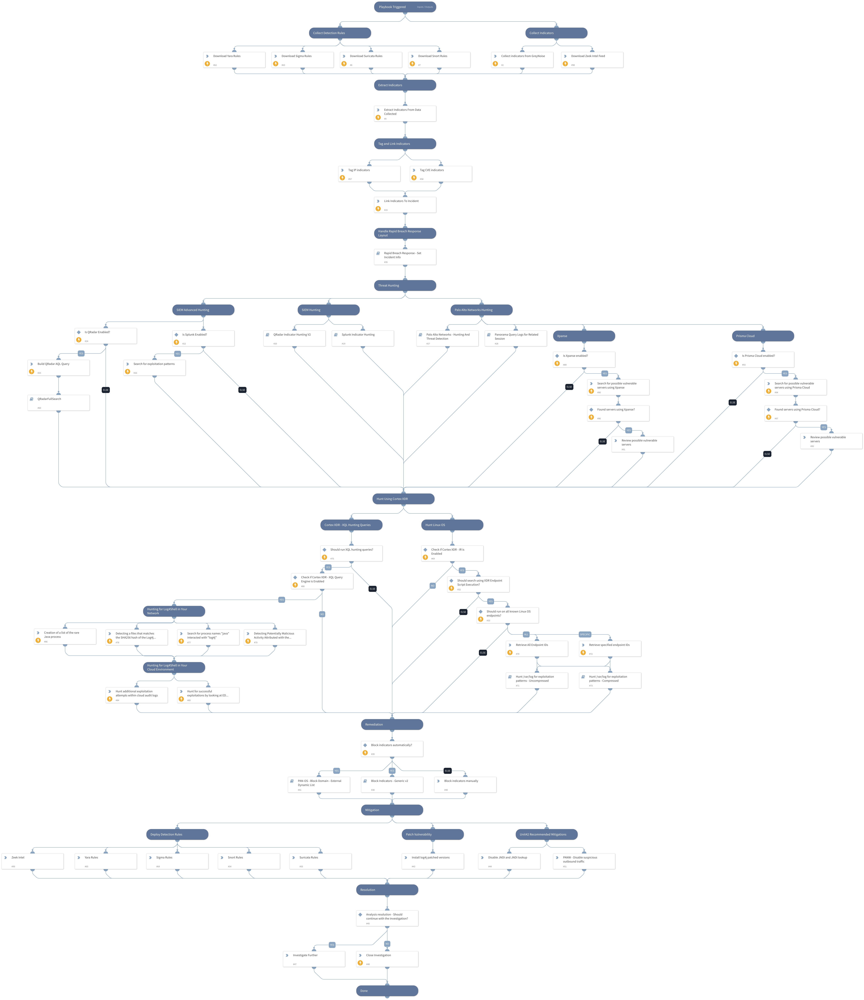

This pack is part of the [Rapid Breach Response](https://xsoar.pan.dev/marketplace/details/MajorBreachesInvestigationandResponse) pack.

**Critical RCE Vulnerability: log4j - CVE-2021-44228** refers to a 0-day exploit in the popular Java logging library log4j2.

On Dec. 9, 2021, a remote code execution (RCE) vulnerability in Apache log4j 2 was identified being exploited in the wild. Public proof of concept (PoC) code was released and subsequent investigation revealed that exploitation was incredibly easy to perform.

On Dec. 14 2021, another vulnerability was discovered related the log4j 0-day exploit known as CVE-2021-45046.

On Dec 18 2021, yet another vulnerability was discovered related the log4j 0-day exploit known as CVE-2021-45105. The vulnerability allows an attacker with control over Thread Context Map data to cause a denial of service when a crafted string is interpreted. This issue was fixed in Log4j 2.17.0 and 2.12.3.

On Dec 28 2021, another RCE vulnerability was published for Apache Log4j2, versions 2.0-beta7 through 2.17.0 (excluding security fix releases 2.3.2 and 2.12.4).
In order to exploit this vulnerability, an attacker with permission to modify the logging configuration file can construct a malicious configuration using a JDBC Appender with a data source referencing a JNDI URI which can execute remote code. This issue is fixed by limiting JNDI data source names to the java protocol in Log4j2 versions 2.17.1, 2.12.4, and 2.3.2.

This pack will provide you with a first response kit which includes:
* Hunting
* Remediation
* Mitigations

More information about the pack and how to use it, visit our [Cortex XSOAR Developer Docs](https://xsoar.pan.dev/docs/reference/playbooks/cve-2021-44228---log4j-rce)

More information about the vulnerability:
[Apache Log4j Vulnerability Is Actively Exploited in the Wild](https://unit42.paloaltonetworks.com/apache-log4j-vulnerability-cve-2021-44228/)

Note: This is a beta playbook, which lets you implement and test pre-release software. Since the playbook is beta, it might contain bugs. Updates to the pack during the beta phase might include non-backward compatible features. We appreciate your feedback on the quality and usability of the pack to help us identify issues, fix them, and continually improve.

