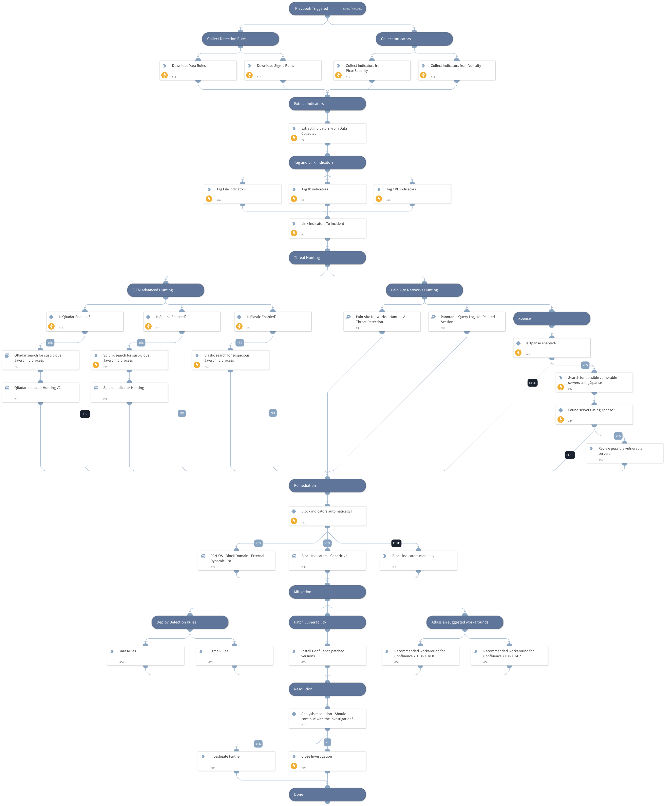

This pack is part of the [Rapid Breach Response](https://xsoar.pan.dev/marketplace/details/MajorBreachesInvestigationandResponse) pack.

Atlassian has been made aware of the current active exploitation of a critical severity unauthenticated remote code execution vulnerability in Confluence Data Center and Server. The OGNL injection vulnerability allows an unauthenticated user to execute arbitrary code on a Confluence Server or Data Center instance. 

**All** versions of Confluence Server and Data Center prior to the fixed versions listed above are affected by this vulnerability.

Atlassian has released the following versions to address this issue:

Released versions 7.4.17, 7.13.7, 7.14.3, 7.15.2, 7.16.4, 7.17.4, and 7.18.1 which contain a fix for this issue.

This playbook includes the following tasks:

* Collect detection rules.
* Exploitation patterns & IoCs hunting using PANW Next-Generation Firewalls and 3rd party SIEM products.
* Cortex Xpanse policies coverage.
* Provides Atlassian workarounds and patched versions.

**More information:**

[Threat Brief: Atlassian Confluence Remote Code Execution Vulnerability (CVE-2022-26134)
](https://unit42.paloaltonetworks.com/cve-2022-26134-atlassian-code-execution-vulnerability/)

[Confluence Security Advisory 2022-06-02](https://confluence.atlassian.com/doc/confluence-security-advisory-2022-06-02-1130377146.html)

**Note:** This is a beta playbook, which lets you implement and test pre-release software. Since the playbook is beta, it might contain bugs. Updates to the pack during the beta phase might include non-backward compatible features. We appreciate your feedback on the quality and usability of the pack to help us identify issues, fix them, and continually improve.

