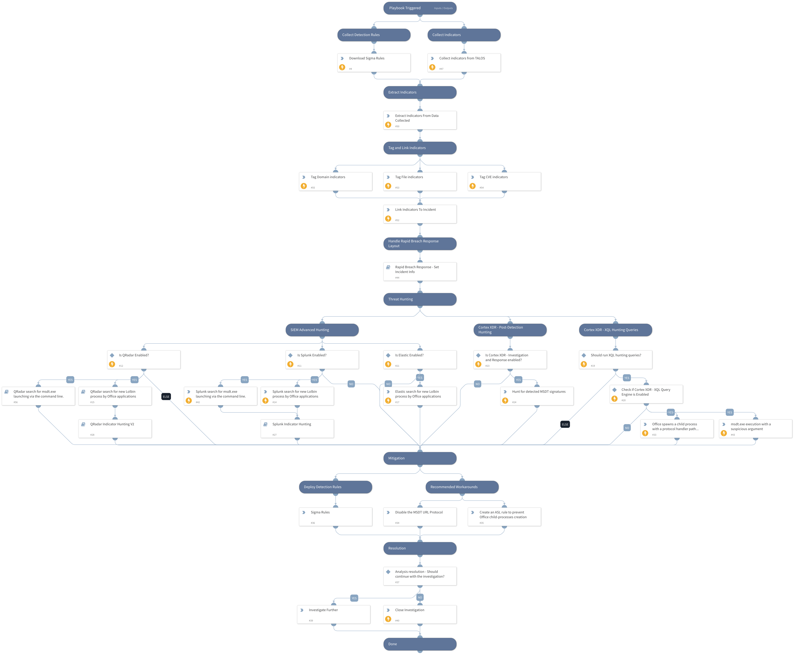

This pack is part of the [Rapid Breach Response](https://xsoar.pan.dev/marketplace/details/MajorBreachesInvestigationandResponse) pack.

On **May 27th**, a new Microsoft Office Zero-Day was discovered by Nao_sec. 

The new Zero-Day is a remote code execution vulnerability that exists when MSDT is called using the URL protocol from a calling application such as Word. 

On **May 30th**, Microsoft assigned **CVE-2022-30190** to the MSDT vulnerability, aka **Follina vulnerability**.

This playbook includes the following tasks:

* Collect detection rules.
* Exploitation patterns hunting using Cortex XDR - XQL Engine and 3rd party SIEM products.
* Cortex XDR BIOCs coverage.
* Provides Microsoft workarounds and detection capabilities.

**More information:**

[Prevention, Hunting and Playbooks for MSDT Zero-Day (CVE-2022-30190)
](https://www.paloaltonetworks.com/blog/security-operations/prevention-hunting-and-playbooks-for-msdt-zero-day-cve-2022-30190/)

**Note:** This is a beta playbook, which lets you implement and test pre-release software. Since the playbook is beta, it might contain bugs. Updates to the pack during the beta phase might include non-backward compatible features. We appreciate your feedback on the quality and usability of the pack to help us identify issues, fix them, and continually improve.

