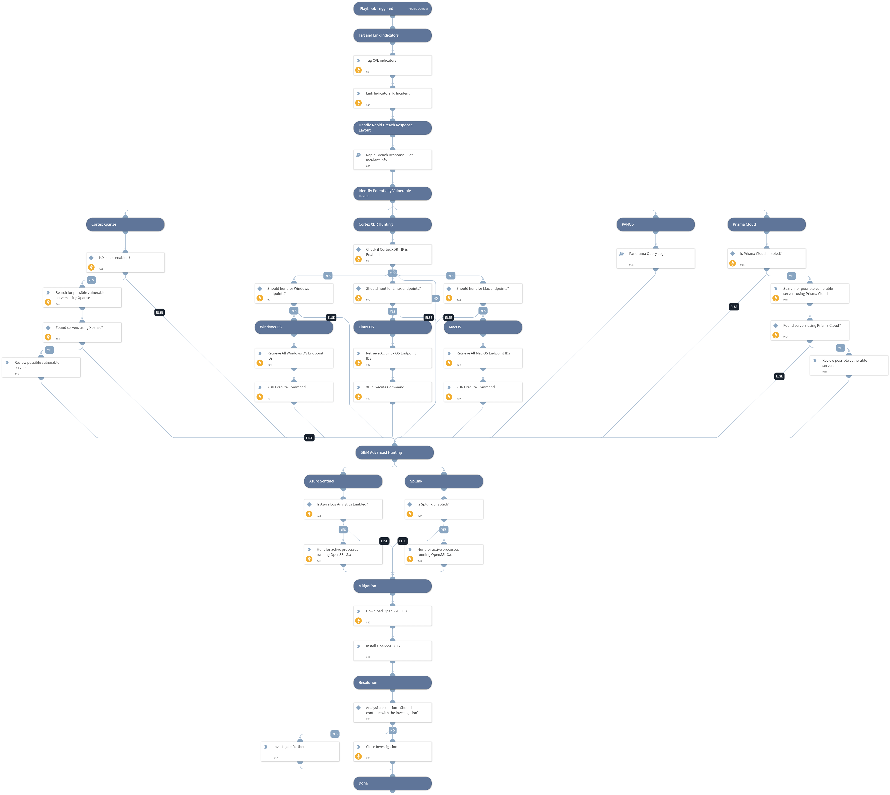

On November 1, OpenSSL released a [security advisory](https://www.openssl.org/news/secadv/20221101.txt) describing two high severity vulnerabilities within the OpenSSL library, CVE-2022-3786 and CVE-2022-3602. OpenSSL versions from 3.0.0 - 3.0.6 are vulnerable, with 3.0.7 containing the patch for both vulnerabilities. OpenSSL 1.1.1 and 1.0.2 are not affected by this issue.

The vulnerability described in CVE-2022-3602 allows an attacker to obtain a 4-byte overflow on the stack by crafting a malicious email address within the attacker-controlled certificate. The overflow will result in a crash (most likely scenario) or potentially remote code execution (much less likely). In CVE-2022-3786, an attacker can achieve a stack overflow of arbitrary length by crafting a malicious email address within the attacker-controlled certificate.

Both vulnerabilities are “triggered through X.509 certificate verification, specifically, name constraint checking. Note that this occurs after certificate chain signature verification and requires either a CA to have signed the malicious certificate or for the application to continue certificate verification despite failure to construct a path to a trusted issuer.” 

**The playbook includes the following tasks:**
* Hunting for active processes running OpenSSL vulnerable versions using:
    * Cortex XDR
    * Splunk
    * Azure Sentinel
* Cortex Xpanse
 * Prisma
 * PANOS

**Mitigations:**
* OpenSSL official patch

More information:
[Unit42 Threat Brief: CVE-2022-3786 and CVE-2022-3602: OpenSSL X.509 Buffer Overflows](https://unit42.paloaltonetworks.com/openssl-vulnerabilities/)
[NCSC-NL - OpenSSL overview Scanning software](https://github.com/NCSC-NL/OpenSSL-2022/tree/main/scanning)

Note: This is a beta playbook that lets you implement and test pre-release software. Since the playbook is beta, it might contain bugs. Updates to the pack during the beta phase might include non-backward compatible features. We appreciate your feedback on the quality and usability of the pack to help us identify issues, fix them, and continually improve.

## Dependencies

This playbook uses the following sub-playbooks, integrations, and scripts.

### Sub-playbooks

* Rapid Breach Response - Set Incident Info
* Panorama Query Logs

### Integrations

This playbook does not use any integrations.

### Scripts

* HttpV2
* IsIntegrationAvailable

### Commands

* xdr-get-endpoints
* closeInvestigation
* associateIndicatorsToIncident
* xdr-script-commands-execute
* splunk-search
* redlock-get-rql-response
* createNewIndicator
* azure-log-analytics-execute-query
* expanse-get-issues
* prisma-cloud-config-search

## Playbook Inputs

---

| **Name** | **Description** | **Default Value** | **Required** |
| --- | --- | --- | --- |
| HuntLinuxOS | Whether to search for relevant OpenSSL 3.x processes on Linux endpoints. | False | Optional |
| HuntWindowsOS | Whether to search for relevant OpenSSL 3.x processes on Windows endpoints. | False | Optional |
| HuntMacOS | Whether to search for relevant OpenSSL 3.x processes on Mac endpoints. | False | Optional |
| SplunkIndex | Splunk index to search. Note that the input value should include the field name as well. e.g. "index=\*" | index=* OR index=_* | Optional |
| SplunkEarliestTime | Splunk earliest time to search. | -1d@d | Optional |
| SplunkLatestTime | Splunk latest time to search. | now | Optional |
| PlaybookDescription | The playbook's description. | On November 1, OpenSSL released a [security advisory](https://www.openssl.org/news/secadv/20221101.txt) describing two high severity vulnerabilities within the OpenSSL library, CVE-2022-3786 and CVE-2022-3602. OpenSSL versions from 3.0.0 - 3.0.6 are vulnerable, with 3.0.7 containing the patch for both vulnerabilities. OpenSSL 1.1.1 and 1.0.2 are not affected by this issue.  The vulnerability described in CVE-2022-3602 allows an attacker to obtain a 4-byte overflow on the stack by crafting a malicious email address within the attacker-controlled certificate. The overflow will result in a crash (most likely scenario) or potentially remote code execution (much less likely). In CVE-2022-3786, an attacker can achieve a stack overflow of arbitrary length by crafting a malicious email address within the attacker-controlled certificate.  Both vulnerabilities are “triggered through X.509 certificate verification, specifically, name constraint checking. Note that this occurs after certificate chain signature verification and requires either a CA to have signed the malicious certificate or for the application to continue certificate verification despite failure to construct a path to a trusted issuer.”   **The playbook includes the following tasks:** * Hunting for active processes running OpenSSL vulnerable versions using:     * Cortex XDR     * Splunk     * Azure Sentinel  * Cortex Xpanse  * Prisma  * PANOS  **Mitigations:** * OpenSSL official patch  More information: [Unit42 Threat Brief: CVE-2022-3786 and CVE-2022-3602: OpenSSL X.509 Buffer Overflows](https://unit42.paloaltonetworks.com/openssl-vulnerabilities/) [NCSC-NL - OpenSSL overview Scanning software](https://github.com/NCSC-NL/OpenSSL-2022/tree/main/scanning)  Note: This is a beta playbook that lets you implement and test pre-release software. Since the playbook is beta, it might contain bugs. Updates to the pack during the beta phase might include non-backward compatible features. We appreciate your feedback on the quality and usability of the pack to help us identify issues, fix them, and continually improve. | Optional |
| RelatedCVEs | CVE indicators. | CVE-2022-3786,CVE-2022-3602 | Optional |

## Playbook Outputs

---
There are no outputs for this playbook.

## Playbook Image

---

