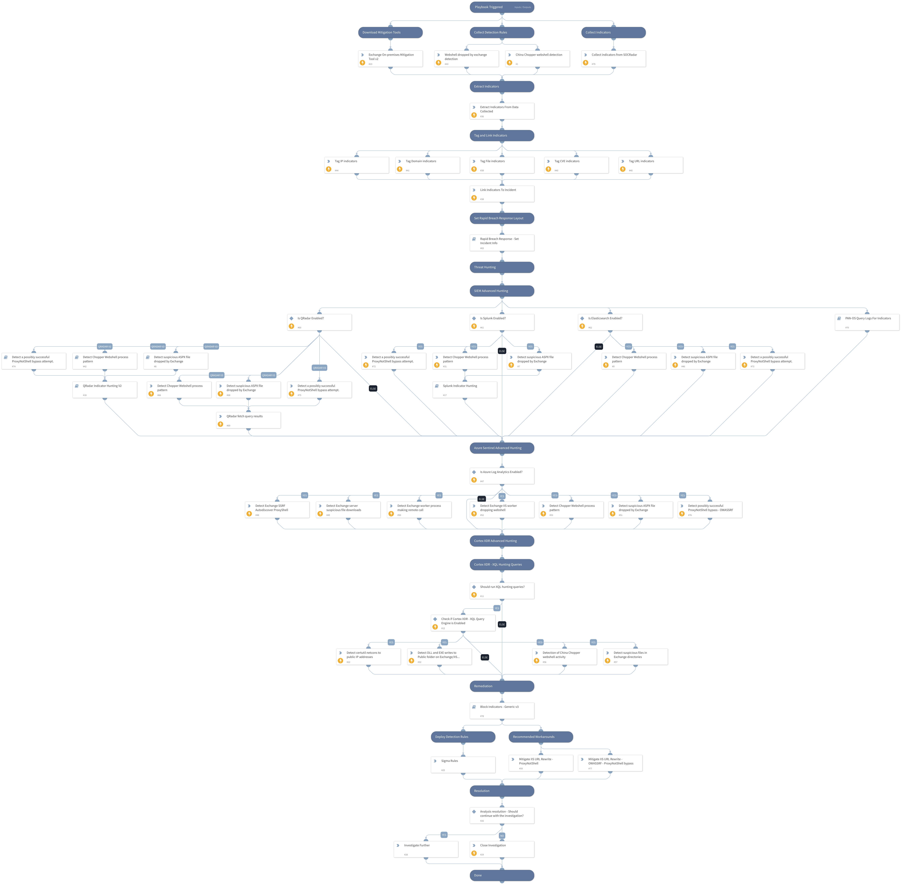

**UPDATE**
A new method for bypassing ProxyNotShell mitigations was found after being seen exploited in the wild by the Play ransomware gang.
While the original exploit took advantage of the Autodiscover endpoint, the new exploit is using the OWA endpoint leading to SSRF.
The OWASSRF exploit method involves two different vulnerabilities tracked by CVE-2022-41080 and CVE-2022-41082 that allow remote code execution (RCE) via Outlook Web Access (OWA).

This playbook introduces several updates in response to the new discovery:
- Hunting:
    - Detecting possibly successful exploitation of the OWA SSRF vulnerability.
- Mitigations:
    - IIS URL Rewrite rule for the modified exploitation URI path.
- Remediation:
    - Block Indicators - Generic v3 playbook.

Microsoft is investigating two reported zero-day vulnerabilities affecting Microsoft Exchange Server 2013, Exchange Server 2016, and Exchange Server 2019. The first one, identified as CVE-2022-41040, is a Server-Side Request Forgery (SSRF) vulnerability, and the second one, identified as CVE-2022-41082, allows Remote Code Execution (RCE) when PowerShell is accessible to the attacker.  

Currently, Microsoft is aware of limited targeted attacks using these two vulnerabilities.  In these attacks, CVE-2022-41040 can enable an authenticated attacker to remotely trigger CVE-2022-41082. It should be noted that authenticated access to the vulnerable Exchange Server is necessary to successfully exploit either vulnerability.

This playbook includes the following tasks:

* Collect detection rules, indicators and mitigation tools.
* Exploitation patterns hunting using Cortex XDR - XQL Engine.
* Exploitation patterns hunting using 3rd party SIEM products:
    * Azure Sentinel
    * Splunk
    * QRadar
    * Elasticsearch
* Indicators hunting using:
    * PAN-OS
    * Splunk
    * QRadar
* Provides Microsoft mitigation and detection capabilities.

**More information:**

[Threat Brief: OWASSRF Vulnerability Exploitation](https://unit42.paloaltonetworks.com/threat-brief-OWASSRF/)

[Threat Brief: CVE-2022-41040 and CVE-2022-41082: Microsoft Exchange Server (ProxyNotShell)](https://unit42.paloaltonetworks.com/proxynotshell-cve-2022-41040-cve-2022-41082/)

**References:**

[OWASSRF: CrowdStrike Identifies New Exploit Method for Exchange Bypassing ProxyNotShell Mitigations](https://www.crowdstrike.com/blog/owassrf-exploit-analysis-and-recommendations/)

[Analyzing attacks using the Exchange vulnerabilities CVE-2022-41040 and CVE-2022-41082](https://www.microsoft.com/security/blog/2022/09/30/analyzing-attacks-using-the-exchange-vulnerabilities-cve-2022-41040-and-cve-2022-41082/)

[Customer Guidance for Reported Zero-day Vulnerabilities in Microsoft Exchange Server](https://msrc-blog.microsoft.com/2022/09/29/customer-guidance-for-reported-zero-day-vulnerabilities-in-microsoft-exchange-server/)

[WARNING: NEW ATTACK CAMPAIGN UTILIZED A NEW 0-DAY RCE VULNERABILITY ON MICROSOFT EXCHANGE SERVER](https://gteltsc.vn/blog/warning-new-attack-campaign-utilized-a-new-0day-rce-vulnerability-on-microsoft-exchange-server-12715.html)

[ProxyNotShell— the story of the claimed zero days in Microsoft Exchange](https://doublepulsar.com/proxynotshell-the-story-of-the-claimed-zero-day-in-microsoft-exchange-5c63d963a9e9)

**Note:** This is a beta playbook, which lets you implement and test pre-release software. Since the playbook is beta, it might contain bugs. Updates to the pack during the beta phase might include non-backward compatible features. We appreciate your feedback on the quality and usability of the pack to help us identify issues, fix them, and continually improve.

## Dependencies
This playbook uses the following sub-playbooks, integrations, and scripts.

### Sub-playbooks
* Block Indicators - Generic v3
* PAN-OS Query Logs For Indicators
* QRadar Indicator Hunting V2
* Detect suspicious ASPX file dropped by Exchange
* Rapid Breach Response - Set Incident Info
* Detect Chopper Webshell process pattern
* Detect a possibly successful ProxyNotShell bypass attempt
* Splunk Indicator Hunting

### Integrations
This playbook does not use any integrations.

### Scripts
* ParseHTMLIndicators
* HttpV2
* http

### Commands
* splunk-search
* extractIndicators
* associateIndicatorsToIncident
* closeInvestigation
* xdr-xql-generic-query
* createNewIndicator
* azure-log-analytics-execute-query
* qradar-search-results-get
* qradar-search-create
* search

## Playbook Inputs
---

| **Name** | **Description** | **Default Value** | **Required** |
| --- | --- | --- | --- |
| CVEs | The vulnerabilities CVE indicators. | CVE-2022-41040,CVE-2022-41082 | Optional |
| SplunkIndex | Splunk's index name in which to search. The default is "\*" - All. | * | Optional |
| SplunkEarliestTime | Splunk's earliest time to search. | -7d@d | Optional |
| SplunkLatestTime | Splunk's latest time to search. | now | Optional |
| ElasticIndex | Elastic's index name in which to search. The default is "winlogbeat-\*" - All. | winlogbeat-* | Optional |
| QRadarTimeRange | QRadar's query time range. | Last 7 DAYS | Optional |
| RunXQLHuntingQueries | Whether to execute the XQL queries. | False | Optional |
| XQLHuntingQueriesType | Whether to execute the ProxyNotShell or OWASSRF XQL queries or both.  \* Use 'ProxyNotShell' as an input to execute ProxyNotShell queries \* Use 'OWASSRF' as an input to execute OWASSRF queries \* Use 'Both' as an input to execute both ProxyNotShell and OWASSRF queries  | OWASSRF | Optional |
| PlaybookDescription | The playbook's description. | **UPDATE** A new method for bypassing ProxyNotShell mitigations was found after being seen exploited in the wild by the Play ransomware gang. While the original exploit took advantage of the Autodiscover endpoint, the new exploit is using the OWA endpoint leading to SSRF. The OWASSRF exploit method involves two different vulnerabilities tracked by CVE-2022-41080 and CVE-2022-41082 that allow remote code execution (RCE) via Outlook Web Access (OWA).  This playbook introduces several updates in response to the new discovery: - Hunting:     - Detecting possibly successful exploitation of the OWA SSRF vulnerability. - Mitigations:     - IIS URL Rewrite rule for the modified exploitation URI path. - Remediation:     - Block Indicators - Generic v3 playbook.  Microsoft is investigating two reported zero-day vulnerabilities affecting Microsoft Exchange Server 2013, Exchange Server 2016, and Exchange Server 2019. The first one, identified as CVE-2022-41040, is a Server-Side Request Forgery (SSRF) vulnerability, and the second one, identified as CVE-2022-41082, allows Remote Code Execution (RCE) when PowerShell is accessible to the attacker.    Currently, Microsoft is aware of limited targeted attacks using these two vulnerabilities.  In these attacks, CVE-2022-41040 can enable an authenticated attacker to remotely trigger CVE-2022-41082. It should be noted that authenticated access to the vulnerable Exchange Server is necessary to successfully exploit either vulnerability.  This playbook includes the following tasks:  * Collect detection rules, indicators and mitigation tools. * Exploitation patterns hunting using Cortex XDR - XQL Engine. * Exploitation patterns hunting using 3rd party SIEM products:     * Azure Sentinel     * Splunk     * QRadar     * Elasticsearch * Indicators hunting using:     * PAN-OS     * Splunk     * QRadar * Provides Microsoft mitigation and detection capabilities.  **More information:**  [Threat Brief: OWASSRF Vulnerability Exploitation](https://unit42.paloaltonetworks.com/threat-brief-OWASSRF/)  [Threat Brief: CVE-2022-41040 and CVE-2022-41082: Microsoft Exchange Server (ProxyNotShell)](https://unit42.paloaltonetworks.com/proxynotshell-cve-2022-41040-cve-2022-41082/)  **References:**  [OWASSRF: CrowdStrike Identifies New Exploit Method for Exchange Bypassing ProxyNotShell Mitigations](https://www.crowdstrike.com/blog/owassrf-exploit-analysis-and-recommendations/)  [Analyzing attacks using the Exchange vulnerabilities CVE-2022-41040 and CVE-2022-41082](https://www.microsoft.com/security/blog/2022/09/30/analyzing-attacks-using-the-exchange-vulnerabilities-cve-2022-41040-and-cve-2022-41082/)  [Customer Guidance for Reported Zero-day Vulnerabilities in Microsoft Exchange Server](https://msrc-blog.microsoft.com/2022/09/29/customer-guidance-for-reported-zero-day-vulnerabilities-in-microsoft-exchange-server/)  [WARNING: NEW ATTACK CAMPAIGN UTILIZED A NEW 0-DAY RCE VULNERABILITY ON MICROSOFT EXCHANGE SERVER](https://gteltsc.vn/blog/warning-new-attack-campaign-utilized-a-new-0day-rce-vulnerability-on-microsoft-exchange-server-12715.html)  [ProxyNotShell— the story of the claimed zero days in Microsoft Exchange](https://doublepulsar.com/proxynotshell-the-story-of-the-claimed-zero-day-in-microsoft-exchange-5c63d963a9e9)  **Note:** This is a beta playbook, which lets you implement and test pre-release software. Since the playbook is beta, it might contain bugs. Updates to the pack during the beta phase might include non-backward compatible features. We appreciate your feedback on the quality and usability of the pack to help us identify issues, fix them, and continually improve. | Optional |

## Playbook Outputs
---
There are no outputs for this playbook.

## Playbook Image
---
